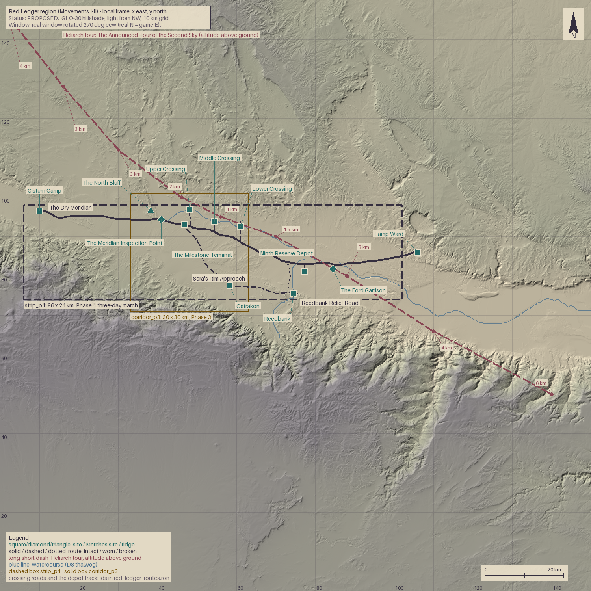

Status: PROPOSED

# Red Ledger region

The Red Ledger campaign (Movements I and II) laid onto terrain window A. Data: `content/terrain/red_ledger/window.ron`, `content/world/red_ledger_sites.ron`, `content/world/red_ledger_routes.ron`. Image and every number below come from `python tools/scripts/region_overlay.py` (the script loads the RON, prints each check with PASS/FAIL, and redraws the image). The coordinates were found with `docs/artifacts/P0-06/plan_region.py`, a scratch planner kept as evidence; it is not needed to verify anything.

Real place names are never used in the game. Real coordinates appear only in `window.ron`, for sourcing.

## 1. Frame and terrain

- **Source.** Copernicus GLO-30, six 1° tiles, per `docs/decisions/ADR-0100-terrain-source.md` §Decision ("use Copernicus GLO-30 as the production source"). Window A of `docs/canon/TERRAIN_CANDIDATES.md` was selected by Liam in the PR #62 review (§Ranking and recommendation, "Selected: A").
- **Window.** 150 × 150 km, real SW corner (30.0 N, 34.6 E), same equirectangular projection as `tools/scripts/hillshade.py`. Sampled at 100 m for the image and checks. The six tiles are all present in `data/raw/terrain/`; the sampled window has 0 void cells of 2,250,000. This is the GLO-30 void check that ADR-0100 §Decision, review resolution (2), left open: no voids in window A.
- **Local frame.** x east, y north, integer meters, origin at the SW corner after the transform.
- **Transform (PROPOSED).** `rotate_deg: 270` counter-clockwise (= 90° clockwise), `mirror_x: false`; mirror is applied before rotation. Real north becomes game east and real east becomes game south. Reason: P0-05 found a real north-south floor 150 km long (TERRAIN_CANDIDATES §A, "Corridor (1)"), and the spec's strip is 96 km wide by 24 km tall, so the road has to run east-west. Travel runs west to east, with the plateau rim along the south edge.
- **Ground.** Elevation in the window runs from -427 m to 1731 m, median 581 m. The road corridor is the pale floor between the rim in the south and rough hills in the north. East of x = 107 km, y 60 to 78 km, 263 km² of level ground lies below -380 m: the real lake surface, which GLO-30 flattens. **PROPOSED:** treat it as a dry salt pan. Lamp Ward stands about 8 km from it.

## 2. Sites

Positions are meters in the local frame and elevations are bilinear samples of the 100 m raster. "Canon" names the document that establishes the site; where the position or the name is new it says so in `notes` and in the table.

| id | Name | x km | y km | z m | Canon (verified by grep) | What is new |
|---|---|---|---|---|---|---|
| `cistern_camp` | Cistern Camp | 10.00 | 96.50 | 185 | World Bible §Households and distance | position |
| `inspection_station` | The Meridian Inspection Point | 40.91 | 94.22 | 106 | Campaign Bible §4 The opening: the Red Ledger incident | name, position |
| `station_ridge` | The North Bluff | 38.21 | 96.62 | 222 | PROPOSED | whole feature, added to carry the ridge requirement |
| `roadside_terminal` | The Milestone Terminal | 46.75 | 93.09 | 85 | Campaign Bible §4 The opening: the Red Ledger incident | name, position |
| `reedbank` | Reedbank | 74.55 | 75.45 | -2 | Campaign Bible §4 The opening: the Red Ledger incident | position |
| `excluded_settlement` | Ostrakon | 58.33 | 77.56 | 74 | Campaign Bible §5 Movement I — People under protection | name, position |
| `reserve_depot` | Ninth Reserve Depot | 77.36 | 81.15 | -108 | Campaign Bible §5 Movement I — People under protection | name, position |
| `marches_garrison` | The Ford Garrison | 84.51 | 81.74 | -161 | Campaign Bible §5 Movement II — A name for the army | name, position |
| `three_crossings_a` | Upper Crossing | 48.15 | 96.75 | 56 | Campaign Bible §5 Movement II — A name for the army | names, positions |
| `three_crossings_b` | Middle Crossing | 54.45 | 93.75 | 15 | same | names, positions |
| `three_crossings_c` | Lower Crossing | 61.05 | 92.55 | -23 | same | names, positions |
| `lamp_ward` | Lamp Ward | 106.00 | 86.00 | -96 | World Bible §The Lamp Concord | position |

Facts that fix each site, with the quoted text kept under 25 words:
- Cistern Camp and the route: "Cistern Camp to Lamp Ward, via the Dry Meridian road" (Campaign Bible §4 The opening: the Red Ledger incident).
- Checkpoint: Captain Varo Kest "receives a directive whose effective date precedes the caravan's departure" (Campaign Bible §4). The terminal is "an old roadside terminal" met afterward (same section).
- Reedbank "lies on a secondary river crossing" (Campaign Bible §4).
- Ostrakon: Sera's approach "passes through an excluded settlement" (Campaign Bible §5 Movement I). The name is a potsherd, the old voting token, so a place whose people were counted out; Greek-inflected, like the World Bible's *Soterion* and *Pylaios*. **PROPOSED.**
- Depot: Olan's "supposedly empty reserve depot" (Campaign Bible §5 Movement I).
- Garrison: "a Marches garrison whose supply guarantees have failed" (Campaign Bible §5 Movement II).
- Three Crossings: Campaign Bible §5 Movement II ("Three Crossings tests whether the growing force can coordinate dispersed defenses"). The names Upper, Middle and Lower follow the flow of the wadi; plain-functional, like *Lamp Ward* and *Cistern Camp*.
- Lamp Ward: "near the opening campaign's road" (World Bible §The Lamp Concord).

## 3. Routes

All routes are polylines with vertices at most 409 m apart (limit 500 m). Slope is rise over run between consecutive vertices on the 100 m raster; the limit is 150‰ (spec) and no named pass is needed.

| id | Name | Kind | Condition | Length km | Max slope ‰ | Mean ‰ |
|---|---|---|---|---|---|---|
| `dry_meridian` | The Dry Meridian | road | intact | 99.4 | 82 | 10 |
| `reedbank_spur` | Reedbank Relief Road | road | broken | 10.9 | 43 | 14 |
| `sera_approach` | Sera's Rim Approach | approach | worn | 37.2 | 79 | 11 |
| `crossing_road_a` | Upper Crossing Track | track | worn | 5.4 | 46 | 12 |
| `crossing_road_b` | Middle Crossing Road | road | intact | 3.8 | 52 | 19 |
| `crossing_road_c` | Lower Crossing Track | track | worn | 5.1 | 25 | 14 |
| `depot_track` | Depot Track | track | worn | 1.8 | 10 | 8 |

Notes on the choices (all PROPOSED unless cited):
- The Dry Meridian is "a major freight road" (World Bible §States made from services), so it is `intact`.
- `reedbank_spur` is `broken` at the start because "Reedbank's relief contracts are suspended" (Campaign Bible §4) and reopening the relief road is "the inciting commitment" (same section). The player makes it `worn` or `intact`; that is the first material hope in the game.
- Routing method: least-cost path on a 300 m grid (cost 1 + (slope/4°)², cells over 7.5° forbidden, extra cost on drainage lines so roads cross water rather than run down it), smoothed and resampled to 400 m vertices. Sites on a route sit on a route vertex.
- Watercourses (PROPOSED, in the routes file) are D8 flow paths from the same grid. `trunk_wadi` drains the floor (catchment about 11,700 km² where it leaves the window); `reed_channel` is the secondary river, about 312 km² at Reedbank (P0-05 wanted 200 to 330 km², TERRAIN_CANDIDATES §How the marks were placed). D8 drainage is where water would run on a surface model, not proof that a wadi flows.

## 4. Distance constraints

Output of `python tools/scripts/region_overlay.py` (run date 2026-10-01). Lengths use road-class routes only (`dry_meridian`, `reedbank_spur`, `crossing_road_b`); tracks and approaches are excluded so that a shortcut cannot shorten the march.

| Constraint (docs/tasks/P0-06.md) | Value | Result |
|---|---|---|
| Camp → inspection station by road, 20–45 km | 31.5 km | PASS |
| Inspection station → Reedbank by road, 20–45 km | 42.8 km | PASS |
| Camp → Reedbank by road, 70–90 km | 74.4 km | PASS |
| Camp → Reedbank road lies inside `strip_p1` | 189 vertices, 0 outside; x 10.0–74.5 km, y 75.5–96.6 km | PASS |
| `strip_p1` exactly 96,000 × 24,000 m | 96,000 × 24,000 | PASS |
| `corridor_p3` exactly 30,000 × 30,000 m | 30,000 × 30,000 | PASS |
| `corridor_p3` contains the inspection station | yes | PASS |
| Ridge within 5 km of the station and inside the corridor | North Bluff, 3.61 km | PASS |
| Ridge is a ridge (crest ≥ 40 m above the mean of its 1–2 km ring; PROPOSED test) | 116 m (crest 221 m) | PASS |
| `corridor_p3` contains a crossing | all three | PASS |
| Crossings a–b along the watercourse, 5–20 km | 7.4 km | PASS |
| Crossings b–c | 7.1 km | PASS |
| Crossings a–c | 14.5 km | PASS |
| A road or track reaches each crossing | `crossing_road_a`, `_b`, `_c` | PASS |
| Slope ≤ 150‰ on every route | worst 82‰ | PASS |
| Heliarch tour within sight of the Dry Meridian | closest 0.1 km horizontal (it crosses the road at (82.1, 83.3) km) | PASS |
| All required site and route ids; every site cited or PROPOSED | 11 required sites plus the ridge; 3 required routes plus 4 more (three crossing roads, depot track) | PASS |

How the two geometric tests are defined: "along the watercourse" is the arc length along the `trunk_wadi` polyline between the points nearest each crossing (all three lie within 150 m of it). "Inside strip_p1" is tested on every vertex of the shortest road-class path from Cistern Camp to Reedbank.

Marching time (not an acceptance test). High-Level Design §4.1b: "A guarded foot column covers 90 km | About three to five days" (the Illustrative tuning targets table, stale until P0-02, used because no higher document covers it). That is 18–30 km a day. Camp → station is therefore 1.1–1.8 days; station → Reedbank 1.4–2.4 days; Camp → Reedbank 2.5–4.1 days, and 74.4 km in three days is 24.8 km a day, inside the band, so the Phase 1 three-day march runs exactly this road.

**`corridor_p3` is not wholly inside `strip_p1`.** The spec allows this ("inside strip_p1 where possible"): a 30 km box cannot fit a 24 km strip. It is inside in x and overlaps 24 of its 30 km in y: 720 of 900 km², 80%. `corridor_p3` runs y 71–101 km against the strip's 74–98 km, so 3 km sticks out at each end. The three crossings, the bluff and the post all sit in the overlap.

## 5. The Heliarch's announced tour

`heliarch_tour_1`, in `red_ledger_routes.ron`. Vertices are `(x_m, y_m, altitude_m)`. **PROPOSED:** altitude is metres above local ground. The size canon gives a band of 1000 / 3000 / 6000 m (min / cruise / max) without naming a datum (ARCHON_SIZE_CANON §2, Heliarch); above-ground keeps the whale's apparent size independent of the terrain, which rises more than 1,000 m from the floor to the rim in this window.

| Vertex | x km | y km | Altitude m | Hours after entry at 20,000 m/h |
|---|---|---|---|---|
| 0 | 2 | 146 | 4000 | 0.0 |
| 1 | 16 | 128 | 3000 | 1.1 |
| 2 | 30 | 112 | 3000 | 2.2 |
| 3 | 46 | 100 | 2000 | 3.2 |
| 4 | 56 | 95 | 1000 | 3.8 |
| 5 | 70 | 90 | 1500 | 4.5 |
| 6 | 88 | 80 | 3000 | 5.5 |
| 7 | 110 | 66 | 4000 | 6.8 |
| 8 | 140 | 50 | 6000 | 8.5 |

Length 170.8 km. Speed is the Size Canon's typical 20,000 m/h (ARCHON_SIZE_CANON §2). The tour descends to its 1,000 m minimum 1.8 km from the Middle Crossing and climbs away over the rim.

**Announced timing (PROPOSED).** The tour is proclaimed before the caravan leaves Cistern Camp. Campaign Bible §5 Movement III says "An announced tour of the sky becomes a weather and fire threat"; that is the only canon on it, so everything else is invented. The column reaches the post in one to two days, so the whale is announced to enter the north-west corner at 08:00 on the day of the checkpoint. The sky event and the standoff then overlap: the whale is nearest the post three hours later.

Angular size is 2·atan(2400 m / 2 / slant), the Size Canon's method (ARCHON_SIZE_CANON §1), with the body's 2,400 m length. The line's closest approach to each site:

| Site | Horizontal km | Altitude m | Slant km | Angular size | Tour hour |
|---|---|---|---|---|---|
| Cistern Camp | 25.3 | 3000 | 25.4 | 5.4° | 2.1 |
| Inspection station | 7.7 | 2030 | 7.9 | 17.2° | 3.2 |
| Roadside terminal | 5.8 | 1667 | 6.1 | 22.3° | 3.4 |
| Upper Crossing | 1.9 | 1694 | 2.6 | 49.9° | 3.4 |
| Middle Crossing | 1.8 | 1072 | 2.1 | 59.4° | 3.7 |
| Lower Crossing | 0.6 | 1189 | 1.3 | 83.8° | 4.0 |
| Reserve depot | 4.2 | 2283 | 4.7 | 28.4° | 5.0 |
| Reedbank | 10.5 | 2305 | 10.8 | 12.7° | 5.1 |
| Ford Garrison | 0.2 | 2715 | 2.7 | 47.6° | 5.3 |
| Lamp Ward | 14.7 | 3458 | 15.1 | 9.1° | 6.1 |

The first-sighting beat is the camp (5.4° at 25 km; the Size Canon calls 6.8° at 20 km "a whale-shaped hole in the haze", ARCHON_SIZE_CANON §2) and then the post. The second is the Three Crossings, where the whale is a wall: 84° from the Lower Crossing. This serves the Execution Plan's awe row for Movement II, "Oil falling on the Three Crossings theater" (Execution Plan §2.7; lower precedence than the Campaign Bible). Because the tour crosses the Dry Meridian once, directly over the ford (road km 75, tour hour 5.3), it can be flown again in reverse in Movement II or III without new geometry. **PROPOSED.**

## 6. How the story moves over this ground

### Movement I — People under protection

The caravan leaves Cistern Camp (185 m) on the pale floor and goes east on a road that is flat and intact: mean slope 10‰, no segment over 82‰. It falls 110 m over the last 20 km, from 216 m to 106 m, so the column walks downhill toward the checkpoint (31.5 km, 1.1 to 1.8 days at 18–30 km/day). The Meridian Inspection Point stands 1.2 km before the road meets the west arm of the Trunk Wadi (road km 32.7 to 33.5). The North Bluff rises 3.6 km north-north-west of it: its crest is 221 m, 116 m above the post and 116 m above the mean of its own 1–2 km ring. From the crest the road is in line of sight between road km 12.0 and 29.5, about 18 km of the approach, and the post is not in sight. So the people on the bluff can watch the column come, and the post cannot see the bluff, which is the ground for the covered withdrawal in Campaign Bible §4 ("prepare a covered withdrawal"). The line-of-sight figures are on a 100 m surface model with 2 m eye and target heights and move with model noise; P1-05 should re-test them at 30 m. The Heliarch enters the window at 08:00 on the checkpoint day; at 3.2 h it is 7.7 km from the post at 2,030 m, 17.2° of the sky. The caravan has seen it before: from the camp it was 5.4°, 25 km off.

After the standoff the terminal stands 6.0 km further on, inside the corridor, on the road the survivors take. The Trunk Wadi runs 2 to 5 km north of the road as it descends. Reedbank is 42.8 km of road from the post and 74.4 km from the camp: the column turns off at road km 65.1 and follows the broken 10.9 km spur south to the secondary channel. The spur crosses the channel at the town and ends 1.6 km beyond it. The town sits at -2 m, and the rim reaches 310 m within 6 km to its south, 312 m above the town.

Sera's less exposed approach leaves the Dry Meridian 0.8 km before the terminal (road km 36.7), runs 20.6 km along the rim foot to Ostrakon (58.3, 77.6 km) and another 16.6 km to Reedbank: 37.2 km in all, no longer than the floor road from the same junction (about 38.0 km), and on average 7.3 km from it. Its price is not distance but Ostrakon, which stands 11.0 km from the Dry Meridian and has to be passed through or negotiated with. The depot is 6.4 km north-north-east of Reedbank, on a 1.8 km track off the Dry Meridian; the whale passes 4.2 km from it at 13:00 on the tour clock, 28.4° of the sky.

### Movement II — A name for the army

The Ford Garrison stands 21.4 km by road east of Reedbank and 77.9 km from the camp, on the south bank 1.2 km off the road, at 161 m below sea level. The Dry Meridian meets the bed of the Trunk Wadi twice near it, at road km 75.1 and 79.5, 4.4 km apart. Campaign Bible §3 lists what the surrender must deliver: "Obtain personnel, stores, and a defensible crossing without treating every conscript as an enemy". The crossing is the ford beneath it. The Heliarch passes almost directly over the garrison (0.2 km horizontal, 2,715 m, 47.6°) at tour hour 5.3.

The Three Crossings lie on a 14.5 km stretch of the Trunk Wadi west of the Reedbank junction. Upper, Middle and Lower are 7.4 and 7.1 km apart along the water, at 56, 15 and -23 m, and 7.7, 13.5 and 20.2 km in a straight line from the checkpoint. Each is reached by a short road from the Dry Meridian: 5.4, 3.8 and 5.1 km. **PROPOSED:** the Middle Crossing road is the only one kept in repair (`intact`), so it is the obvious target for a converging operation, and the other two are worn tracks. All three crossings are inside `corridor_p3`, so Movement II can be played in the same 30 × 30 km box as the checkpoint, the bluff, the terminal and Ostrakon, with 30.8 km of the Dry Meridian running through it. The Campaign Bible says "The enemy need not be annihilated" and that keeping two communities connected can secure recognition "even if a third crossing is lost" (§5 Movement II); the geometry lets a defender hold two crossings 7.1 km apart and lose the third. The whale passes within 2 km of all three, between hours 3.4 and 4.0 of its tour, at 1,100 to 1,700 m; over the Lower Crossing it fills 84° of sky.

East of the garrison the Dry Meridian leaves the wadi and runs 21.5 km to Lamp Ward at the edge of the dry basin (106 km east, 99.4 km from the camp), about 8 km north of the level floor at -380 m.

## 7. Decisions and open questions

PROPOSED in this task (each one is marked in the data files):
1. The 270° rotation, so the road runs east-west and the strip is 96 km wide (spec reading: x extent 96 km, y extent 24 km).
2. All names not in canon: Meridian Inspection Point, North Bluff, Milestone Terminal, Ostrakon, Ninth Reserve Depot, Ford Garrison, Upper/Middle/Lower Crossing, and the names of routes and watercourses.
3. A `station_ridge` site, a `watercourses` list and a `status` field in the sites/routes files; none is in the spec's schema.
4. Heliarch altitude as metres above ground, and the whole tour path and timing.
5. The real lake surface treated as a dry salt pan.
6. Route conditions: Dry Meridian intact, spur broken, Sera's approach worn, the Middle Crossing road intact.

Questions for Liam:
- Is the east-west orientation acceptable? The alternative is a 24 × 96 km strip running north-south, which the spec's `(x_m, y_m)` convention seems to rule out.
- The Ford Garrison is a fourth crossing 26.5 km downstream of the three. Should the garrison instead guard one of the three? The spec places it separately, so it is separate here.
- The "less exposed" approach is the same length as the road. If Liam wants it to cost time as well as a political price, the rim path has to be moved south into rougher ground, which raises its slope.
- P1-05 should recheck every slope and sightline on the 30 m model; the numbers here are on a 100 m resample.
