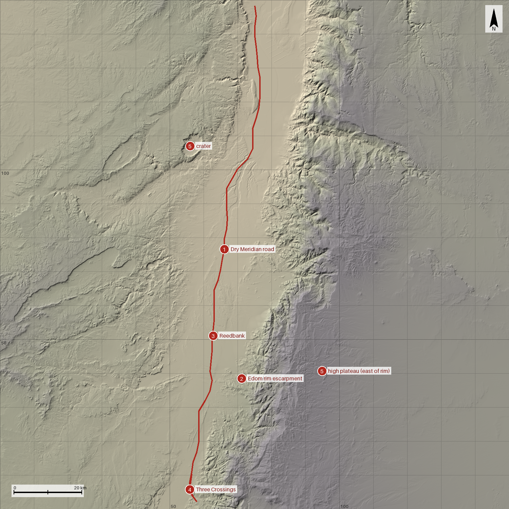
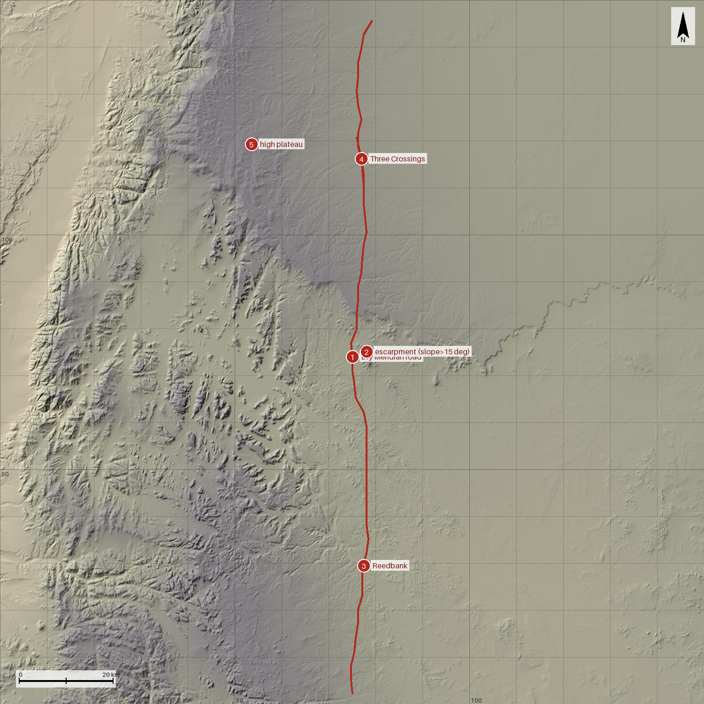
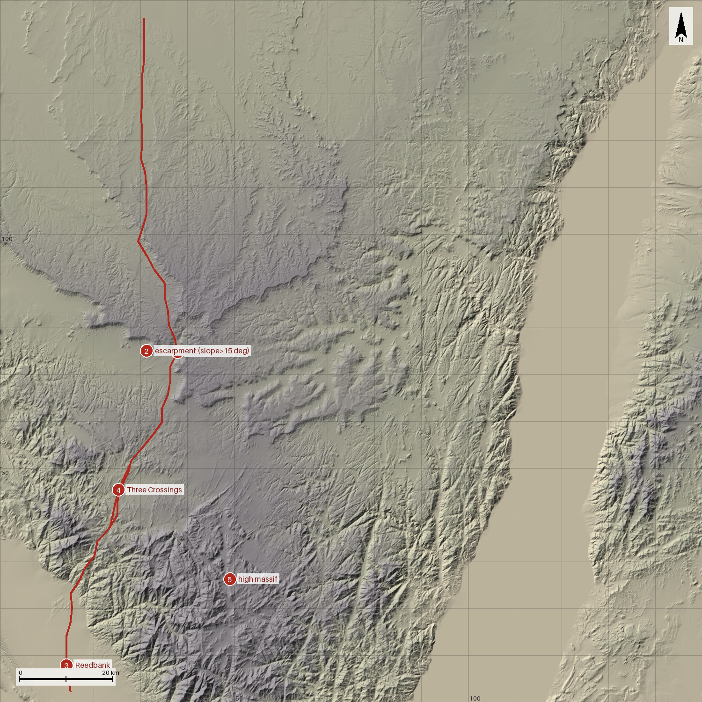
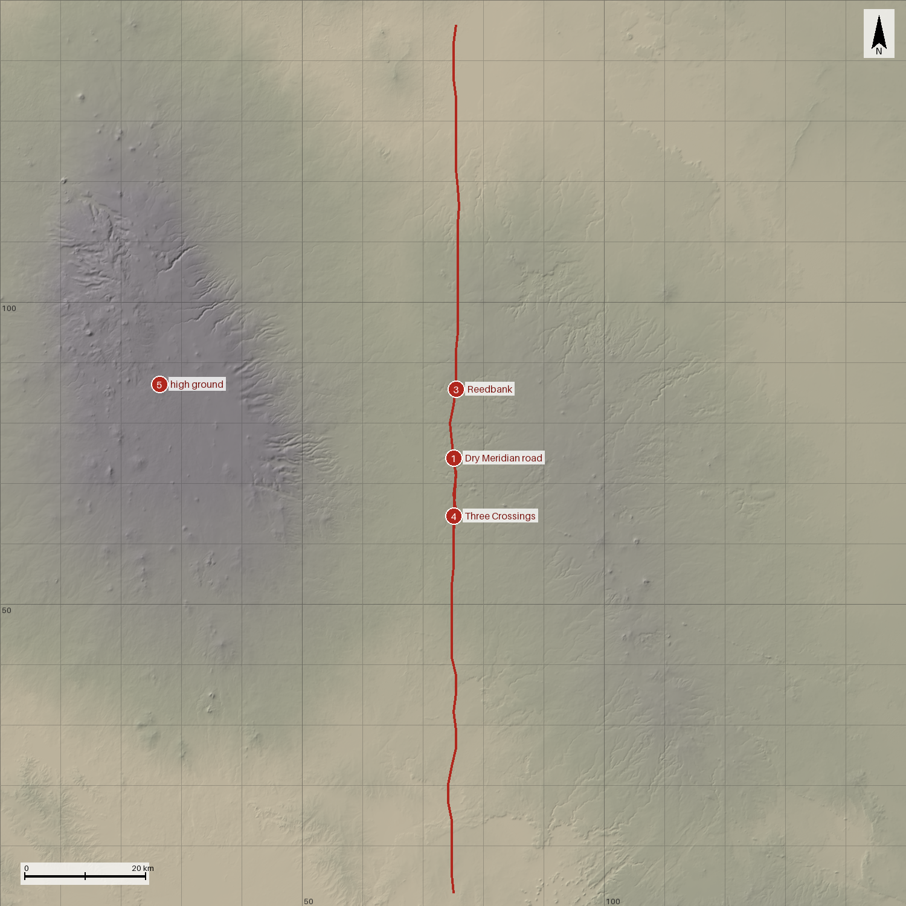

# Terrain candidates

**Status: ACCEPTED.** Not authoritative. Source decision: `docs/decisions/ADR-0100-terrain-source.md` (Proposed). Real-region names are for Liam's reference only; none is for in-game use (the game never uses real place names).

Four 150 × 150 km windows cut from Copernicus GLO-90 (90 m, 1500 × 1500 px = 100 m per pixel). Each image shows the 10 km grid (labels every 50 km, window-local), a 20 km scale bar, a north arrow, and numbered marks for the story features. Tints are the Field Atlas day palette for terrain fill: Low `#DDD2B8`, Middle `#BBBBA4`, High `#9C979B` (Field Atlas §3.1, table rows "Low ground", "Middle ground", "High ground", verified by grep). Tint bands are window-relative (5th percentile, median, 95th percentile), so tone is comparable inside one image, not between images. Hillshade: azimuth 315°, altitude 45°, no vertical exaggeration.

Coordinates below are **window-local km from the SW corner: x east, y north**. Windows may be rotated by multiples of 90° or mirrored later.

## How the marks were placed (read this before trusting a coordinate)
Marks are **candidate positions**, not canon, and not a site plan (that is P0-06). They come from measurements on a 300 m resample of the same data, plus judgment:
- **1 Road.** I chose 3-5 waypoints by eye on the render (a long basin, plain, or valley running roughly north-south). A least-cost router then snapped a path between them, minimising slope (cost 1 + (slope/6°)², no cells steeper than 22°, flat 0 m sea excluded, an extra cost on drainage lines so the path crosses them instead of running down them). The unconstrained least-cost route ran along the window edge, which is why waypoints were needed.
- **2 Escarpment.** Cells steeper than 15° on the 300 m grid. Marks in B and C are the steep cell nearest y = 75 within 8 km of the road (D has none). A's mark was picked by hand on the Edom rim: the nearest steep cell is 0.6 km from the road, but that is a small local step, so I used the continuous rim at 8.9 km.
- **3 Reedbank.** A drainage line the road crosses, from a priority-flood D8 flow accumulation. I picked a crossing with a catchment of about 200–330 km², "secondary" next to the largest trunk in the window.
- **4 Three Crossings.** Three separate drainage crossings (catchments over 36 km², at least 2 km apart along the road) within 20 km of road. The windows' best sets are given.
- **5 High ground.** Largest block of the top 10 % of the window's elevations, or a feature read by eye (the crater in A).
- The analysis scripts and raw results are in `docs/artifacts/P0-05/analysis/` as evidence. They are scratch tooling, not part of the build.
- Catchment area = cells × 0.09 km². Drainage here is where water *would* run on a surface model; it says nothing about whether a wadi flows in reality.

## Regenerating the images
```
pip install -r tools/scripts/requirements.txt
mkdir -p data/raw/terrain
# tiles: ADR-0100 §Download commands (21 unique tiles, about 93 MB for all four)
python tools/scripts/hillshade.py --sw-lat 30.0 --sw-lon 34.6 --tiles data/raw/terrain/*.tif --marks docs/canon/terrain_candidates/A-negev-arava.marks.json --out docs/canon/terrain_candidates/A-negev-arava.png
python tools/scripts/hillshade.py --sw-lat 29.0 --sw-lon 35.0 --tiles data/raw/terrain/*.tif --marks docs/canon/terrain_candidates/B-hisma-rum.marks.json  --out docs/canon/terrain_candidates/B-hisma-rum.png
python tools/scripts/hillshade.py --sw-lat 28.3 --sw-lon 33.5 --tiles data/raw/terrain/*.tif --marks docs/canon/terrain_candidates/C-sinai.marks.json     --out docs/canon/terrain_candidates/C-sinai.png
python tools/scripts/hillshade.py --sw-lat 31.8 --sw-lon 36.5 --tiles data/raw/terrain/*.tif --marks docs/canon/terrain_candidates/D-harrat-azraq.marks.json --out docs/canon/terrain_candidates/D-harrat-azraq.png
```
`--tiles` accepts any superset of the window's tiles. Each command prints the window's elevation statistics. The `*.marks.json` files sit next to the images (format in the script docstring).

## Summary

| ID | Real region (reference only) | SW corner | NE corner | Elevation min / p5 / median / p95 / max (m) | Features 1 / 2 / 3 / 4 / 5 |
|---|---|---|---|---|---|
| A | Central Negev, Arava rift, Edom rim | 30.0 N, 34.6 E | 31.349 N, 36.168 E | -427 / -170 / 581 / 1294 / 1731 | yes / yes (9 km) / yes / **weak (edge)** / yes |
| B | Hisma basin, Rum massifs, Ras en-Naqab | 29.0 N, 35.0 E | 30.349 N, 36.553 E | 0 / 267 / 887 / 1386 / 1838 | yes / **weak** / yes / yes / yes |
| C | Southern Sinai margin, Gulf of Aqaba | 28.3 N, 33.5 E | 29.649 N, 35.042 E | -4 / 0 / 765 / 1405 / 2600 | yes / yes / yes / yes / yes (**12 % sea**) |
| D | Harrat ash-Shaam basalt field, Azraq | 31.8 N, 36.5 E | 33.149 N, 38.099 E | 505 / 592 / 720 / 1261 / 1800 | yes / **no** / yes / yes / **weak** |

Road figures (300 m grid): A 160 km, mean slope 0.8°, steepest cell 8.6°; B 156 km, 1.2°, 10.9°; C 166 km, 2.3°, 14.0°; D 150 km, 0.7°, 2.9°. All four satisfy feature 1.

## A — Central Negev / Arava


- **Feel:** a long pale graben under a stepped limestone rim, with a single great wadi draining it northward.
- **Corridor (1):** Arava floor from (58, 2) through (62, 40) and (70, 100) to (75, 148); 160 km, flat floor, mean slope 0.8°.
- **Escarpment (2):** the eastern rim, nearest steep cells at (71, 38.5), 8.9 km east of the road. A second steep line, a western bluff at (67, 110), lies about 7 km west of the road.
- **Reedbank (3):** (63, 51), catchment about 200 km². The great trunk wadi crosses the same road at (67, 86), about 5,500 km², much too large to call secondary.
- **Three Crossings (4):** the best set is at the **south edge**: (57, 4), (56, 6), (56, 10), catchments 50–70 km². They are small, and an edge feature is poor: expect to move the window south or change the road. The road also meets the trunk and one tributary at (67, 86) and (66.5, 93), only two within 20 km.
- **High ground (5):** an erosion crater at about (56, 107), marked by eye on the render (not measured), and the Edom plateau east of the rim, up to 1,725 m, in a block whose centroid is (95, 41), 32 km from the road.
- **Risks:** feature 4 is the weak one. The road itself runs from -400 m to +398 m, so the northern end sits near the bottom of the rift.

## B — Hisma basin / Rum massifs


- **Feel:** a pale floor with grey towers standing in it, and a bare plain to the east.
- **Corridor (1):** (75, 2) to (75, 70), (78, 100), (80, 148); 156 km, mean slope 1.2°, roads on a plain.
- **Escarpment (2): weak.** A step in the plateau around (78, 75) with only 87 cells over 15° within 12 km of the road; the strong relief is the massif belt 20–25 km west of the road, not an escarpment beside it.
- **Reedbank (3):** (77.5, 29.5), catchment about 325 km².
- **Three Crossings (4):** (77.5, 110.5), (77, 116), (76, 121): a fan of six crossings between y = 108 and y = 123, catchments 40–140 km². Six crossings in 15 km, the most in any window's best 20 km (A 3, C 3, D 3, at catchments over 36 km²).
- **High ground (5):** the plateau to the north-west (about 1,715 m near (54, 119), 23 km from the road) and the massif belt around (51, 23) up to 1,837 m.
- **Risks:** the eastern half is a featureless plain; the eye wanders, and so would the player.

## C — Southern Sinai margin


- **Feel:** a high grey-red wall with dry rivers cut through it, and the sea at its foot.
- **Corridor (1):** (15, 2), (28, 50), (38, 75), (30, 100), (30, 148); 166 km, mean 2.3° but steepest cell 14.0°. It threads hills in y = 30–60 rather than crossing open ground.
- **Escarpment (2):** the plateau edge along the road; nearest steep cells (31, 75), 0.3 km from the road at the closest point. 3,430 steep cells within 12 km.
- **Reedbank (3):** (14, 8), catchment about 260 km², 8 km from the south edge.
- **Three Crossings (4):** (24, 38), (25, 45), (28, 51): three large wadis (230, 325, 245 km²) within 15 km. Largest catchments of the four sets.
- **High ground (5):** a massif at about (49, 26) reaching 2,588 m, the highest ground of all four windows.
- **Risks:** **2,725 km² (12.1 %) of the window is flat 0 m sea** (Copernicus tiles have none over ocean; AWS readme), a strip along the east side from x = 88 to 146 km and y = 0 to 139 km. The sea strip cannot be rotated away; moving the window changes what is in it. Also, the shortest path through the hills is rougher than A's or B's.

## D — Harrat ash-Shaam / Azraq


- **Feel:** a pale flat under a low dark rise, with few edges to hold.
- **Corridor (1):** (75, 2) to (75, 148); 150 km, mean slope 0.7°, steepest cell 2.9°.
- **Escarpment (2): none.** No cell in the window exceeds 15° within 12 km of the road, and there is no escarpment mark for D. The relief range is 505–1,800 m, but spread over a gentle slope in the west.
- **Reedbank (3):** (75.5, 85.6), catchment about 150 km².
- **Three Crossings (4):** (75, 56), (75, 65), (75.5, 72): three crossings of 90–165 km² catchments in 17 km.
- **High ground (5): weak.** One broad rise in the west (about 1,800 m at its top, centre (26, 86)), 48 km from the road, with no steep faces.
- **Risks:** fails feature 2 and is weak on 5.

## Ranking and recommendation
Ranked by how many of the five features the window supplies, then by how strongly.

1. **A — Central Negev / Arava.** Four of five features are met; the corridor is a clean 160 km floor, an escarpment stands 9 km off, a crater and a plateau give contrast. Weakness: Three Crossings only at the southern edge.
2. **C — Southern Sinai margin.** Best relief and the best Three Crossings, but 12 % of the window is sea, and the road is the roughest of the four.
3. **B — Hisma / Rum.** Best Three Crossings fan, but a weak escarpment and a bland east half.
4. **D — Harrat / Azraq.** Fails the escarpment requirement.

**Selected: A** (Liam, PR #62 review). P0-06 places sites on window A. The remainder of this paragraph is the original reasoning. Recommendation: A, on the numbers; the images are the evidence. If A's Three Crossings problem matters, the cheapest fix is to slide A south by about 20 km (or mirror it) and re-run the three commands in ADR-0100 for the new tiles. A window is now picked, so P0-06 may begin.

## Attribution (for the eventual credits)
Notice text and its source page are in ADR-0100. Liam accepted the longer "produced using" notice for now (PR #62 review). **Follow-up:** the game is not being sold, so this credit is adequate today, but the acknowledgement must be improved before any release; a later credits task should pick this up.
