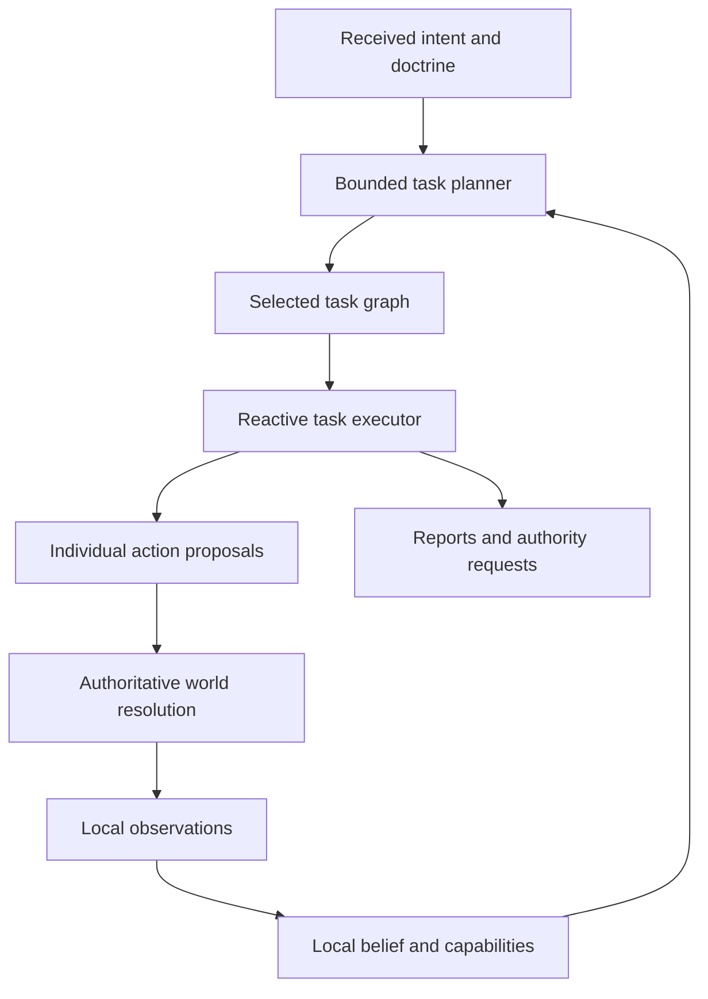
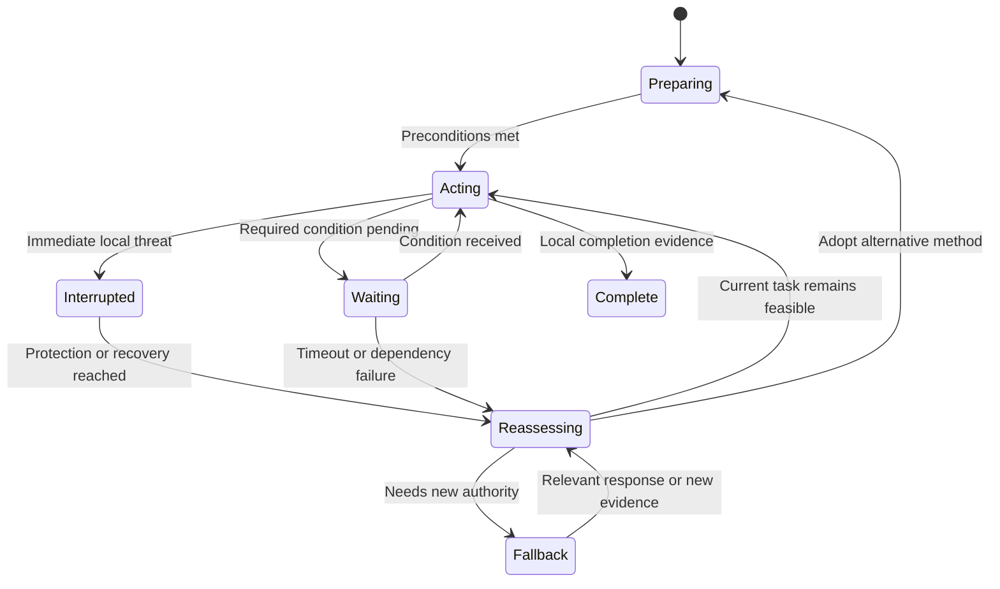
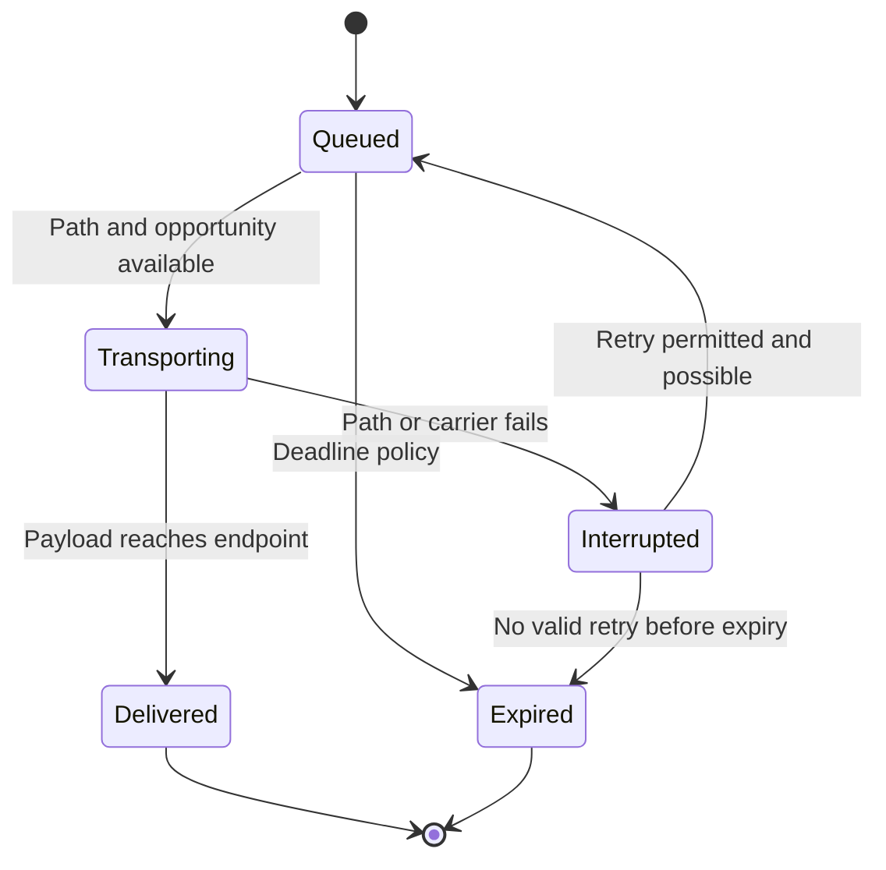

# Achlydesa — Subordinate AI and Simulation

**Version 2.0 · 27 September 2026 · Implementation design**

**Core contract:** The player gives a force a purpose and boundaries. Its people use their own information, capabilities, and judgment to act, adapt, coordinate, and ask for authority when necessary.

This revision expands the original autonomous-squad design into an implementable architecture. It covers subordinate planning, individual execution, shared simulation services, enemy command, deterministic resolution, information boundaries, performance, debugging, and prototype acceptance. It describes a proposed implementation, not a completed engine or empirically validated model of human behavior.

Companion specifications are `ACHLYDESA_SIMULATION_AND_PLAYER_INTERACTIONS.md`, `ACHLYDESA_FIELD_ATLAS_STYLE_AND_UI_BIBLE.md`, and `ACHLYDESA_STRATEGY_RPG_HIGH_LEVEL_DESIGN.md`. The world bible governs lore. The simulation document governs broad gameplay; the field-atlas bible governs presentation and interaction. This document supplies the algorithms and contracts beneath them.

**Reconciled rules:** Connected communication is not shared omniscience. A pre-dispatch preview is the issuing headquarters' estimate, not an untransmitted remote leader's plan. Scheduled reviews are legitimate planning boundaries. There is no separate battle-ending transition. The atlas can abstract appearance without changing geometry or outcomes.

## Contents

1. Non-negotiable simulation rules
2. Recommended architecture
3. Ownership, components, and authoritative state
4. Orders, authority, and acceptance
5. Perception, belief, and contact tracking
6. The planning pipeline
7. Candidate evaluation and bounded rationality
8. Task methods and action contracts
9. Core intent implementations
10. Reactive execution and interruption
11. Formation, navigation, and local movement
12. Coordination and shared resources
13. Leadership, cohesion, relationships, and succession
14. Communications and reports
15. Decision requests and WEGO boundaries
16. Time, scheduling, and simultaneous effects
17. Combat, suppression, wounds, and vehicles
18. Supply, repair, engineering, and routine sustainment
19. Enemy command and irregular forces
20. Archons, anomalies, and the junction
21. Spatial scale, streaming, and analytical advancement
22. Determinism, saving, and migration
23. Interface projection and explanations
24. Data contracts and event schema
25. Worked execution traces
26. Debugging and automated verification
27. Implementation sequence and performance gates
28. Research basis, boundaries, and unresolved tuning

## 1. Non-negotiable simulation rules

The game represents a continuous subcontinental theater with one coordinate system and one clock. A typical local concentration contains about 15–25 friendly squads and support elements. Ordinary squads contain five to eight persistent people. The wider institution has no arbitrary unit cap; people, leaders, equipment, transport, supply, and political support constrain it.

| Rule | Engineering consequence |
|---|---|
| Player commands squads, crews, and service elements | Individual actions are generated internally, not exposed as an alternative control scheme |
| People remain persistent | Injury, inventory, relationships, training, succession, and death belong to identities |
| Every actor acts on available knowledge | Planning interfaces never accept the complete authoritative world as an input |
| Orders and reports travel | Issue, delivery, acknowledgment, execution, and knowledge of execution are distinct |
| Autonomy operates within intent | Local adaptation does not silently change objective, political commitment, or protected resource authority |
| One world, one clock | Zoom, distance, and camera visibility cannot change physical rules |
| No clerical burden | Routine reload, aid, rest, redistribution, maintenance, and traffic handling are autonomous |
| Advanced technology is inherited | Capability comes from surviving assets, repair, recovery, or cannibalization; no research progression |
| Outcomes persist | Wrecks, depleted stores, altered routes, deaths, service failures, and reports remain consequential |
| Imperfection must have a cause | A mistaken decision traces to evidence, estimation, coordination, capability, or a known human boundary |

There is no requirement to make every subsystem equally detailed. Represent detail when it changes a command decision or explains an outcome. A single magazine count may matter; a fully modeled pocket zipper does not. Represent a casualty's transport burden and deterioration; do not require medical procedures from the player.

**Autonomy success test:** The player can leave a competent squad with a coherent Hold or Observe intent for a long execution period and expect it to remain purposeful without servicing a queue of trivial questions.

## 2. Recommended architecture

Use a hybrid system with four narrowly defined responsibilities:

1. **Intent and doctrine** define desired effects, priorities, constraints, and permitted fallback.
2. **Hierarchical task methods** generate a small collection of feasible ways to pursue that intent.
3. **Utility evaluation** ranks those methods using the leader's knowledge and estimates.
4. **Behavior trees and small state machines** execute tasks and handle local interruptions.

Hierarchical task planning decomposes abstract tasks into executable subtasks; behavior trees provide a structure for reactive task switching [R1–R2]. The particular combination, scoring model, authority rules, and scheduling design below are Achlydesa design proposals. They are not prescriptions from those sources.



Do not begin with a general planner capable of inventing arbitrary tactics, a global utility search over every possible action, or a runtime language model directing soldiers. Start with a small, authored method library whose failures can be reproduced. No online model service, training corpus, or reinforcement-learning pipeline is required for the proposed first playable.

The system must work without dialogue generation. Explanations can be assembled from structured reasons and authored sentence templates. Optional character phrasing must never invent a justification that the planner did not use.

## 3. Ownership, components, and authoritative state

Use stable entity IDs with explicit component ownership. An entity-component implementation is suitable, but a conventional data-oriented architecture is also acceptable. The important boundary is who may read or mutate which data.

| Component/service | Owns | Does not own |
|---|---|---|
| World state | Physical positions, terrain changes, inventories, damage, bodies | What any character knows |
| Observation service | Evidence generated by sensors and local events | Automatic faction-wide revelation |
| Belief store | Claims, sources, uncertainty, local interpretations | Hidden entity state |
| Command service | Authority, accepted instructions, precedence | Instant delivery |
| Planner | Candidate methods, estimates, selected task graph | Applying physical effects |
| Executor | Task progress, actions, interruption/resumption | New strategic objectives |
| Communications | Message custody, transport, delivery, acknowledgment traffic | Telepathic squad blackboards |
| Resource service | Physical custody and allocation at the controlling authority | Globally visible inventory truth |
| Scheduler | Authoritative time, event ordering, conservative advancement | UI animation timing |
| Projection service | A headquarters' received picture and outgoing local records | Full simulation inspection |

A person's own immediate bodily state and carried equipment can be available through a bounded self-state interface. The leader's view of another person is observed or reported. Squad knowledge is a collection of communicated claims; it is not a reference to every member's latest private perception.

Use separate read interfaces such as `LeaderKnowledgeView`, `LocalSelfState`, `AvailableDoctrine`, and `AuthorityScope`. Physical services receive authoritative state only when validating or resolving an action. A movement collision can stop a body without allowing its planner to see every obstacle beyond its sensed area.

## 4. Orders, authority, and acceptance

### 4.1 Order contract

The normal player instruction remains unit + verb + target/place. Defaults fill the rest. Internally, an order needs:

| Field | Meaning |
|---|---|
| Issuer and command epoch | Who is authorized; which command assignment is current |
| Recipient and sequence | Who must act; ordering within that authority stream |
| Intent | Verb, desired effect, target geometry/contact reference, level |
| Purpose | Why the task matters; optional player wording plus structured purpose tag |
| Constraints | Hard boundaries, protected resources, forbidden commitments, risk permissions |
| Preferences | Emphasis, priority, broad timing preference |
| Start/completion rules | Conditions, evaluator, required evidence, timeout, follow-on |
| Fallback | What remains authorized when progress is blocked |
| Evidence references | Information attached to the instruction and actually transmitted |
| Doctrine version | Defaults used at issue and any explicit overrides |

Free text may explain purpose to the player, but simulation behavior must not depend on parsing unrestricted prose. Structured fields are authoritative. A purpose tag such as `PreservePassage` can change method evaluation without requiring an LLM to interpret a paragraph.

### 4.2 Acceptance algorithm

On complete delivery, the recipient checks message integrity, authority, command epoch, sequence, target representation, timing policy, and mandatory fields. An incomplete instruction that lacks its target or protected boundary is not executable. The unit retains its prior intent and can request retransmission.

Authority is resolved through an explicit command assignment. A support relationship does not grant unlimited command over the supporting unit. At a command handover, recipients receive a new epoch; a delayed former commander's instruction cannot override the newly recognized authority. If the recipient has not learned of the handover, it follows its locally valid chain until the transition reaches it. Contradictory equal-authority orders produce a conflict and fallback rather than arbitrary last-writer behavior.

Within a valid authority stream, a higher sequence supersedes a lower one. A cancellation is an instruction with a sequence and safe follow-on. Deduplicate repeated messages. Receiving a replacement does not rewind completed actions, recover fired ammunition, or remove an already launched projectile.

### 4.3 Constraint hierarchy

Distinguish structural impossibility, hard authority restrictions, accepted risk bounds, and preferences. A weighted score cannot buy permission to violate a hard boundary.

- Structural impossibility: the unit has no means to perform the physical action.
- Hard boundary: do not cross a named line, spend a protected reserve, or make a new political commitment without authority.
- Risk bound: a plan's estimated exposure or loss exceeds what the current order permits.
- Preference: speed, caution, concealment, conservation, or doctrine default.

Unknown conditions are not automatically impossible. They can justify assessment, a conservative estimate, or a request when uncertainty itself exceeds authority. Physical collisions, involuntary displacement, and panic remain possible; a hard planning constraint is not a force field. Record such a violation as an actual event, not as authorized plan selection.

## 5. Perception, belief, and contact tracking

### 5.1 Evidence pipeline

The world produces signatures: sound, light, movement, thermal contrast, impacts, visible damage, traffic, and emissions. Sensors evaluate physically possible observations. An observation becomes a local claim. Sharing that claim requires an available communication action, including nearby speech or signals.

Each observation stores observer, sensor, observed time, approximate location/extent, measurable features, interpretation confidence, and provenance. There is no automatically correct faction label or real entity ID in the planner's contact object. Ground-truth linkage may exist in protected diagnostics but must not be dereferenceable by AI.

Contacts originate in evidence from a real physical source. Misclassification is allowed; random phantom units with no source are not. A real decoy may be mistaken for a weapon. Testimony and deliberate deception are separate attributed claims and do not become confirmed sensor contacts merely because an NPC said them.

### 5.2 Detection model

Start with a calibrated gameplay detection model driven by geometry, signature, attention, equipment, illumination, obscuration, observer condition, and relative movement. Do not claim its constants are real sensor performance.

For stochastic detection, use a time-based hazard model or fixed canonical observation opportunities. For a constant hazard rate `lambda` over interval `dt`, `1 - exp(-lambda * dt)` is the event probability. Prefer an accumulated-hazard threshold per stable observer/source/sensor episode: partitioning the same interval into more computational steps must not create extra rolls. If conditions change, integrate the changed rate or return to canonical substeps. Distinct independent sensors need distinct episode identities; reloading cannot reset the threshold.

Broad-phase geometry can identify candidate interactions using ground truth inside the sensor service. It may not expose that candidate list to the planner. A sensor's actual failed or successful observation is the permitted output.

### 5.3 Belief representation

Use source-tagged claims and a modest hypothesis set, not an unrestricted probabilistic model of the whole theater. A contact can have several plausible classifications and a reachable-location region. Prediction uses known terrain, elapsed time, last observed motion, and plausible mobility. Unknown terrain must not secretly eliminate a route using the actual navmesh.

When evidence is weak, preserve ambiguity. Merge contacts only when available evidence supports association. Split a track when new evidence suggests multiple sources. Retain provenance so duplicate reports relayed by three people do not count as three independent confirmations.

Negative evidence is scoped to an actual observation opportunity. Searching one visible approach can reduce belief in a contact there; it cannot prove an entire settlement empty. “No report” is not negative evidence.

### 5.4 Knowledge distribution

Maintain per-person/local-team observations where isolation matters and a leader belief store containing information actually shared. Nearby communication can be cheap and usually successful without being instantaneous across walls, noise, or separation. To avoid excessive bookkeeping, aggregate ordinary short-range exchanges as scheduled local communication events with explicit reach and timing.

Leader incapacity does not erase information stored in devices or known to survivors, but a successor does not inherit unshared thoughts. Reports at HQ remain separate from local squad belief even when a radio path exists. Reconnection sends a prioritized summary; it does not instantly replicate every observation and personal memory.

## 6. The planning pipeline

Planning is event-triggered with periodic safety checks. The ordinary loop is:

```text
reassess(unit, trigger, now):
    local = snapshot_allowed_knowledge(unit, now)
    intent = locally_accepted_intent(unit)
    reconcile_authority_and_capabilities(local, intent)

    if current_plan_is_valid(local, intent, trigger):
        maintain_or_repair_current_branch()
        return

    methods = applicable_methods(intent, local, received_doctrine)
    candidates = bounded_decompose(methods, local, deterministic_budget)
    feasible = reject_known_hard_violations(candidates)
    rated = estimate_and_rank(feasible, local, leader_profile)

    if acceptable_candidate_exists(rated):
        adopt_with_switching_cost(rated.best)
        record_reasons_and_material_changes()
    else:
        execute_authorized_fallback_or_minimum_survival()
        create_or_update_material_decision_request()
```

An invalidated plan does not force the unit to become motionless while a new full plan is calculated. Immediate protective behavior continues under existing authority. A scheduled planner job works from a captured belief revision; if important inputs change before adoption, validate or discard its result.

### 6.1 Reassessment triggers

| Trigger | Normal response |
|---|---|
| Small obstacle or occupied anchor | Repair local path/anchor assignment |
| Task reaches a checkpoint | Evaluate completion and next branch |
| New relevant observation | Update affected estimates and dependencies |
| Lost required capability/support | Rebuild affected task subtree |
| New valid order/doctrine override | Reconcile current tasks, cancel obsolete work safely |
| Suppression or immediate hazard | Reactive interruption; later reassess intent |
| Resource/deadline threshold | Reevaluate feasibility or authorized branch |
| Leader succession | Preserve useful plan; revalidate authority and coordination |

Subscribe a plan to its actual dependencies. An unrelated distant report should not force every squad to replan. Use revisioned caches for capability summaries, terrain knowledge, target hypotheses, and reservations.

### 6.2 Planning horizon and search bound

Plan a coarse corridor and major dependencies over the mission horizon, but expand detailed actions only for the next meaningful segment. A three-day march should not contain a precomputed footstep for every soldier.

Bound search by a deterministic count of expansions or candidate evaluations, not elapsed CPU milliseconds. When the budget is exhausted, keep the best valid plan found or use the fallback. Record `search budget exhausted` separately from `no feasible method exists`. The former must not falsely claim physical impossibility.

## 7. Candidate evaluation and bounded rationality

First reject known hard violations. Then compare remaining candidates using estimates normalized to an intent-specific scale. A prototype scoring model is:

```text
score(plan) =
    w_effect * expected_intent_progress
  - w_loss * estimated_personnel_and_capability_loss
  - w_time * delay_relative_to_intent
  - w_stock * scarce_resource_cost
  - w_exposure * detection_and_observation_exposure
  - w_coordination * coordination_burden
  - w_uncertainty * unsupported_assumption_cost
  - switching_cost
```

These are gameplay estimates, not reliable probabilities of real-world success. Use a small number of interpretable terms. Avoid hundreds of opaque modifiers. “Expected progress” can be a coarse ordinal estimate until testing supports a more quantitative forecast.

Deadline constraints can be hard or soft according to the received order. A speed emphasis changes preference weights, not protected authority. A conservation emphasis values scarce stocks more, but cannot make an impossible attack feasible.

**Illustrative comparison:** A direct approach is faster but exposed; an indirect approach is slower but uses documented protection; an observation-first method delays commitment while resolving an important unknown. If the indirect approach violates a hard arrival time, it is rejected rather than merely assigned a low score. If all remaining methods require protected fuel, the leader falls back and asks for authority.

### 7.1 Preventing indecision

Use minimum commitment intervals where appropriate, switching penalties for abandoned preparation, and hysteresis around ordinary replan thresholds. A new plan must improve expected outcome enough to justify disruption. Severe danger, lost authority, and genuine infeasibility bypass ordinary hysteresis.

Record recently failed methods with their causal conditions. Do not retry the same blocked door indefinitely. Retry becomes sensible when the relevant fact changes, such as a cleared obstacle, a new tool, a changed route, or explicit new authority.

### 7.2 Character difference

All leaders share a baseline competence floor: they recognize their own obvious equipment limits and do not knowingly select a nonsensical route when a clearly viable alternative exists. Judgment affects estimation quality and useful alternative comparison. Coordination affects assignment and synchronization. Initiative affects reassessment and exploitation within intent. Composure affects reliable action under pressure and recovery.

Qualities may change simulated deliberation time and bounded search depth within tuned limits. Do not make every low-rated leader useless or every high-rated leader omniscient. Systemic ignorance, not a secretly accurate estimate with random stupidity added, should cause most information-driven mistakes.

## 8. Task methods and action contracts

A **method** decomposes an abstract task. A **task instance** records progress through one chosen decomposition. A **primitive action** proposes a physical act to the world. Keep these concepts distinct.

| Contract element | Requirement |
|---|---|
| Preconditions | Facts believed necessary to attempt the method; uncertainty explicit |
| Authority guard | Required permissions and protected boundaries |
| Required/preferred capabilities | Who and what can execute it; legal substitutions |
| Resources | People, tools, ammunition, transport, capacity, workspace |
| Decomposition | Ordered or concurrent subtasks and dependency edges |
| Progress evidence | What the acting unit must observe to regard a task as complete |
| Failure evidence | What makes the method invalid or stalled |
| Abort/cleanup | Safe interruption point, reservations released, persistent effects retained |
| Fallback | Local branch or authority request |
| Explanation tags | Reasons that can be reported without revealing hidden truth |

Planned effects are predictions only. A planner marking “bridge clear” as an expected effect does not change the actual bridge. Completion is supported by local evidence; physical resolution independently determines what happened.

An example method for a Hold intent might decompose into assess the assigned area, choose viable sectors, allocate observation and protection roles, occupy anchors, maintain coverage, rotate routine rest, and report material changes. This is an authored game procedure, not a literal reproduction of a military drill manual.

For concurrent tasks, represent dependencies as a directed acyclic graph. Use explicit synchronization barriers only where necessary. If one participant cannot reach a barrier, timeout, substitution, or fallback must exist. Nothing should wait forever on a person who died without a corresponding failure path.

## 9. Core intent implementations

The table defines intent semantics, not an exhaustive tactic library. Each method uses available knowledge and respects authority.

| Intent | Desired effect and methods | Completion/continuation | Typical authority exception |
|---|---|---|---|
| Move | Traverse a corridor; choose pace, formation, rest and local detours | Arrival and useful organization; secure/sustain or follow-on | No feasible route within boundary/deadline |
| Observe | Choose observation locations, search sectors, maintain contact, report | Standing until end condition; local repositioning permitted | Needed access or exposure exceeds authority |
| Suppress | Apply permitted effects to reduce a target's observed freedom to act | Maintain while required and supportable; reassess evidence | Protected expenditure or new collateral boundary |
| Kill | Defeat a specified contact using feasible capabilities | Locally assessed effect, uncertainty retained; report | Cannot achieve effect with available capability/risk |
| Assault | Occupy a specified position through coordinated movement and effects | Local evidence of control; secure and reorganize | Essential support/capability lost |
| Hold | Deny specified use/passage or retain assigned area | Standing; local positions and routine sustainment adapt | Position cannot be retained within accepted limits |
| Support | Supply named capability to recipient or prioritized recipients | Standing or bounded support condition | Conflicting recipients or incompatible commitments |
| Retreat | Disengage and reach a safer named area while retaining survivors | Arrival, rally, aid, reassess original obligation | Named fallback unreachable or authority conflict |
| Resupply | Restore a mission capability/preset from a physical source | Verified compatible transfer; partial completion possible | Source/transport unavailable or protected allocation needed |
| Evacuate | Move protected people to an identified care/exit point | Custody and handover recorded | Transport, route, or destination cannot support task |
| Recover | Retrieve a material asset, using transport/repair as needed | Asset reaches authorized custody/location | Recovery cost/risk exceeds order |

Escort, Screen, Patrol, Rest, Breach, Fortify, Clear, and Demolish are contextual templates or specialist methods using the same contracts. Add them when their underlying capabilities exist. Do not expose dozens of near-identical verbs just because the method library grows.

### 9.1 Goal truth versus believed completion

A unit may correctly conclude that it reached a coordinate. It may only believe that a concealed hostile force has been defeated. Record `assessed objective status` separately from actual world facts. Discovery of new evidence can reopen a finite objective if the received order authorizes continued pursuit; it cannot automatically authorize an unrelated campaign.

### 9.2 Opportunity limits

An opportunity is eligible only when it directly advances the current purpose, falls within geographic/time/resource limits, and does not abandon an essential obligation. Capturing an unattended compatible asset might be acceptable during recovery. Pursuing a withdrawing opponent away from a protected passage is not automatically allowed during Hold.

If opportunities routinely make squads abandon their tasks, the purpose test is too broad. Instrument how often autonomous deviations cause missed intent, and tune the eligibility guard before adding more aggressive scoring.

## 10. Reactive execution and interruption

Use behavior trees for reusable reactive sequences and hierarchical state machines for long-lived task phases. Leaf actions return running, success, or failure plus a typed reason. Distinguish waiting on a valid condition from an action that is stuck. A wait stores its trigger, next check, and timeout.



The executor must arbitrate competing actions. A person cannot simultaneously drive, carry a casualty, and operate a separate weapon. Actions claim capacity such as hands, posture, movement, attention, tool use, or crew station. Compatible concurrent actions are explicitly authored; concurrency is not inferred from the absence of a conflict flag.

Interruptions are classified as immediately interruptible, interruptible at checkpoint, or already committed. Moving can stop with physical deceleration; a material transfer can stop after the current transferred item; a launched projectile cannot be recalled. A cancelled task releases future reservations but leaves already consumed resources and persistent effects intact.

Reactive priorities protect basic physical survival and prevent impossible action. They do not make all soldiers invulnerable or guarantee perfect threat response. Under extreme suppression, a person may freeze, flee, surrender, or follow a trusted individual. The leader then attempts rally, reorganization, or withdrawal. Such human breakdown is a recorded state with causes, not an unexplained plan override.

## 11. Formation, navigation, and local movement

### 11.1 Spatial representation

The theater's base grid is an address and sampling framework. Movement uses continuous positions with height and explicit level/connectivity identifiers. Surface, bridge deck, and internal floor can share horizontal coordinates without sharing occupancy. The atlas renders this through levels and sections; the simulation does not depend on camera orientation.

Use three related navigation products:

- A regional graph of known passages, route segments, and connectivity for long travel.
- A corridor representation for the current segment and permitted deviations.
- A local traversability/anchor model for individual movement, cover, entrances, and occupancy.

They reference the same world. The knowledge view of each product differs from the authoritative collision geometry. A new wall can stop a soldier physically; an unseen wall cannot make the planner globally reroute before discovery.

### 11.2 Paths and formations

Squad formation is a set of roles, relative preferences, spacing bounds, and coverage obligations. It is not a rigid geometric object. Generate candidate anchors near the desired sector, reject occupied/incompatible/known unsafe ones, and assign people with a bounded cost-based matching step. Costs include travel, exposure, role fit, separation, and disruption.

Preserve assignments unless there is material benefit to changing them. Otherwise soldiers shuffle between equally good anchors every reassessment. Flexible spacing compresses through constrained terrain, then reforms; the squad reports only meaningful delays or capability loss.

Local avoidance handles nearby bodies and obstacles. It must obey traversability, clearance, slopes, movement capabilities, and level connections. Do not apply free-space steering through walls. Swept collision checks prevent fast vehicles or projectiles tunneling through narrow obstacles between steps.

### 11.3 Bottlenecks and deadlocks

Reserve scarce local traversal opportunities such as a narrow entrance or single-lane crossing through an explicit controlling process where one exists. Uncoordinated units use local yielding rules, stable tie breaks, and bounded waiting; they do not possess a magical theater-wide traffic board.

Detect a wait-for cycle and select a feasible yielding or reversal action. If none exists within authority, report the actual obstruction and use a fallback. Never quietly teleport a vehicle or dissolve collision to clear traffic.

Player-drawn theater corridors, mandatory control points, and march ordering remain valid high-level instructions. They are not editable footstep paths or individual firing positions. Route deviation tolerance must be explicit so small obstacle avoidance does not violate a route centerline interpreted as mathematically exact.

## 12. Coordination and shared resources

### 12.1 Inside a squad

The leader assigns roles to qualified present people and allocates local resources. A temporary split requires a qualified subleader, a bounded subtask, a communication/return plan, and a rally or timeout condition. The split does not create new player-selectable command units. Loss of the necessary leadership forces regrouping or a simpler method when feasible.

Role assignments survive temporary interruptions where useful. Subleaders receive intent and can act locally during separation. Shared progress becomes known through observation or messages; a hidden fireteam success is not an instant global barrier release.

### 12.2 Between squads

Use explicit request, acceptance, readiness, commitment, and completion reports for linked activity. A named coordinator owns the local agreement. Units retain their own intent and fallback. Supporting a unit does not recursively wait on it without a timeout.

An operation label groups related assignments for the player. It does not install an invisible general that silently retasks friendly squads. Staff can distribute a player-approved frontage or service policy according to authorized templates, but changing the operation's purpose requires command authority.

### 12.3 Resource ownership

Distinguish a planning claim, an authorized reservation, physical custody, and actual consumption. Use atomic updates at the authority controlling the resource. Two disconnected headquarters can believe the same truck is available; their conflicting requests are reconciled when they reach the truck's controlling authority. Rejecting the later claim produces a report, not retroactive knowledge at the sender.

Within one controlling ledger, priority is explicit player priority, then existing committed obligation, then issue time, with a stable final tie break. Reserve a truck's capacity over an interval rather than treating it as permanently owned by one order. Include travel, loading, unloading, handover, and return if the commitment requires them.

Reservations carry owner, purpose, expiry/lease, relevant interval, cancellation policy, and current version. A lease expiring does not imply that a physically absent truck has returned. A service can retain an unavailable/overdue state until evidence or actual custody resolves it.

## 13. Leadership, cohesion, relationships, and succession

Squad capability derives from present people, equipment, stocks, condition, and relationships. Expose Command, Observation, Fire, Maneuver, and Sustainment summaries with specialist tags; never use those summary ratings as substitutes for actual prerequisites.

No roster role is mandatory. A squad without a specialist remains a valid formation with fewer feasible methods. Casualties can leave a squad below its normal five-to-eight-person organization without making the remaining people disappear or invalidating their ability to act. Equipment presets assign compatible loads using role, training, burden, and mission needs; player locks on important items remain respected. Missing medical, communication, engineering, or anti-vehicle capability produces a specific limitation rather than a generic penalty to every action.

| Quality | Implementation effects | Prohibited shortcut |
|---|---|---|
| Judgment | Relevant fact selection, estimate calibration, useful plan comparison, abort recognition | Hidden enemy lookup |
| Coordination | Role matching, communication timing, synchronizing complex tasks, rally | Universal accuracy multiplier |
| Initiative | Local reassessment latency and appropriate opportunity use | Permission to ignore boundaries |
| Composure | Stability of attention and execution under pressure, recovery | Immunity to physical injury |

Training and experience change demonstrated capabilities and stable parameters through authored progression rules. Repeated behavior can suggest a doctrinal amendment; it does not silently promulgate one. Every unit applies the doctrine version it has actually received, with explicit order overrides taking precedence.

Cohesion is Unified, Strained, or Fractured, with retained contributing causes. It affects shared action, information exchange, role confidence, succession, and rally. It does not directly make bullets weaker or stronger. Suppression is a separate immediate individual response to credible threat.

Directional relationships are sparse records with a default neutral value, not a dense matrix allocated for every pair of people in the world. Ordinary relationships influence integration and recovery. Only sufficiently strong, authored triggers cause exceptional rescue, refusal, revenge, or succession fracture. Trigger evaluation uses events the character knows, not distant deaths they have not heard about.

Succession follows recognized authority and qualification before ordinary affinity. On leader incapacity, a locally qualified successor takes over, inherits accessible records, preserves useful intent, and revalidates complex tasks. If no successor can coordinate a split, the method simplifies or regroups. If succession fails, remaining people continue feasible survival/fallback behavior and send a request if possible.

Disobedience is rare, caused, and reportable. A known moral or loyalty boundary can appear in the commander's preview; an unknown private boundary cannot. The game must distinguish refusal, inability, misunderstanding, disrupted communication, and involuntary breakdown rather than labeling all five “AI failed.”

## 14. Communications and reports

Communications are physical services with endpoints, paths, delay, capacity, availability, and detectability. Radio, prepared wire, relays, runners, carried records, and survivors are different transports beneath one message contract. The player sets infrastructure and priorities, not frequencies, encryption, or routing tables.

### 14.1 Message lifecycle



This is authoritative transport state, not sender knowledge. Acknowledgment is a separate message. A hidden courier loss does not announce `LOST` at HQ. The sender can infer overdue delivery from its own expectation and show uncertainty.

Reports may lose lower-priority fragments while retaining received content exactly. Orders require a complete executable core: authority, sequence, task, target, and governing boundaries. Lost explanatory prose is tolerable; silently dropping a restriction is not. Retransmission and duplicate delivery cannot apply the same command twice.

### 14.2 Prioritization and summary

Prioritize immediate authority exceptions, critical changes to task feasibility, material contacts, acknowledgment, and routine summaries according to doctrine and channel capacity. Do not let large historical uploads starve an urgent new message. Coalesce routine reports but retain provenance and material changes.

On reconnection, send current intent/activity, urgent casualties/capability loss, important contacts, decisions pending, then history as capacity permits. Reports contain observation time and receipt time per endpoint. A late old report enters history without replacing a newer supported current claim.

Connected, Delayed, Cut, and Unknown are summaries supported by evidence at the viewing headquarters. They are not direct exposure of the complete current transport graph. No commander knows a relay was destroyed until an observation, local failed exchange, or other evidence supports that belief.

## 15. Decision requests and WEGO boundaries

A request is justified when intent cannot be pursued within existing authority and the subordinate cannot resolve the conflict through an authorized method, substitution, or fallback that already satisfies the decision. The unit remains responsible for useful action while waiting.

| Situation | Default handling |
|---|---|
| Routine obstacle, reload, minor casualty aid, ordinary rest | Handle locally |
| New contact within existing task/risk | Report and continue |
| Material adaptation still within authority | Adapt and report |
| Protected reserve required | Fallback and request authority |
| All feasible routes violate an explicit deadline/boundary | Fallback and request change |
| Successful recognized succession | Continue and report |
| Failed succession or irreconcilable authority conflict | Local survival/fallback and request |

A request stores cause identity and version, affected intents, controlling constraint, evidence, options, recommendation, fallback, and useful response deadline. Deduplicate by cause and authority scope. A destroyed crossing should not create an independent modal for every vehicle.

The earliest qualifying request delivered to an active player-controlled command authority can pause the shared clock. Scheduled reviews and defined natural review conditions can also do so. A request still at a disconnected squad cannot. The system resolves the current timestamp's causal batch before exposing planning, so another event at that same timestamp is not postponed by arbitrary queue ordering.

After the player commits a response, that request version is acknowledged for pause scheduling. It remains locally unresolved until the response arrives, but it must not immediately pause again. New material facts create a new version. `Keep fallback` is a meaningful recorded response; closing a card or reading it is not.

A stale request can arrive after its cause has resolved locally. If HQ has the resolution, display it. If not, it may legitimately need to act on old evidence. Do not discard the request using hidden knowledge.

The presentation pause freezes advancement and permits inspection, not new orders. No menu, zoom level, playback control, or save/load cycle may manufacture a planning boundary.

## 16. Time, scheduling, and simultaneous effects

### 16.1 Authoritative time

Use integer simulation timestamps and explicit event phases. Prototype with millisecond timestamps and a 100ms canonical movement/control step for active local interaction. These are starting values to measure, not validated accuracy requirements. Weapons and fast physical interactions use timestamped events and swept tests; they are not limited to moving one projectile sample per 100ms.

The canonical step is a numerical policy, not a player turn. An execution window can span seconds, hours, or days. Planner reaction delay is simulated time. CPU scheduling delay must not silently become a character trait.

### 16.2 Event ordering

An event key contains time, causal phase, stable source ID, and persistent source-local ordinal. Use stable ordering within a phase, but batch genuinely simultaneous interactions against a common snapshot where first-processed mutation would create an advantage.

One workable phase policy is:

1. Integrate previously committed motion and continuous processes to this boundary; resolve due impacts and expirations as a batch.
2. Commit resulting physical/resource changes and generate observable signatures.
3. Deliver due messages whose transport conditions remain valid at the boundary.
4. Process due observations and local communication; update belief revisions.
5. Reassess eligible plans and produce action proposals from the post-effect state.
6. Arbitrate incompatible proposals/reservations; schedule resulting actions, messages, and future effects.
7. Publish received HQ evidence and evaluate legitimate planning boundaries.

A lethal impact due at a timestamp prevents a new action proposed afterward at that timestamp. Two already launched projectiles arriving together still resolve, even if both shooters die. Two permitted simultaneous shot proposals are evaluated from the same phase snapshot. Explicit phase semantics take precedence over accidental entity iteration order.

Avoid zero-time causal loops. Repeated local transitions have a finite transition budget and a defined next positive-time opportunity. Physical communication has a minimum propagation/processing policy appropriate to the abstraction. Exhausting a transition budget is a diagnostic failure or bounded yield, not an unlimited same-time loop.

### 16.3 Scheduler outline

```text
advance_execution():
    while session == Executing:
        boundary = minimum(
            next_scheduled_event,
            next_active_canonical_step,
            next_conservative_interaction_horizon,
            next_scheduled_command_review
        )

        advance_quiet_processes_exactly_or_conservatively(boundary)
        synchronize_interacting_entities(boundary)
        resolve_timestamp_phases(boundary)
        publish_scoped_command_revisions()

        if delivered_blocking_decision_or_due_review():
            enter_planning_after_current_timestamp_batch()
            return

        yield_to_presentation_without_changing_simulation_rules()
```

The scheduler may use hidden physical state to establish a conservative interaction horizon. That is an engine correctness operation. It must not turn into a player-facing warning, special camera movement, newly revealed marker, or command pause. The planner receives no explanation containing those hidden facts.

### 16.4 Independent regions and parallel work

Use one logically authoritative timeline. Independent regions can prepare updates concurrently, but interactions require synchronization at the earliest causal boundary. Messages, long-range effects, observation, moving entities, and environmental fronts can join formerly independent regions.

Begin with a single-threaded deterministic resolver plus parallel read-only queries. Add parallel mutation only after profiling demonstrates a need and deterministic merge rules exist. A region may advance independently only with a conservative guarantee that no earlier interaction can arrive. Do not begin with optimistic rollback across the whole theater unless the project can support that complexity.

## 17. Combat, suppression, wounds, and vehicles

### 17.1 Physical effects

Retain the original commitment that consequential shots resolve individually. Represent rounds as compact analytic events rather than rigid-body objects when possible. A burst schedules its rounds at distinct times; future unlaunched rounds are cancelled if the weapon or shooter becomes unable to fire. Already launched rounds remain physical events.

Aim selection reads the shooter's belief and assigned task. Trajectory sampling uses weapon state, posture, condition, training, perceived target information, and suppression. Collision and material resolution read actual geometry. This split allows a shooter to aim at a misclassified contact while the world resolves what the shot actually strikes.

Check swept trajectories against moving entities and structures over the relevant interval. Fast-forwarding must not move a target to its end position and then test an entire earlier flight against that single position. Use bounded trajectory segments or analytic intersection appropriate to the motion model.

Material interactions produce penetration/obstruction, damage, fragmentation events where modeled, and observable signatures. Major structural collapse uses authored transitions. The player does not need a fully destructible high-resolution building mesh for cover to fail or a route to become blocked.

Every discharge consumes actual compatible stock. A failed shot/reliability event has a causal record. Shot randomness, reliability randomness, and observation randomness use separate event-keyed streams. Cosmetic tracer frequency does not alter authoritative shots.

### 17.2 Suppression and target allocation

Suppression is an immediate individual response to perceived credible threat. Its drivers include observed impacts/near misses, protection, witnessed casualties, uncertainty, fatigue, wounds, and composure. It changes exposure, attention, action reliability, and willingness to execute demanding tasks. It is not a second hit-point bar.

A suppression order evaluates available evidence of effect and the continued need for that effect. It cannot inspect the enemy's hidden suppression value to choose an exact moment to stop. Units without sufficient evidence use doctrine, expenditure limits, and reassessment rather than omniscient optimization.

Within a squad, target allocation avoids needless duplication by sharing assignments. Across disconnected squads, duplicate effort is possible. Perfect theater-wide target auctions would violate the communication model. A shared observer/coordinator can reduce duplication only by communicating.

### 17.3 Wounds and care

Each injury records region, type, severity parameters, functional effects, time-dependent progression, treatment state, and assessment history. Use a compact gameplay model with meaningful thresholds, not a claim to medical fidelity. Critical deterioration schedules an event or bounds analytical advancement; it cannot be skipped during a long march update.

Stable, Urgent, and Critical are assessed prognoses. The unit or HQ may have an outdated or incomplete assessment. Death is an authoritative physical state; the commander's knowledge may remain missing, incapacitated, or unconfirmed until evidence arrives.

Self-aid, buddy aid, stabilization, carrying, and loading are autonomous tasks with skill, time, access, material, and protection requirements. One helper cannot treat two casualties simultaneously. A carried person changes transport capacity and movement capability. Care may pause or fail because the environment changes; clicking Evacuate does not confer treatment success.

Dead people leave active control, but their identity, equipment location, relationships, and history persist. Body recovery is not a mandatory player chore. Casualty evacuation, prisoners, passengers, and cargo reuse a common custody and transport framework with different constraints.

### 17.4 Vehicles and drones

Represent common capabilities: mobility, weapon use, observation, communications, crew availability, cargo/transport, and structural safety. Expose Operational, Degraded, Disabled, or Destroyed according to useful function. Keep damage states and repair eligibility below the summary. Destruction can leave salvage; salvage is not instant restoration of the same vehicle.

Crew leaders judge remaining capability, local hazards, escape, task importance, and repair options. Dismounting, abandonment, temporary repair, and recovery are methods, not individual player clicks. A mobility failure with a functioning weapon can support a changed local method if intent permits it.

Drones and autonomous weapons use the same knowledge and action boundaries. Their sensors may be different; their intelligence is not global. Link loss invokes their authorized local policy. Battery, fuel, repair, payload, and recovery remain physical constraints. A platform cannot continue receiving perfect target updates through a failed link.

### 17.5 Weather, obscuration, and hazards

Represent weather as reproducible spatial fields and scheduled changes, with local modifiers where terrain matters. Simulation fields may be more detailed than what the army's forecast knows. Plans use available observations and forecasts; physical movement, sensing, exposure, and service operation use actual local conditions during resolution.

Smoke, dust, fire, contamination, and other hazards have authored propagation/decay models, source terms, and interaction bounds. Choose modest numerical models that produce the intended consequences and can be tested. There is no requirement for computational fluid dynamics. A hazard update must invalidate affected sensor/physical caches and wake potentially interacting agents before they cross its boundary.

Keep concealment and protection separate: obscuration changes observation; material and geometry determine whether an effect is physically stopped. A person can know a location through testimony while being unable to see it. A terrain feature can obstruct a projectile without guaranteeing concealment from every sensor.

Environmental damage, exhaustion, and exposure contribute timed events or bounded continuous processes. Their rates are gameplay parameters. They must share the same time integration policy during tactical action and multi-day travel, with persistent effects rather than a separate travel attrition roll.

## 18. Supply, repair, engineering, and routine sustainment

### 18.1 Autonomous service jobs

Staff turns a player-approved service policy into bounded jobs: assess demand, select compatible stock and carriers, obtain allocation, travel, transfer, confirm custody, and resume or return. Service jobs use the same tasks, reservations, messages, and physical movement as combat elements.

| Process | Autonomous responsibility | Request authority when |
|---|---|---|
| Ammunition redistribution | Compatible transfers at feasible opportunities; respect equipment locks | Required protected stock or incompatible priority |
| Routine rest | Schedule around pace, security, fatigue, deadline | Deadline cannot coexist with minimum viable movement |
| Food and water | Consume loads, replenish through assigned services | Endurance falls below feasible continuation |
| Maintenance | Use allocated time, tools, skill, and parts | Unique donor, protected parts, or material mission delay |
| Evacuation | Allocate local carriers/transport under priority | Capacity or risk forces a command tradeoff |
| Traffic | Sequence known shared bottlenecks and yield locally | No feasible authorized movement remains |

Consumption is driven by actual activity. A stationary vehicle need not use the same fuel as a moving one; a firing weapon spends rounds, not a generic daily ammunition percentage. Aggregate stable processes only when their model permits equivalent integration.

### 18.2 Inventory conservation

Every countable resource has an owner/custodian and location. Transfers are atomic changes between physical holders at an authorized handover event. Reserve then transfer; never subtract stock from a source while also leaving a duplicate payload in its carrier.

Cancelled work retains already consumed materials. Interrupted transfers record exactly what moved. Loss, spoilage, recovery, expenditure, and production from permitted existing services are typed deltas with causes. Renewable food/water flows and recharging systems have explicit source capacities; they do not imply advanced research or unlimited material creation.

### 18.3 Repair and engineering

Repair restores a specified function using known compatible inputs. Assessment can reveal missing dependencies. Cannibalization transfers actual donor parts and removes corresponding donor capability. Labor, tools, workspace, transport, and power can limit progress. A project waiting for parts is distinct from work actively progressing.

Engineering methods change persistent traversability, cover, access, or service availability. Changes invalidate affected geometry and belief caches appropriately: physical navigation updates immediately for resolution; actors learn the change through observation or reports. A hidden demolition does not globally update everyone's route graph.

Fire support uses request, local assessment, allocation, readiness, execution, and effect reporting. The player chooses target/effect and constraints; observers and crews handle the procedure. Supports require actual available platforms and communications. “Off-map” can mean outside the current viewport or an explicitly modeled external service; it must not become unaccounted free ammunition or knowledge.

## 19. Enemy command and irregular forces

Enemy squads use the same subordinate planner, physical rules, messages, and knowledge restrictions. Faction variation comes from doctrine, capabilities, objectives, command structure, trust, and risk preferences—not privileged sight.

An enemy headquarters adds a bounded operational allocator above squad AI. It receives reports, maintains commitments, evaluates feasible objectives, assigns forces/reserves/support, and sends orders. It should reassess when significant information or capability changes, or at doctrine-defined review times. It does not recompute a perfect global offensive every frame.

Candidate objectives are generated from known obligations and opportunities: protect a service, contest a junction approach, secure a corridor, recover a capability, observe uncertainty, reinforce a threatened commitment, or withdraw to preserve the institution. Allocation considers availability, travel, sustainment, confidence, and existing promises. A force cannot be assigned simultaneously to two distant tasks because both appear valuable.

Enemy adaptations must be justified by observed patterns, captured records, or received testimony. Do not feed the player's doctrine screen, mouse activity, future staged orders, or exact hidden inventories into enemy decisions. Difficulty should initially vary material, institutional competence, and reasonable doctrine parameters. Any deliberate informational handicap or advantage must be an explicit game option, not an accidental architecture leak.

Irregular cells are persistent people, squads, leaders, caches, contacts, safe sites, and service relationships. They can disperse and become difficult to observe, but do not turn into an invisible abstract damage meter. Civilian assistance appears through information, concealment, guides, recruits, food, aid, transport, and warning under the settlement model. Suppressing these networks consumes actual reconnaissance, security, garrison, and protection commitments.

Faction eradication means no recognized command structure or organized armed formation remains. Individual survivors can persist. Evaluate actual institutional state for campaign rules, but report eradication to the player only as supported assessment; hidden survivors and uncertainty cannot be disclosed by a prematurely precise UI flag.

## 20. Archons, anomalies, and the junction

Implement known anomalous effects as explicit world rules or capability providers with authored causes, conditions, costs, dependencies, and observables. Do not make anomaly resolution a separate omniscient narrative layer that bypasses physical inventory, time, authority, or reports.

For example, a documented nonlocal passage can add a special connectivity edge with access conditions and consequences. A service that transfers harm can transform an effect according to its authored world rule. A memory/archive service can return attributed evidence. Those are extension points, not new definitions of any Archon's canonical powers.

Actors maintain learned hypotheses about these rules. Discovery and testing can update belief; they do not unlock a research tree. Repeated observation can reveal reliable conditions while the ultimate explanation remains unknowable. A commander should be able to plan around a repeatable consequence without understanding cosmology.

The Soterion junction can be represented by interacting service, authority, and dependency systems. Its campaign transition is explicit authored logic with real state prerequisites and recorded consequences. Do not secretly mutate a subordinate planner's utility weights to force a story beat while presenting the result as its ordinary judgment.

Separate observed anomalies from hidden canonical state. The player, a squad leader, and an enemy headquarters may hold different incomplete models. A report can describe a wrong hypothesis sincerely. Preserve the difference between a world's impossible rule and a UI or AI bug.

## 21. Spatial scale, streaming, and analytical advancement

### 21.1 Storage model

A two-meter grid over 1,000 × 1,000 km contains roughly 250 billion cell addresses. This is not a sensible dense mutable entity array. Use compressed terrain tiles, sparse changes, regional connectivity, local detailed geometry, and indexed persistent entities. Tile residency is a memory concern, not whether people exist.

Unloaded terrain must still support conservative interaction queries through coarse bounds and on-demand loading. Chunk seams cannot stop a shot, a sensor query, a radio path, a weather front, or a moving convoy. Persistent wrecks and construction are sparse revisions over the base terrain.

### 21.2 Advancement classes

| Class | Method | Exit/wake conditions |
|---|---|---|
| Active interaction | Canonical local steps plus timestamped physical events | Contact ends and conservative stability conditions hold |
| Predictable movement | Analytic segment progress, scheduled consumption/rest thresholds | Route vertex, potential sensing/contact, hazard, traffic, resource/deadline event |
| Stable service/rest | Integrate known rates to the earliest threshold/event | Injury, input loss, completion, external interaction, new order |
| Inactive stored asset | Persistent record with scheduled decay/hazard events if applicable | Access, damage, service use, environmental change |

Camera visibility never selects these classes. A distant firefight still resolves its consequential shots and individuals. Performance comes from skipping provably quiet work, spatial indexing, caching, and compact events—not substituting an offscreen casualty roll.

### 21.3 Conservative wake-up

Before analytical advancement, bound the entity's swept motion and potential sensing/effect reach over the interval. Compare against indexed actors, obstacles, hazards, communications changes, and scheduled events. Stop before the earliest possible interaction, load the required detail, and synchronize participants.

An ambush that remains unknown to a column can still force a computational wake-up. The column's planner receives no warning until observation occurs. If the engine cannot certify a quiet interval, use canonical stepping. A fast column must not pass through an observer or hazard simply because both were sleeping.

Wound progression, resource exhaustion, weather boundary crossings, and message arrivals participate in the same horizon. Stable rates can integrate exactly under the model. Nonlinear or condition-dependent processes use bounded substeps unless an equivalent closed form has been implemented and tested.

### 21.4 Performance and information leakage

Present time advancement through a consistent pacing policy. An extra internal step must not visibly announce danger or create a special slowdown cue. At extreme load, simulation throughput can limit acceleration; do not promise fixed multi-day fast-forward on all hardware. Buffer presentation and use general processing status where necessary, without identifying hidden locations or causes.

Absolute resistance to timing inference from hardware load is not established by this design. The practical requirement is that no explicit pause, alert, animation, location cue, or deliberately different playback mode exposes hidden activity. Benchmark overload behavior and make it a known product limitation rather than pretending computational cost cannot vary.

## 22. Determinism, saving, and migration

### 22.1 Deterministic contract

For the same simulation version, initial state, world seed, accepted commands, and supported numerical configuration, execution must produce matching authoritative outcomes regardless of render rate, camera, UI inspection, or worker completion order. Cross-version and cross-platform bit-identical replay require additional engineering; do not promise them by default.

Derive random samples from stable keys such as world seed, subsystem, source identity, action/episode identity, and local sample ordinal. Use the world seed, not a newly created battle seed: there are no isolated battles to reseed. A speculative planning query must not consume a future combat roll. Cosmetic randomness has a separate namespace.

Independent subsystems cannot share a fragile global random cursor. Sampling a decorative particle or one extra candidate method must not alter a later wound result. Use stable IDs and deterministic reductions; do not depend on hash-map iteration order or floating-point thread reduction order.

### 22.2 Save contents

Persist authoritative entities and terrain revisions, local beliefs, accepted order/authority versions, doctrine versions, task graphs and leaf progress, pending events, message custody, reservations, relationship triggers, random ordinals/thresholds, outstanding decisions, and session origin. Also preserve the player’s local draft baskets and presentation context without treating them as issued orders.

Checkpoint only at a coherent event boundary. Snapshotting half an inventory transfer or half a simultaneous effect batch can duplicate assets or change who survives. A journal can recover from the last valid checkpoint, but replay of the journal must be idempotent.

Loading during execution restores execution or view pause with commands locked. It must not reroll detection, redeliver a cancellation, forget a protected reserve, or grant an unscheduled planning phase.

### 22.3 Schema and content migration

Version component schemas and authored method definitions. Active plans reference a method version so a patch does not reinterpret a half-completed task accidentally. A migration can retain a compatible plan, migrate its state, or invalidate it into an explicitly safe reassessment at the saved world time. Report a material migration consequence if it changes player-visible commitments.

Store diagnostic state hashes at canonical checkpoints. Hash sorted, normalized authoritative data, not presentation caches or worker scheduling artifacts. Separate mismatches in world state, beliefs, messages, and plans to make divergence diagnosable.

## 23. Interface projection and explanations

The field-atlas UI reads a headquarters-scoped projection. The same scope must govern map marks, roster counts, tooltips, sorting, forecasts, accessibility labels, and notifications. Hiding a hostile counter is insufficient if hovering empty terrain still returns its name.

Before dispatch, a preview uses the issuing HQ's knowledge and a nonmutating estimator. It may reuse planning code through a restricted knowledge adapter, but cannot obtain the remote leader's current private perception or reason trace. Label it `Command staff estimate`. A received leader plan is labeled with its observation and receipt times.

Every material local decision records:

- Intent/order and plan version.
- Trigger and evidence actually available.
- Applicable method candidates and known rejection reasons.
- Controlling constraints and important estimates.
- Chosen action, rejected alternative, and fallback.
- What remains unknown.

Developer diagnostics can inspect the complete trace. Player explanations include only what was actually reported and may be shortened by communication limits. Do not make `Why?` a hidden debug query that bypasses radio delay.

Useful messages are specific: “The bridge assessment rules out the truck; the western route misses your deadline; I am holding at the camp.” A generic confidence percentage or “AI path failed” is insufficient.

The command picture's states are evidence-driven. `Issued`, `sent`, `receipt reported`, `execution reported`, and `completion reported` are not a guaranteed linear progress bar. Completion may arrive before acknowledgment. Older reports may arrive afterward. Source time and sequence prevent inappropriate rollback; contradictory claims remain visible as disputed evidence.

## 24. Data contracts and event schema

The following contracts are engine-neutral and illustrate required fields. Serialize IDs and enums explicitly; do not serialize arbitrary closures as task state.

```text
OrderIntent {
  id, issuer_id, authority_epoch, recipient_id, sequence,
  issued_at, expires_at?, late_policy,
  verb, purpose_tag, target_reference, target_geometry, target_level,
  hard_constraints[], accepted_risk_bounds, emphasis, priority,
  start_condition, condition_evaluator, timeout, completion_condition,
  follow_on, fallback, doctrine_version, attached_evidence_ids[]
}

BeliefClaim {
  id, holder_id, subject_contact_id?, claim_kind,
  observed_at, acquired_at, source_ids[], provenance_root_ids[],
  value_or_hypotheses, spatial_support, uncertainty,
  supersedes_claim_ids[], contradicts_claim_ids[], revision
}

LeaderPlan {
  id, intent_id, version, method_version,
  based_on_belief_revision, capability_revision,
  task_nodes[], dependency_edges[], local_branches[],
  assignments[], resource_claims[], abort_guards[],
  next_assessment_at, explanation_trace_id
}

TaskInstance {
  id, method_id, state, assigned_actors[],
  inputs, progress, held_resources[], expected_effects[],
  wake_conditions[], timeout, interrupt_policy,
  resume_checkpoint, failure_reason?, parent_plan_id
}

WorldEvent {
  id, timestamp, phase, source_id, source_ordinal,
  cause_ids[], event_type, affected_entities[],
  physical_deltas[], observable_signatures[], schema_version
}

Message {
  id, sender_id, recipient_id, created_at,
  payload_kind, payload_reference, mandatory_fragments[],
  priority, transport_policy, current_custodian_or_channel,
  attempt_state, expiry_policy, causation_id
}

DecisionRequest {
  id, cause_id, version, requesting_unit, destination_authority,
  relevant_intent_ids[], evidence_ids[], controlling_constraint,
  alternatives[], recommendation, fallback, useful_reply_before,
  response_order_id?, pause_acknowledged_version?
}
```

Keep transport state out of the immutable intent payload. Keep per-recipient delivery state out of a shared broadcast payload. Each receiver can receive different fragments and at a different time. Keep authoritative world events separate from reports derived from those events.

Inventory transactions need unique IDs, source/destination custody, item identity/type, quantity, cause, and effective timestamp. A resource reservation needs its controlling authority and version; the planner must not confuse a request ID with a granted allocation.

### 24.1 Minimal module boundaries

| Module | Principal input | Principal output |
|---|---|---|
| Intent validator | Delivered order + local authority | Accepted/rejected instruction with reason |
| Belief updater | Local observations and delivered claims | New local belief revision |
| Planner | Restricted knowledge, intent, doctrine, capabilities | Proposed plan and trace |
| Executor | Accepted plan, local events, self-state | Physical action proposals and task status |
| Resolver | Valid action proposals and world state | World events and resource deltas |
| Message service | Send requests and transport state | Endpoint deliveries |
| HQ projector | Local issue records and received evidence | Consistent command-picture revision |
| Scheduler | Pending events and process horizons | Next causally valid time boundary |

## 25. Worked execution traces

The following numbers are test fixtures. They demonstrate contracts, not final balance values.

### 25.1 Hold under a changed crossing condition

| World time | Authoritative/local event | HQ knows | Result |
|---|---|---|---|
| 08:10:00 | HQ issues Hold order 41 for the western causeway | Order issued | Message queued; old local intent remains |
| 08:10:06 | 01 receives complete valid order | Receipt unconfirmed | Leader accepts 41, selects sectors, sends acknowledgment |
| 08:10:12 | Acknowledgment reaches HQ | Receipt reported | No claim that occupation is already complete |
| 08:12:00 | Squad occupies viable anchors | Last reported receipt | Hold execution continues; activity report sent |
| 08:12:06 | Activity report arrives | Executing reported | Atlas reflects dated positions/sector |
| 09:12:00 | 02 discovers crossing damage; deadline becomes infeasible | No new information yet | Local fallback; grouped bridge request created |
| 09:18:00 | Request reaches HQ | Cause and affected units reported | Shared planning pause after timestamp batch |
| 09:18:00 | Player stages and commits deadline change | Response issued | Execution resumes; 02 continues fallback until delivery |

The damage does not cause a 09:12 player pause. Staging a response does not resolve the physical bridge. A report about 01's sector does not prove that 02 can traverse it with a truck.

### 25.2 Disconnected squad and private knowledge

At 11:00 the last available report places a squad on a route. At 11:04 it loses contact with HQ. At 11:07 a member observes a physical vehicle and misclassifies it. The observation reaches the leader locally; the leader chooses an authorized avoidance branch. HQ sees neither the contact nor the new route. If the leader's request cannot be transported, execution continues without a privileged stop.

At 11:40 a runner arrives carrying the current position, reduced capability, and a short contact report. HQ receives those fragments; it does not automatically learn every earlier shot or every member's private observation. A later, better report may correct the classification while retaining the original mistaken report in history.

### 25.3 Replacement arriving before an older instruction

Order 41 is delayed. A later legitimate review issues 42. The same recipient receives 42 first, accepts it, and records the sequence. When 41 arrives it is rejected as stale. The source can learn of rejection only through a return message or later evidence. No UI action removes physical work already performed under a previously valid instruction.

Repeat this fixture across a command handover: an old-epoch message arrives after the unit accepts the new authority epoch. It must not override the new chain. Also test the converse, where the handover itself has not arrived and the unit acts under locally valid older authority.

### 25.4 One truck, two promises

Western and Eastern HQ each possess an old report of a truck being available. Both send allocation requests. The controlling service receives the western request first and grants a valid interval. The eastern request arrives with a conflicting interval and lower priority; it is denied or offered a later slot. Eastern HQ learns this only when the reply arrives.

The truck never splits into two payloads. No frontend validation at Eastern HQ reads the hidden new western reservation. The conflict is believable operational friction, not an instantaneous global red error that reveals another headquarters' activity.

### 25.5 Casualty, suppression, and succession

A squad's leader becomes incapacitated while one member is suppressed and another is carrying a casualty. The recognized qualified successor assumes authority, keeps the received intent, and reassesses capability. Carrying capacity and the suppressed member's current limitations rule out the prior complex method. The successor chooses a simpler authorized method or fallback and reports the change.

If no qualified subleader remains for a temporary split, the split cannot continue as though the dead leader were still coordinating it. A distant friend's death does not trigger a relationship reaction until the character learns of it. The casualty's deterioration continues under world time and can become the next scheduled event even during quiet movement.

### 25.6 Multi-day march interrupted by an unseen interaction

A column advances analytically along a known segment while consuming stocks and scheduling rest. A conservative interaction bound predicts that it may enter another actor's sensing region before the next route vertex. The engine synchronizes that area and resumes detailed observation opportunities before the crossing.

If nobody detects anything, there is no report or pause. If evidence is detected, local plans react. HQ learns only through the communication path. Moving the player camera to another part of the theater must not change detection, inventory, movement, or outcome.

### 25.7 Impossible dependency under uncertain knowledge

An element tasked with restoring a known service discovers that an assumed upstream dependency is absent or changed. It records the observed failure, tests only authorized assessment methods, and compares restoration/reroute/fallback options. It does not query the complete Soterion network to identify a hidden solution.

A later archive report may supply a useful hypothesis. That report is new evidence with provenance, not an automatic technology unlock. If acting on it would sever another documented service outside the order's authority, the subordinate requests a decision.

## 26. Debugging and automated verification

### 26.1 Required developer views

Build the following before adding a large method library:

- Side-by-side ground truth, local belief, and selected HQ projection.
- Active task graph with blocked prerequisites, reservations, timeouts, and current leaves.
- Candidate comparison showing hard rejections separately from preference scores.
- Message timeline including custody, fragments, retries, delivery, and acknowledgment.
- Entity history linking action, world event, observation, report, and decision by cause IDs.
- Scheduler view of next event, wake bound, active regions, and analytical advancement reason.

Diagnostics are development tools. They must not accidentally populate player-facing caches, hover text, exported campaign records, or achievements with hidden truth.

### 26.2 Invariants and metamorphic tests

| Test | Required result |
|---|---|
| Replay same snapshot and commands | Identical normalized authoritative hashes within supported version/configuration |
| Change camera/render rate/UI inspection | No simulation difference |
| Change worker completion order | Deterministic commit order and result |
| Save/load mid-execution at valid checkpoint | Same future state; no free planning, duplicated transfer, or reroll |
| Refine an analytically equivalent quiet interval | Equivalent result; if equivalence cannot be certified, use canonical stepping |
| Add irrelevant report to unrelated unit | No unrelated plan rebuild or random-stream shift |
| Mutate hidden enemy state outside all causal influence until time T | Same player projection and pause sequence through T |
| Reorder/duplicate delivered messages | Sequence/epoch rules respected; idempotent application |
| Truncate mandatory order field | No execution of an unsafe partial order |
| Spend/transfer/cancel stock concurrently | Conservation and nonnegative custody invariants hold |
| Kill barrier participant or controlling leader | Timeout/substitution/succession path; no eternal wait |
| Move an interaction across a chunk seam | Same physical and observational outcome |
| Contradict an older report with newer evidence | Claims retain provenance; no silent history rewrite |
| Conceal an anomaly dependency | Planner cannot exploit it before learning it |

“Outside all causal influence” includes sound, emissions, terrain damage, transport, and other effects. A hidden change that produces a legitimately observed consequence may correctly change behavior. The test should not mistake physical causality for a knowledge leak.

### 26.3 Scenario coverage

Use the worked traces as integration fixtures, then vary leadership, doctrine, visibility, route damage, communication delay, resource scarcity, and report ordering. Include no-success cases. A valid implementation must survive impossible orders without freezing, cheating, or demanding individual micromanagement.

Log operational failure reasons separately from software faults. `No known authorized route` is an ordinary outcome. `Planner exceeded recursion guard`, `reservation invariant broken`, and `task has no wake condition` are defects that need diagnostics even if a safe fallback protects the save.

### 26.4 Behavior quality metrics

Measure task completion under the information actually available, needless plan switching, time stuck without a valid wait reason, intervention requests per simulated march day, duplicate requests per cause, protected-boundary violations, resource waste, and the fraction of material decisions with understandable explanations.

Do not optimize only win rate or casualty reduction. A subordinate that refuses every dangerous task might minimize loss while violating intent. Evaluate preservation, progress, timeliness, obedience, and useful initiative together. Review traces of bad outcomes rather than assuming every failure means the AI made a mistake.

## 27. Implementation sequence and performance gates

### 27.1 Vertical slices

| Slice | Implement | Gate before proceeding |
|---|---|---|
| 1: Headless world | Stable IDs, clock, terrain levels, movement, inventory, event journal | Deterministic movement/transfer across save/load |
| 2: Intent loop | Move/Hold/Observe, method library, executor, authority, basic reports | Valid orders continue without repeated player intervention |
| 3: Information boundary | Local observation/belief, physical messages, HQ projection | Disconnected-squad and hidden-state equivalence tests pass |
| 4: Material exceptions | Replanning, cancellation, sequence/epoch handling, grouped decisions | Blocked crossing and stale-response traces pass |
| 5: People and effects | Shots, suppression, wounds, aid, succession, cohesion, crew roles | Casualty/succession changes capability without manual soldier control |
| 6: Support and duration | Supply jobs, repair, traffic, rest, transport reservations, quiet advancement | Multi-day march runs with physical accounting and bounded exceptions |
| 7: Opposing institutions | Enemy HQ allocator, doctrine variation, irregular persistence | Enemy acts on reports and pays for commitments |
| 8: World specificity | One anomalous dependency and one junction service interaction | Strange rules produce traceable operational consequences |

Prototype the planner and resolver without the finished art. Connect the field-atlas UI as a projection client rather than embedding simulation authority in map widgets. This keeps the low-art presentation cheap while the simulation develops.

### 27.2 Benchmark tiers

Use a fixed reference machine and recorded fixtures. Initial benchmark tiers can include a few squads at one crossing; 25 friendly and 25 opposing elements in simultaneous local interactions; and hundreds of persistent elements distributed across quiet travel, service, and several active contacts. These are test loads, not a promised final unit cap or measured capacity.

Record milliseconds per simulated second, planning expansions, perception candidate counts, path-query time, active shot events, event-queue size, resident terrain memory, save size, and report/projection cost. Track percentile spikes, not only averages. Stress long-range messages, chunk crossings, weather changes, and large correlated replans.

Define acceptable wall-clock limits after measuring on intended hardware. If the budget is exceeded, first reduce unnecessary replans, improve broad-phase queries, cache immutable geometry, batch compatible calculations, and analytically advance proven quiet work. Reduce cosmetic work freely. Do not invisibly alter distant combat rules or delete persistent people to maintain a nominal fast-forward label.

### 27.3 Main technical risks

| Risk | Early mitigation |
|---|---|
| Planner behavior too opaque | Structured reason traces and small method library from the first slice |
| Information leakage through convenience APIs | Restricted knowledge views; hidden-state equivalence tests |
| Replan storms or oscillation | Dependency subscriptions, hysteresis, bounded search, subtree repair |
| Cross-region causal mistakes | Conservative horizons and shared timestamp semantics before parallel optimization |
| Deadlocks in movement/support | Explicit ownership, wait-for diagnostics, timeout/fallback paths |
| Scale overwhelms detailed combat | Benchmark active interactions early; compact individual shot events and spatial indexing |
| Too many authority requests | Improve default doctrine and fallback coverage; group causes without concealing real decisions |
| Character qualities feel arbitrary | Explainable parameter effects; shared competence floor; outcome review |

## 28. Research basis, boundaries, and unresolved tuning

### 28.1 Sources and design translation

The military principle informing the command model is that intent and delegated initiative can guide subordinates without prescribing every action. U.S. Army mission-command material describes this relationship [R3]; Marine Corps warfighting material likewise connects intent to subordinate judgment [R4]. Achlydesa translates the principle into explicit authority, fallback, and communication mechanics. It does not claim to reproduce a full current military procedure or to validate these algorithms as a model of real command performance.

| Reference | What it supports here | What remains a game-design choice |
|---|---|---|
| R1: SHOP/HTN research | Decomposition of abstract tasks through alternative methods | Method library, search budgets, uncertainty treatment, all gameplay weights |
| R2: Behavior-tree research | Modular reactive switching and composition of agent behavior | Task interruption semantics, authority guards, scheduling and human traits |
| R3: Army mission-command explanation | Intent, delegated initiative, and command responsibility | UI, pause rules, personality representation, numerical risk model |
| R4: Marine Corps warfighting material | Subordinate judgment consistent with higher intent | Specific game tasks and fallback policies |
| R5: Marine Corps logistics publication | Logistics as a coherent operational subject | Inventory granularity, service automation, resource balance |

**R1.** University of Maryland, [SHOP project description and publications](https://www.cs.umd.edu/projects/shop/description.html), including Nau et al., *SHOP2: An HTN Planning System*, JAIR 20 (2003). The project description explains decomposition and alternative methods. This document does not prescribe using the SHOP2 implementation itself.

**R2.** Michele Colledanchise and Petter Ögren, [*Behavior Trees in Robotics and AI: An Introduction*](https://arxiv.org/abs/1709.00084), 2018 book; arXiv version revised 2022. Used for the architectural role of behavior trees, not a claim that a tree alone solves planning or coordination.

**R3.** U.S. Army, [*Understanding mission command*](https://www.army.mil/article-amp/106872/understanding_mission_command), 2013. A historical official explanation of the principle; it is not cited as verification of the latest edition of doctrine.

**R4.** U.S. Marine Corps, [*MCDP 1: Warfighting*](https://www.marines.mil/portals/1/publications/mcdp%201%20warfighting.pdf), 1997; related official [Warfighting training handout](https://www.trngcmd.marines.mil/Portals/207/Docs/TBS/B130876%20Warfighting.pdf?ver=2015-03-26-091706). Relevant indexed passages concern commander's intent and initiative.

**R5.** U.S. Marine Corps, [*MCDP 4: Logistics* publication entry](https://www.marines.mil/News/Publications/MCPEL/Electronic-Library-Display/Article/899840/mcdp-4/). Retained as background to the logistics design.

Research access note: the planning-project description and behavior-tree abstract were directly accessible during this revision. Some official military pages/PDFs blocked full retrieval; their indexed official descriptions/passages support only the broad concepts attributed above. Numerical models, AI behavior, and implementation recommendations throughout this document are proposals requiring prototype evaluation.

### 28.2 Tuning still required

Prototype rather than prematurely lock: local control-step duration, observation rates, search expansion limits, reaction delays, utility normalization, uncertainty penalties, replan hysteresis, report-coalescing thresholds, resource safety margins, and default review cadence. No initial constant should be labeled “doctrinal” merely because it feels plausible.

Keep fixed: information separation, physical custody, explicit authority, persistent identity, deterministic causal resolution, common offscreen/on-screen rules, and the prohibition on routine soldier micromanagement. These are the foundation against which tuning is evaluated.

### 28.3 Revision crosswalk

This revision preserves the original squad scale, freely composed roster, qualified temporary splits, leader qualities, directional relationships, autonomous casualty care, physical supply, common vehicle states, permanent death, and imperfect player log. It adds concrete planning/execution contracts, authority epochs, scheduling phases, resource ownership, enemy command, analytical wake-up rules, persistence requirements, and integration tests.

It replaces the old live-connected-knowledge wording with delivered knowledge; the immediate remote-leader preview with a scoped staff estimate; the isolated battle seed with stable world/event keys; and the diagram's battle-ending state with continuous-theater planning and execution. It makes scheduled reviews explicit and resolves the previously deferred interfaces at the architectural level. Detailed balance, individual method content, and measured performance remain implementation work.
