# Achlydesa — Experience Bible

Status: PROPOSED

Produced by task P0-03 on 2026-10-02. Expands Execution Plan §2.1 to §2.7 into a buildable specification; Phase 2 and later engineers implement from it. Once Liam accepts it, it ranks directly above the Execution Plan (see `CLAUDE.md` §Document map and precedence).

**Conventions.**

- **Citation key.** Short names map to files in `docs/design/`: World Bible = `achlydesa-world-bible.md`; Campaign Bible = `ACHLYDESA_CAMPAIGN_AND_CHARACTER_BIBLE.md`; Field Atlas = `ACHLYDESA_FIELD_ATLAS_STYLE_AND_UI_BIBLE.md`; Technical Design = `ACHLYDESA_AUTONOMOUS_SQUAD_TECHNICAL_DESIGN.md`; Simulation = `ACHLYDESA_SIMULATION_AND_PLAYER_INTERACTIONS.md`; Execution Plan = `ACHLYDESA_EXECUTION_PLAN.md`. ADRs are in `docs/decisions/`. Size canon = `docs/canon/ARCHON_SIZE_CANON.md` (itself `Status: PROPOSED`); the roadmap = `docs/ROADMAP.md`.
- **PROPOSED** marks every invention: a number, name, placement, rule or text that existing canon does not state. Each carries a one-line reason. Everything unmarked is existing canon and carries a citation.
- **Numbers.** Everything the simulation computes is an integer (ADR-0009). Signals are 0 to 1000. Ratios are per-mille (‰). Positions are `i64` centimeters. Offline constants (decay rates, lookup knots, contrast checks, sound arithmetic) are produced by `docs/artifacts/P0-03/affect_constants.py`, and its output is in `docs/artifacts/P0-03/affect_constants.txt`. The script is review evidence; the simulation uses only the integers it prints. PROPOSED: a later task moves it to `tools/scripts/` (this task may touch only `docs/artifacts/P0-03/`). `docs/artifacts/P0-03/check_citations.py` checks that every `<source> §<section>` citation in this file resolves to a heading.
- **Phase tags.** "Requires Phase N" means the projection field or system does not exist before that phase in `docs/ROADMAP.md` §Phase overview. The affect bus must tolerate every absent field by contributing zero.
- **Terms.** *Projection* = the headquarters-scoped knowledge projection (Field Atlas §20.2, Technical Design §23). *Beat* = a discrete, player-facing emotional moment (a Roll, a first-sighting card, an arrival, a sting, a proclamation, a lost voice).

---

## 1. Purpose and three feelings

The owners of the promised future became monsters, and the player commands the people they discarded (`CLAUDE.md` §Achlydesa, Execution Plan intro). The simulation already models command honestly. This document specifies the layer that lets the player *feel* it, in four channels.

**Awe: the colossal.** Awe is the felt scale of bodies the player knows only through dated reports: a whale-shaped hole in the haze, a shell with a city on it. It is computed, not staged: it follows the angular size of a reported body (§4a) and is delivered through atlas breaks and horizon plates (ADR-0008). Its top rung is the flinch, when every colossal body the player has learned to dread goes dark at once (§4f). *Awe is not spectacle for its own sake.* Every awe effect either carries information the player can use (an edge label with a report age) or is itself an observation (a compass that disagrees). None is allowed to cost legibility (ADR-0008 decision 1).

**Despair: what cannot be recovered.** Despair is the player attending to loss the simulation already models: a name, a fading counter, a grave that is still on the atlas twenty years later, a category of machine struck through, a voice gone from the theme (§5). *Despair is not punishment.* No despair mechanism removes capability, information or control, and none lowers a score. It must make the player grip the controls, not close the game (Execution Plan §2.3, "Despair floor").

**Hope: material and countable.** Hope is lamps lit in a settlement, a manifest with names on it, a kept promise, a person alive today who would not be (§6). It is earned by play and counted in people. *Hope is not a score.* The Kept tally multiplies nothing, has no target, and never promises the old world back (World Bible §The dying inheritance; Execution Plan §2.4, "The honest ceiling").

**Satire: the monsters speak.** The archons write to the player in the corporate liturgy of the movement that made them (World Bible §Corporate liturgy), celebrate during the player's worst hours, and fail to notice what the reader can see (§7). Every proclamation is tied to one real simulated event, and every archon is quietly fundraising for the Joining, which keeps the summoning in the present tense (Execution Plan §2.5). *Satire is not filler and not a wink.* It targets the powerful; displaced people are never the punchline (Campaign Bible §14; World Bible §Comedy that belongs to the catastrophe).

---

## 2. Inviolable rules

Each rule is a testable invariant with a named test. Test names are PROPOSED (they give Phase 2+ engineers a fixed vocabulary); the checks they extend are existing canon.

| ID | Invariant | Test that verifies it |
|---|---|---|
| R1 | **Affect is a pure function of the projection.** `AffectFrame(t) = F(AffectState(t-1), ProjectionRevision(t))`. `ach_affect` receives only types exported by `ach_know`, and no hidden event can alter a frame. | `affect_hidden_state_equivalence`: extends the hidden-state equivalence test (Field Atlas §23.2 "A hidden event cannot alter counters, alerts … audio"; Technical Design §26.2 "Mutate hidden enemy state outside all causal influence") so that frames, beats and audio parameters are identical through time T. `cargo xtask check-deps` enforces that `ach_affect` depends only on `ach_core` and `ach_know` (`xtask/allowed_deps.toml`). `affect_replay_equivalence`: frames recomputed from a journal replay equal the recorded frames. |
| R2 | **Affect never changes command information, controls or measurements.** `AffectFrame` has no write path into the command picture. The scale bar, distances, coordinates, counters, labels and controls are byte-identical whatever the frame holds (ADR-0008 decision 1; Execution Plan §2.1). | `affect_command_layer_invariance`: render the Command marks layer, scale bar, coordinate readout and control tree with the frame forced to all-0 and all-1000. Pixel, layout and selection-count hashes must match. |
| R3 | **Every emotional beat is caused by a simulated event.** A beat record carries `cause: EventId`. No beat exists without one, and removing the cause from the journal removes the beat. No scripted feelings. | `affect_beat_causation`: a property test over random scenarios (no beat with a null cause), plus a counterfactual run with the cause event deleted from the journal (beat must be absent). Campaign Bible §12 ("Story logic … does not bypass those systems") is the source rule. |
| R4 | **The camera never moves without consent.** The atlas camera changes only on a player input: pan, zoom, an explicit `Show on atlas`, or a recenter the player requested (Field Atlas §7.1 "Recenter only when requested or necessary"; ADR-0008 decision 6). | `camera_consent`: a recorded session containing a first-sighting card, a Roll, an arrival and a flinch. The camera transform may change only on frames that follow a listed input event. |
| R5 | **Beats fire on received knowledge only.** A death is felt when it is confirmed and received, never when it happens. The Roll lists only confirmed deaths (Simulation §15.2; Campaign Bible §12 "A general cannot react to a death that has not been reported"). | `no_beat_before_receipt`: for every beat, `beat.at >= cause.received_at(HQ)`. |
| R6 | **Affect touches only the non-command layers it is licensed for.** Palette temperature shifts at most ±3% of the hue circle (±30‰ ≈ ±10.8°) and only on terrain-fill tokens and plate frames (§3.4). It never shifts Paper, Ink, Secondary ink, Friendly, Hostile, Caution or Anomalous (Field Atlas §3.1). | `palette_shift_bounds`: the shift is ≤30‰ on every input; luminance order Low < Middle < High is preserved; every Field Atlas §3.1 foreground/background pair still passes 4.5:1. |
| R7 | **Plates are reports, not tactical sources.** Every fact a plate shows is also stated in its report text, so the first three atlas layers stay sufficient with every plate removed (ADR-0008 decision 2; Field Atlas §2). | `plate_removal_sufficiency`: replay a scenario with plates stripped. Orders, decision cards and the command picture must be unchanged. |
| R8 | **Affect is deterministic, integer-only and saved.** No floating point, no hidden clock, no randomness in `ach_affect` (ADR-0009; `CLAUDE.md` §Simulation crates). State is serialized in saves (`#[serde(skip)]` is forbidden on it). Presentation smoothing lives in `ach_godot` and never feeds back. | `affect_save_load_roundtrip`; `#![deny(clippy::float_arithmetic)]`; known-answer tests for `lut`, trace decay and every constant in §3. |
| R9 | **Nothing in the simulation reads affect, the Kept tally or the Roll as an input.** They are write-only views. Difficulty never alters them (Execution Plan §8). | `affect_write_only`: the authoritative journal hash of a scenario is identical with `ach_affect` replaced by a no-op and with Kept recording disabled. |
| R10 | **Despair and hope never subtract capability, information or control.** A Roll, a grave, a struck-through category or a lost voice is a record, not a modifier. (Deaths change capability through `ach_people`, not through these views.) | The R9 test, plus a UI test that every control enabled before a Roll appears is enabled while it is pending (`roll_does_not_gate_controls`). |
| R11 | **Satire targets the powerful.** Every proclamation names its causing event, uses at least one corporate-liturgy term, and carries the Joining appeal line (§7.3). No template binds a displaced-person noun as the subject of an absurd action. | `proclamation_lint` (event id present, liturgy term present, appeal present, banned subject tags absent). The lint is a floor: Liam reviews every template (Campaign Bible §14). |
| R12 | **A flinch follows the evidence rule.** Trust, then a plain break, then a distant cost, never explained. No game-voice text states or implies a cause, and no two courts' explanations agree (World Bible §Craft notes; §The flinch). | `flinch_evidence_order` (≥3 trust reports precede the break; the break precedes the cost report) and `flinch_report_lint` (§4f banned vocabulary). |
| R13 | **The ceilings hold.** `hope ≤ 800` always. `awe ≤ 900` unless the flinch coincidence flag is set. | Property tests over arbitrary projection inputs (`hope_ceiling`, `awe_ladder_cap`). |
| R14 | **No feeling is carried by sound or color alone.** Every deadline, urgency or state also appears as text or shape. Hidden events make no sound. Infrasound has a user setting (Field Atlas §22 "Do not communicate a deadline solely through sound or flashing"; Execution Plan §8). | `affect_accessibility_matrix`: for each beat, a non-audio, non-color encoding exists; the signatures remain recognizable at 0% infrasound (§4e). |

---

## 3. The affect bus

`ach_affect` derives five signals from the projection (Execution Plan §2.1). It sits inside the simulation process and is subject to every simulation-crate rule (`CLAUDE.md` §Simulation crates and their hard rules).

### 3.1 Conventions

| Item | Definition |
|---|---|
| Signal | `u16`, 0 to 1000, in order `awe`, `dread`, `grief`, `hope`, `tension`. Frame = `{awe, dread, grief, hope, tension, revision}`. |
| `lut(K, x)` | Integer piecewise-linear interpolation over a knot list `K = [(x0,y0), …]`, clamped at both ends, `i64` arithmetic, truncating toward zero. Knots live in content, not code (Execution Plan §3.2 precomputed integer tables). |
| Trace | A `u32` in 0..=1,000,000 (output units × 1000, so slow decay does not stall in integers). `hit(w)`: `T = min(1_000_000, T + 1000·w)`. `tick(d)`: `T = T − max(1, T·d / 1_000_000)` while `T > 0`. The `max(1, …)` guarantees the trace reaches zero. |
| Decay rate | `d = round(1e6 · (1 − 2^(−1/H)))` ppm per tick for half-life `H` ticks. Values below were computed by `docs/artifacts/P0-03/affect_constants.py`. |
| Cadence | One `AffectTick` per simulated minute of headquarters time, ordered after message delivery in the same tick (Technical Design §16.2 Event ordering). Every projection revision also re-evaluates, so a report that arrives mid-minute acts at once. A quiet interval may be advanced in closed form only if the result is byte-identical to stepping (Technical Design §26.2). |
| Attack and release | **Rise is instant; fall is limited** to a per-minute step. The presentation layer adds its own real-time attack easing (≤2 s). That easing is presentation-only, so a player paused on a first-sighting card hears the awe arrive in real time. |
| Frozen at receipt | Values consumed by a stored artifact (for example report register, §3.4) are captured from the frame at the moment the projection received that artifact and stored with it, so reopening a report later never rewrites it. |

### 3.2 Projection field contract

The affect bus names these fields. The projection API (Phase 2) must expose each, or expose it empty, under the same name. **PROPOSED:** the `proj.` namespace and field names are a contract proposal for `ach_know`; the reason is that R1 is only testable if the inputs are named.

| Field | Contents | Used by | Available |
|---|---|---|---|
| `proj.squads[]` | `squad_id`, `last_report_received_at`, `expected_report_interval_min`, `silence_ordered` | dread | Phase 2 (own-force reports); `expected_report_interval_min` and `silence_ordered` Phase 3 |
| `proj.orders[]` | `order_id`, `deadline_at?`, `unknown_risk_warnings: u8`, `state` | dread | Requires Phase 3 |
| `proj.decisions[]` | `request_id`, `state` (Field Atlas §19), `useful_by?` | tension | Requires Phase 3 |
| `proj.contacts[]` | `contact_id`, `class`, `last_seen_at` | tension | Requires Phase 3 |
| `proj.reports[]` | report records (Field Atlas §20.1) plus `suppression_reported: bool` | tension | Phase 2; suppression flag requires Phase 4 |
| `proj.personnel` | `missing_count`, `entries[]` (confirmed deaths: `person_key`, `kind`, `known_affinity_class`, `confirmed_at`, `received_at`, `acknowledged_at?`) | dread, grief, theme voices | Requires Phase 4 |
| `proj.roll[]` | Roll cards and entry state (§5.1) | grief, theme voices | Requires Phase 4 |
| `proj.kept` | `count`, `unaccounted`, `entries[]`, `events[]` (§6.1) | hope | Requires Phase 5 |
| `proj.registry[]` | Last-Of lines: `category`, `count`, `held_by_others`, `struck_at?` (§5.4) | grief | Requires Phase 5 |
| `proj.settlements[].arrivals[]` | arrival confirmations (§6.2) | hope | Requires Phase 5 |
| `proj.services[]` | `restored_events[]`, `capacity_restored`, `capacity_recorded` | hope | Requires Phase 5 |
| `proj.promises[]` | promise records (§6.3) | hope | Requires Phase 8 |
| `proj.archon_claims[]` | `archon_id`, `claim_kind` (Observed, Predicted, Dossier), `observer_pos_cm`, `claimed_pos_cm`, `claimed_alt_cm`, `size_ref`, `observed_at`, `received_at`, `behavior` (Normal, Dark, Still, Withdrew, Clutched, Absent) | awe, sound | Requires Phase 6 |
| `proj.compass_reports[]` | observed bearing deviation, observer, `observed_at` | atlas break (§4b) | Requires Phase 6 |
| `proj.break_claims[]` | `subject` (Archon, Service, Site), `kind`, `observed_from`, `observed_to`, `observer`, `received_at` | flinch (§4f) | Requires Phase 6 |
| `proj.anomaly_reports[]` | `pos_cm`, `observed_at`, `received_at` | awe | Requires Phase 7 |
| `proj.plates[]` | plate records attached to reports (§4c) | plate frame | Requires Phase 6 |

### 3.3 The five signals

All constants below are **PROPOSED** (Execution Plan §2.1 supplies only the inputs). The reason is the same for every constant: Phase 2 needs a first set to tune against the feeling gates, and every constant lives in `content/` so tuning never touches code.

#### awe

| Item | Specification |
|---|---|
| Inputs | `proj.archon_claims[]` with `claim_kind = Observed` (predicted and dossier claims never drive awe; Field Atlas §6.2 separates observed from predicted). `proj.anomaly_reports[]`. `proj.break_claims[]` for the flinch coincidence. Requires Phase 6 and Phase 7. |
| Angle | For each claim, `θ_cdeg` from §4a. |
| Age factor | `f_age = lut(AWE_AGE, age_hours)` with knots `(0,1000) (6,800) (48,450) (240,200) (720,100)`, in ‰. A body seen last month still weighs on the player; it does not vanish. |
| Object term | `A_obj = max over claims of  lut(AWE_ANGLE, θ_cdeg) · f_age / 1000`. Knots (θ in 0.01°, awe): `(0,0) (30,0) (100,120) (300,260) (700,420) (1500,600) (2500,720) (4500,820) (10000,900)`. Below 0.3° the body is a speck and contributes 0. |
| Anomaly term | `A_anom = min(150, 50 · n)`, `n` = anomaly reports within 20 km of any friendly counter, received within the last 72 h, capped at 3. |
| Size term | `awe_size = min(900, A_obj + A_anom)`. **900 is the cap of the size ladder**; only the flinch reaches above it. |
| Flinch term | `F` is a trace. On the rising edge of the flinch coincidence (§4f), `F = 1_000_000`. Each tick `F.tick(1924)` (half-life 6 h). `awe_target = max(awe_size, 900 + F/10_000)` while `F > 0`, else `awe_size`. |
| Output | `awe = max(awe_target, awe_prev − 4)` (release 4 per minute). |
| Worked values | Heliarch overhead at 3 km cruise: θ 43.6°, awe 813 fresh, 365 at 48 h. Heliarch at 20 km: 6.8°, awe 409. Heliarch at first sighting (120 km): 1.15°, awe 121. Pylaios at 2 km: 8.6°, awe 455. Flinch: 1000 at the coincidence, 950 after 6 h, 906 after 24 h, 900 after 48 h. (`affect_constants.txt` §3, §6.) |
| Consumers | Music drone and sub-bass, archon sound signatures (§4e), ambience wind bed. |

#### dread

| Item | Specification |
|---|---|
| Inputs | `proj.squads[]` (age of last report; Phase 2, expected interval Phase 3). `proj.personnel.missing_count` (Phase 4). `proj.orders[]` deadline and unknown-risk warnings (Phase 3). |
| Overdue term | `r = 1000 · age / expected_interval` (‰, saturating at 20000; a squad under `silence_ordered` uses the order's own interval). `D_overdue = max over squads of lut(DREAD_OVERDUE, r)` with knots `(1000,0) (2000,150) (4000,400) (8000,650) (20000,800)`. Late reports are normal for a patient column; the term starts only after the expected interval is exceeded. |
| Missing term | `D_missing = min(300, 75 · missing_count)`. |
| Deadline term | `D_deadline = max over active orders of lut(DREAD_DEADLINE, minutes_to_deadline)` with knots `(0,350) (60,250) (360,100) (1440,0)`; a deadline already passed with the order incomplete holds 350. |
| Warning term | `D_warn = min(150, 50 · unknown_risk_warnings_on_active_orders)`. |
| Target | `dread_target = min(1000, D_overdue + D_missing + D_deadline + D_warn)`. The maximum sum is 1600, so the clip is reachable only in a genuinely bad hour. |
| Output | `dread = max(dread_target, dread_prev − 2)` (release 2 per minute: dread lingers). |
| Consumers | Ambience, music dissonance layer, report register, palette cool shift, Anodyne signature detune (§4e). |

#### grief

| Item | Specification |
|---|---|
| Inputs | `proj.personnel.entries[]` confirmed deaths: `kind` (founder, named character, other soldier), `known_affinity_class` (§5.1: None, Acquaintance, Close, Kin), `acknowledged_at`. Requires Phase 4. `proj.registry[]` struck Last-Of lines (§5.4), each `hit(120)`; requires Phase 5. |
| Weight | `w = base(kind) · aff(class) / 1000`. `base`: founder 300, named character 200, other soldier 80. `aff`: None 500, Acquaintance 800, Close 1200, Kin 1500. Examples: soldier with a close survivor, 96; founder with a close survivor, 360. |
| Trigger | The trace `G` takes `hit(w)` when the death's Roll entry is acknowledged, or 48 simulated hours after confirmation, whichever is first. The player hears grief after reading the name, and ignoring the card does not postpone it forever. |
| Decay | `G.tick(23)` (half-life 21 days). |
| Floor | `G_floor = min(100, 25 · founders_confirmed_dead)`. A founder's death leaves a permanent undertone. |
| Output | `grief = max(G/1000, G_floor)`; no release limit is needed because the trace decays slowly by construction. |
| Worked values | A Roll of three soldiers and one founder, all close: trace 648. By day 7, 518; day 21, 334; day 42, 177; day 70, 83. |
| Consumers | Music: theme voices (removal, §5.5) and the low strings layer. Report register. Palette cool shift. |

**PROPOSED reason for the floor:** it keeps loss audible for the rest of the campaign without a single permanent modifier on play (R10).

#### hope

| Item | Specification |
|---|---|
| Inputs | `proj.kept.events[]` (delta in people), `proj.settlements[].arrivals[]`, `proj.services[]` restored events, `proj.promises[]` kept events, `proj.kept.count`. Requires Phase 5; promises require Phase 8. |
| Impulses | Kept increase of `n` people: `hit(lut(HOPE_KEPT_DELTA, n))`, knots `(0,0) (1,40) (5,110) (20,220) (100,350)`. Arrival confirmed: `hit(180)`. Service restored: `hit(150)`. Promise kept: `hit(200)`. No single event hits more than 400. |
| Decay | `H.tick(160)` (half-life 3 days). |
| Level term | `L_kept = lut(HOPE_KEPT_LEVEL, kept_count)` with knots `(0,0) (10,60) (50,130) (200,220) (1000,300)`. It falls when the tally falls: when people die, the warm level honestly drops (the death itself is felt through grief, §3.3). |
| Target | `hope_target = min(800, H/1000 + L_kept)`. **800 is the honest ceiling** (R13): hope never reaches the top of the scale. |
| Output | `hope = hope_target` on rise; fall limited to 3 per minute. |
| Not an input | Enemy casualties, territory held and kills never feed hope. Hope counts people and services, nothing else. |
| Consumers | Music warm layer, palette warm shift, ambience (lamps), plate frame. |

**PROPOSED reason for the ceiling value:** the cap must be visibly below the scale top to be honest, and 800 leaves a head-room the music can never claim.

#### tension

| Item | Specification |
|---|---|
| Inputs | `proj.contacts[]` (Phase 3), `proj.reports[].suppression_reported` (Phase 4), `proj.decisions[]` in `AwaitingPlayer` (Phase 3). |
| Contact term | `T_contacts = min(400, 100 · n)`, `n` = hostile or unclassified contacts last seen within 30 min. |
| Suppression term | `T_supp = 250` if any own element reported suppressed within the last 20 min, else 0. |
| Decision term | `T_dec = min(300, 100 · n_awaiting) + max over awaiting of lut(TENSION_URGENCY, minutes_to_useful_by)` with knots `(0,150) (60,75) (240,0)`. |
| Target | `tension_target = min(1000, T_contacts + T_supp + T_dec)`. |
| Output | `tension = max(tension_target, tension_prev − 10)` (release 10 per minute: tension is the quickest signal to drop). |
| Consumers | Music pulse layer, ambience, Autophagos heartbeat rate (§4e), report register. |

### 3.4 Consumers

| Consumer | Reads | What it does | What it must never do |
|---|---|---|---|
| **Music layers** (PROPOSED stack) | all five | L0 drone: always on, gain follows `awe`. L1 pulse: `tension`. L2 dissonant dyad: `dread`. L3 caravan-theme voices: present-voice set from §5.5, loudness from `grief` (voices thin, never louder). L4 warm lift: `hope`. Layer gain `= −40 dB + 40 dB · signal/1000` with ±50 hysteresis on enter and exit. | Carry a deadline or alarm; play during a hidden event (R1). |
| **Ambience** | `dread`, `tension`, `awe`, `hope` | Wind bed and room tone density (`dread`, `tension`); lamp hum and distant voices only when a lit-settlement report is in the projection (`hope`). | Respond to anything the projection does not contain (Field Atlas §22 "A hidden event has no player-facing sound"). |
| **Palette temperature** | `hope`, `dread`, `grief` | `Δh = clamp((hope − max(dread, grief)) · 30 / 1000, −30, 30)` ‰ of the hue circle, so −30‰ at despair and +24‰ at the hope ceiling. Applied only to the three terrain-fill tokens (Low, Middle, High ground, which Field Atlas §3.1 marks "Terrain fill only") and plate frames. Rotates toward amber for positive, toward teal for negative. Eased over ≥20 s of real time; a `reduced motion` setting freezes it (Field Atlas §22). One global shift per theater, never per region. | Touch any token with command meaning (Field Atlas §3.1: Paper, Ink, Secondary ink, Friendly, Hostile, Caution, Anomalous); alter lightness (luminance order and every contrast pair stay intact, R6); vary by place (a regional shift would encode where things are). |
| **Report register** | `tension`, `dread` | Four registers by `max(tension, dread)`: 0–249 Plain, 250–499 Brisk, 500–749 Terse, 750+ Clipped. Register changes sentence length and drops optional color clauses; the Field Atlas §22 writing formula (subject, observed change, consequence, next action) is never shortened. Captured at receipt (§3.1 "Frozen at receipt"). | Remove or reorder a fact slot, change a number, or alter report age or source. Test: the same report rendered at all four registers has identical fact slots. |
| **Plate frame** (reading of "plate lighting", see Open question 1) | `hope`, `dread`, `grief` | Display-time tint and grain of the plate's *margin and mat* only, inside the same ±30‰ shift. | Re-light or recolor the image. The image's lighting condition is chosen when the plate is generated, from the observer's actual time, weather and terrain (§4c); it is immutable and hash-checked. |

---

## 4. Awe

### 4a. Angular size is the metric

Awe is computed from how much of the observer's view a body fills: **θ = 2·atan(s / 2d)**, with `s` the largest body dimension and `d = √(ground² + altitude²)` to the body, using the bodies, altitudes and cases in `docs/canon/ARCHON_SIZE_CANON.md` (§1 Method; its Tables 1 to 4; `Status: PROPOSED`, so every value here is provisional with it). Mneme uses its width, because its length fills the horizon (size canon §1). Execution Plan §2.2 asks that "Angular sizes are computed, not staged"; this section is how.

**Integer implementation.** The simulation has no `atan`. For each claim: `d = isqrt(ground² + altitude²)` in centimeters; `x‰ = 500 · s / d`; `θ_cdeg = lut(ATAN, x‰)` in hundredths of a degree. **PROPOSED** knots (reason: a table is the only floating-point-free route, and these keep the maximum error to 0.45°, inside the 1° tolerance of size canon Table 7), produced by `docs/artifacts/P0-03/affect_constants.py`:

```
x‰:      0   50   100  200  300  400  500  600  800  1000 1250  1500  1750  2000  2500  3000  3500  4000  5000  6000  7000  8000
θ cdeg:  0   572  1142 2262 3340 4360 5313 6193 7732 9000 10268 11262 12051 12687 13640 14313 14811 15193 15738 16108 16374 16575
```

Known-answer tests: the Heliarch overhead at 3 km cruise returns 4360 (43.6°, size canon Table 3); the Heliarch at 20 km ground returns 674 (6.79°; size canon Table 1 gives 6.8°); a test asserts the maximum error against exact `atan` over 0..8000‰ is ≤ 50 cdeg.

**The awe ladder.** The size term (§3.3 `awe`) turns θ into five rungs. Examples use size canon bodies; awe values are fresh reports, from the script.

| Rung | θ (largest dimension) | `awe` | Example | What the player has |
|---|---|---|---|---|
| 1. A tooth on the horizon | below 1.5° | 0 to 155 | Heliarch at its 120 km first-sighting distance, 1.15° (121); Pylaios at its 66.9 km first sighting, 0.3° (0) | A dated report and, at first sighting, a plate (§4d). The number is small on purpose: the card carries this beat. |
| 2. A hole in the haze | 1.5° to 10° | 155 to 487 | Heliarch at 20 km, 6.8° (409); Pylaios at 2 km, 8.6° (455) | Edge labels, the dated shadow (§4b), the compass turning. |
| 3. A range of hills that has an address | 10° to 25° | 487 to 720 | Anodyne at 3 km, 17.0° (622); Autophagos at 10 km, 22.6° wide (691); Strategos wings at 15 km, 22.4° (688) | A footprint that runs off the sheet. |
| 4. The sky is occupied | 25° and up | 720 to 900 | Heliarch overhead at 3 km, 43.6° (813); at its minimum 1 km, 100.4° (900, the cap) | Everything above, plus the dated shadow across the survey. |
| 5. The flinch | no size | 901 to 1000 | Every known body goes dark or still together (§4f) | Silence where the drone was. |

**Scale contrast is characterization, and never an icon.** Strategos is 6000 m of wings around a 40 m brain, a 150:1 ratio (size canon Table 6). Only the wing angle drives awe. The interface may state both angles as numbers and must never draw the brain as a large icon (size canon §4; Field Atlas §6.2 "restrained scale cues").

**The ladder runs past what can be drawn.** The Demiurge has no size and the Being is not on the map in any form (Execution Plan §2.2). The Receiver inverts the grammar: it contributes no `archon_claims` entry, so `awe` falls to its floor in its presence (size canon §4: its size "is the absence of a number", PROPOSED there). The drone cuts to room tone. **PROPOSED reason:** after mountains, silence is the only louder thing (Campaign Bible §10: "the smallest visible thing through which the largest reaches").

### 4b. The atlas-breaking catalogue

The atlas stays north-up and honest; archons are the one subject it cannot draw politely (Execution Plan §2.2, Option A; ADR-0008). Four effects, each limited to layers without command meaning or made of observed information. Layer names are those of Field Atlas §2 (Survey, Command marks, Operational evidence, Archive plates); the draw order is Field Atlas §4's render pipeline, so every break sits *beneath* counters and labels.

| Effect | Trigger (projection fields) | Layer | Why it is honest | It must never touch |
|---|---|---|---|---|
| **True-scale footprint** | An `Observed` claim with a body footprint: the ground projection of the SDF recipe (Execution Plan §4.3), sized from the size canon (Table 5, in chunks). Drawn at the claim's reported position and heading. | Operational evidence. Outline clipped by the sheet edge; an edge label on an opaque paper backing: `AUTOPHAGOS · rep. 11 d` (Execution Plan §2.2). | The outline is the claimed footprint at the claim's date. It does not move between reports (Field Atlas §5.2: reported movement "ends at last report"). The label states the age. | Scale bar, coordinates, counters, labels. The footprint never intercepts selection or hit tests, and never adds route cost: "An enlarged landmark never becomes a false obstacle" (Field Atlas §1). |
| **Irreconcilable surveys** | Two or more survey generations in the projection disagree inside an archon's `break_radius_m`. **PROPOSED** content field in `size_canon.ron`, default 3 × the largest footprint dimension (reason: the effect needs a bound or it spreads). | Survey: contours that fail to meet, using revision marks "pushed to their limit" (Execution Plan §2.2; Field Atlas §4 "Known discrepancies are shown as revision marks"). | Both surveys are real dated records. The ground really changed, because "archon-altered terrain" is a procedural overlay keyed to history (Execution Plan §4.5). The offset is at most one contour interval, and each unjoined contour carries its survey date. | Height queries (they return the survey of record with its date, and a measured value when one was observed), route preview geometry, slope hatching legibility. If texture interferes with reading a route it is removed (Field Atlas §4). |
| **Instrument drift** | A `proj.compass_reports[]` entry within 12 h of the selected report. The rose turns by the reported deviation. | Operational evidence: the rose is an instrument glyph. | The deviation is an observed measurement: "Compasses point toward the furnace beating inside its chest" (World Bible §The Heliarch of the Second Sky). Reports state both bearings: `MAG 071 / TRUE 064 · Sera Pell · D9 23:10`. The drift is itself a sighting (Execution Plan §2.2; ADR-0008 decision 3). | The map orientation (north-up, Field Atlas §4), grid coordinates, bearings in the order composer. With no compass report the rose sits at north with the text `NO COMPASS REPORT`. |
| **Dated shadow** | An `Observed` Heliarch claim carrying a shadow polygon (the "shadow projection" footprint kind, size canon Table 5). | Operational evidence, drawn beneath Command marks. | The polygon is where the shadow lay at the observation time. Opacity `lut(SHADOW_AGE, hours)` with **PROPOSED** knots `(0,800) (24,500) (168,250) (720,100)` ‰. It never falls to zero and always carries its date, because "Do not use fading alone for age" (Field Atlas §5.2). | Hazard semantics. A predicted oil-fall hazard is a separate hollow overlay "distinguished from observation" (Field Atlas §6.2). The shadow is never a no-go region and never hit-tested. |

**Never broken (all four):** the scale bar, distances, coordinates, controls and labels (ADR-0008 decision 1; Execution Plan §2.2 "Never broken"). Keeping the instrument pristine is what makes the broken parts frightening.

### 4c. The horizon plate

A plate is a report, not a camera (Execution Plan §2.2 Option B; ADR-0008 decision 2).

| Item | Specification |
|---|---|
| Size | 480 × 120 internal; 120° horizontal field of view. That is 4 px per degree and a 30° vertical field. A 0.3° tooth is 1.2 px wide; the Heliarch at 20 km (6.8°) is 27 px; the Heliarch overhead (43.6°) is 174 px. Upscale is nearest-neighbor by an integer factor of 2 to 4 (Field Atlas §2 "two to four physical display pixels per terrain pixel"). |
| Not the dossier plate | Dossier plates stay 160 × 120 (Field Atlas §2). The Receiver's small archival plate is a dossier plate (ADR-0008 decision 5). |
| Palette | Four colors per lighting condition, taken from the Field Atlas §3.1 tokens so no new color enters the game. **PROPOSED:** DAY = Paper `#E9DFC9`, Rule `#B8AB94`, Secondary ink `#655B68`, Ink `#352F3F`. NIGHT = Paper `#222B29`, Rule `#526057`, Secondary ink `#AEB5A8`, Ink `#E4DDC6`. Sun elevation ≥ 0° selects DAY, otherwise NIGHT. Reason: one deterministic switch, and lamps and auroras are simply the lightest color on the darkest. Weather (haze, dust, overcast) changes dither bias, not palette. |
| Dithering | Ordered Bayer 4 × 4, threshold biased by weather. 2 bits per pixel. |
| Generation | When the report is created, in the simulation thread, by the deterministic CPU raymarch of the archon recipe against the real terrain from the observer's position (Execution Plan §4.3). Inputs: observer position, facing, time, weather, terrain, and **only the bodies the observer could perceive** (line of sight and haze limit; size canon Table 4). Seed `hash(report_id)`. |
| Triggers (**PROPOSED**, closed list) | P1: first sighting of an archon body by a friendly observer (§4d). P2: an arrival ceremony (§6.2). P3: a burial or grave-line report, at least 3 graves within 1 km along a route (§5.3). P4: a *rephotograph*, an observer standing within 200 m and 15° of an earlier plate's viewpoint after at least one year. Cap: one plate per observer per 6 h and one per site per 24 h. Reason: Execution Plan §2.2 says "something significant" without defining it, and a closed list keeps plates rare. The render budget is set in Phase 6 after measuring (Execution Plan Phase 6 gate). |
| Record | `{report_id, observer, pos_cm, facing_cdeg, observed_at, lighting, weather_id, sun_elev_cdeg, seed, render_version, image_hash, pixels}`. The pixel payload is 480 × 120 × 2 bits = 14,400 bytes. The image is immutable and hash-checked. |
| Travel | The plate is part of the report message. It shares the report's route, delay and fate; a lost message loses the plate. It reaches headquarters with the report's physical delay, so the whale in the plate is where it *was* (Execution Plan §2.2). It is stored in the campaign record, so a plate taken in Movement I is still available at the twenty-year cut. |
| Staleness display | The plate image carries no age effect. Its margin, at native resolution on an opaque backing (Field Atlas §2 "Resolve labels … at native display resolution"), reads `OBS D9 23:10 · RCVD D9 23:55 · Sera Pell · bearing 071°` and an age class in words: Fresh (< 6 h), Recent (< 72 h), Old (< 30 d), Dated (≥ 30 d). The mat grain (§3.4) increases with class. Age is never carried by color alone (Field Atlas §22). On the atlas a plate is a pin with a dated 120° wedge on the Operational evidence layer. |
| Consistency (R7) | Every element in a plate corresponds to a statement in the report text: "11 lamps lit on the east quay", "14 graves, 9 named". Reports remain complete with the plate removed. |

**Plates carry hope and despair** (Execution Plan §2.2): the three named examples are specified by their triggers.

| Plate | Trigger | Composition rule | Feeling |
|---|---|---|---|
| Reedbank's lamps at night | P2, an arrival at a settlement with lit lamps reported | NIGHT palette, observer at the approach road, each lit lamp one Ink-colored pixel group; the count is stated in the report | Hope |
| A grave line on the crossing | P3 | Graves as 3 × 5 px marks along the route in the plate's Secondary ink; the report lists names where known | Despair |
| The checkpoint twenty years later | P4, in Movement V | Same viewpoint and facing as the Movement I plate; the coalition's insignia above the gate, as the site data now records it (Campaign Bible §5, Movement V: "The insignia above the checkpoint may be the coalition's own"). The report drawer offers the pair side by side; the player opens it. | Despair, and the question a successor asks |

### 4d. First-sighting protocol

Execution Plan §2.2: the first report of an archon body "arrives as a decision-queue card with the plate embedded, even if routine notifications are reduced. The camera never jumps, and the player opens it." These are **additions to the Field Atlas §19 decision-request state machine** (PROPOSED as a whole; reason: §19 has no state for a card that needs no authority).

```mermaid
stateDiagram-v2
    [*] --> SightingObserved: Observer perceives a body not yet on record
    SightingObserved --> Outbound: Report and plate created
    Outbound --> AtHQ: Message delivered (physical delay)
    AtHQ --> SightingUnopened: Card queued, class Critical
    SightingUnopened --> SightingOpen: Player opens the card
    SightingOpen --> SightingUnopened: Player closes it (card stays)
    SightingOpen --> SightingAcknowledged: Acknowledge
    SightingOpen --> SightingAcknowledged: Show on atlas (explicit; camera moves)
    SightingOpen --> SightingAcknowledged: Create observation intent (draft in composer)
    SightingAcknowledged --> [*]
```



| Rule | Specification |
|---|---|
| Trigger | The first *received* `Observed` claim for an `archon_id` in the generation. Any archon in the size canon qualifies (the four bodies and the three intrusions of ADR-0006). Once per archon per generation. |
| `AtHQ` | As in Field Atlas §19, `AtHQ` is the earliest point that may cause a decision pause. The card causes **one review pause**. It is the one guaranteed awe beat per archon (Execution Plan §2.2). |
| Bypassing reduced notifications | The card is class **Critical**: it stays accessible when routine notifications are reduced (Field Atlas §12.2) and receives the single urgent notification (Field Atlas §22 "Urgent reports can receive one notification"). It carries a visible `FIRST SIGHTING` badge, because sound alone never carries it (R14). |
| No automatic opening | The card does not open itself. "Never cover a selected destination with an automatically opened panel" (Field Atlas §7.1). Opening it never grants planning authority (Field Atlas §23.2). |
| Camera | Never moves (R4). `Show on atlas` is the only action that recenters, and the player must press it. |
| Contents | Plate (if any), observer, observation time, receipt time, bearing, estimated distance, and the angular size as a measurement: `≈ 7° of sky at est. 20 km, reported`. No awe score, no adjective. Claim status uses the Field Atlas §22 vocabulary (`reported`, `estimated`). |
| Duplicates and order | Later receipts of the same sighting attach to the card (Field Atlas §19 "Repeated copies of the same cause are deduplicated"). A report observed earlier but received later adds an earlier-observation line: "newest receipt is not necessarily newest observation" (Field Atlas §12.2). |
| Nothing hidden | If the observer is lost before the message leaves, there is no card and no sound. A plate missing from the payload leaves a complete text card (R7). |
| Not a decision | No fallback, no deadline, no required answer. It does not suppress anything and never repeats. |
| Re-arm (**PROPOSED**) | At the twenty-year transition, an archon whose last `Observed` claim is more than 15 years old and whose new claim differs from the dated record re-arms once, titled `SIGHTING (CHANGED)` and paired with the old plate. Reason: Movement V's "Changed skylines" (Execution Plan §2.7) needs an event that causes it. |

### 4e. Sound signatures

Each archon has a procedural signature, audible at theater scale as sub-bass whose level follows `awe` (Execution Plan §2.2 Sound). These are synthesis recipes for the Phase 6 audio work, not music (music composition is out of scope). All numbers are **PROPOSED** (reason: the plan gives images, not parameters). Audio runs in `ach_godot`, where floats are allowed (ADR-0009), and reads only the frame and the claims in the projection. Parameter arithmetic is reproduced by `affect_constants.py` §8.

**Common rules.**

- A signature sounds for the top two claims by θ whose age is at most 72 h. A claim whose `behavior` is `Dark`, `Still`, `Withdrew` or `Absent` mutes that archon's whole signature, sub-bass included, over 2 s; the next `Normal` claim restores it. This is the audible half of the flinch (§4f), and it is honest because it only reflects what was reported.
- **Sub-bass:** `gain_dB = −48 + 36 · awe / 1000` (−48 dB at 0, −12 dB at 1000).
- **Infrasound setting.** The user setting `infrasound_scale` (0 to 100%, default 100%) scales only the infrasonic partial listed below, and is the setting called for by Execution Plan §8. Each signature must stay recognizable at 0% from its audible layers (R14).

| Archon | Sub-bass | Infrasound partial | Source canon |
|---|---|---|---|
| Heliarch | sine 31 Hz | sine 14 Hz at −6 dB | slow descending sweeps, the tick of oil on dust (Execution Plan §2.2) |
| Autophagos | sine 27 Hz | sine 12 Hz at −6 dB | a heartbeat under distant civic bells, heard through a body (Execution Plan §2.2) |
| Anodyne | sine 40 Hz, 0.2 Hz amplitude breathing at 20% depth | none | hospital monitor tones, slightly detuned (Execution Plan §2.2) |
| Strategos | sine 36 Hz | none | a radio-check chorus that never gets a reply (Execution Plan §2.2) |

**Heliarch.**

| Layer | Recipe | Driven by |
|---|---|---|
| Descending sweep | Sine, exponential sweep 220 Hz to 55 Hz over 14 s (two octaves, 7 s per octave). Attack 3 s, release 9 s. Period `P = 40 − 22·awe/1000` s. Level `−36 + 24·awe/1000` dB. | `awe` sets period and level |
| Oil tick | White noise band-passed 2 to 6 kHz, 8 ms burst (1 ms attack, 7 ms exponential decay), irregular spacing, ±15% level jitter. Ticks per minute `= awe / 10`. Silent unless the projection holds an observed oil-fall claim within 20 km. | `awe` sets rate; the oil-fall claim gates it |

**Autophagos.**

| Layer | Recipe | Driven by |
|---|---|---|
| Heartbeat | Two sine thumps, "lub" 48 Hz and "dub" 60 Hz, 220 ms apart; 5 ms attack, 120 ms decay. Low-passed at 300 Hz with a short 80 ms resonance, so it is "heard through a body". `bpm = 40 + tension/50` (40 to 60). | `tension` sets rate; `awe` sets level |
| Civic bells | Additive bell, strike note 196 Hz, partial ratios 0.5, 1, 1.2, 1.5, 2, 2.5 with decays of 6 s down to 2 s. Low-passed at 1.2 kHz and set 30 dB under the heartbeat ("distant"). A strike every 12 to 25 s. | `awe` sets level |

**Anodyne.**

| Layer | Recipe | Driven by |
|---|---|---|
| Monitor tone | Two sines, 880 Hz and 880·2^(c/1200) Hz, `c = 5 + 35·dread/1000` cents (5 to 40 cents, beating from 2.55 Hz to 20.57 Hz). Beep 60 ms, 2 ms attack, 120 ms release, 60 per minute. | `dread` sets the detune; `awe` sets level |

**Strategos.**

| Layer | Recipe | Driven by |
|---|---|---|
| Radio check | One call is three 1200 Hz sine beeps of 80 ms with 60 ms gaps (0.36 s), then a 0.40 s band-passed noise squelch tail (300 to 3000 Hz, linear fade). Then the net holds a **1.5 s quiet window in which no station sounds**. Stations call in turn: `n = 3 + awe/200` stations (3 to 8), one slot of 2.26 s each, a full round of 8 stations lasting 18.1 s. Each station's pitch is offset by a fixed ±`(1 + 2·dread/1000)`% (1% to 3%). | `awe` sets station count; `dread` sets pitch spread |

Invariant `strategos_no_reply`: in the rendered event list, no call onset falls within 1.5 s after any squelch tail has ended, so no station is ever answered, and no layer contains a voice.

### 4f. The flinch

The flinch is the top of the awe ladder (rung 5, §4a). Source rules, all from the World Bible: when the Being stirs toward its next transition, the Demiurge flinches, and "This is the Being's only manifestation anywhere in Achlydesa" (§The flinch). It is **simultaneous** (every archon and Soterion-linked system at once: "go dark, go still, withdraw, or clutch what they hold"; services "fail or overreach"), **material, repeatable, and costly** ("It always costs someone something"), **rare** ("A handful of times across the campaign"), **never shown directly**, and **the courts reassure afterwards, no two explanations agreeing**. The player must never be told the cause (§Craft notes; the Being is "never confirmed in-world", §Cosmology).

**The evidence rule** (World Bible §Craft notes, the flinch bullet, paraphrased): first establish a behavior the player already trusts; then break it with one plain observation, in ordinary units, from a named person; then let a later ordinary detail from somewhere else show that it broke everywhere at once and what it cost someone; never explain it. The same bullet gives a calibration series in the game's report register. Every channel below is assigned to one of three beats.

| Beat | What happens | Who delivers it |
|---|---|---|
| **Trust** | A behavior the player has seen at least three times | Ordinary reports and plates |
| **Break** | One plain observation, in ordinary units, from a named person | One report |
| **Cost** | A later, ordinary detail from somewhere else that exposes the coincidence and what it cost someone | A different observer's report, a Last-Of line, a Kept removal |
| *Explanation* (not a beat the player is given) | Each court explains the event away in liturgy; the explanations contradict | Proclamations (§7.4) |

**Bus signature.** `proj.break_claims[]` carries each reported break: `subject` (an archon, a service or a site), `kind` (`Dark`, `Still`, `Withdrew`, `Clutched`, `Absent`, `Failed`, `Overreached`) and the observed interval. The **flinch coincidence flag** rises when the projection holds break claims on at least two distinct subjects, at least one an archon, whose observed intervals overlap or start within 30 minutes of each other. **PROPOSED** (reason: the World Bible says "minutes or hours", so overlap-or-near is the least strict honest test). Claims older than one year at receipt are ignored, so a historical record in the dated atlas never fires it. On the rising edge, `awe`'s flinch trace is set to full (§3.3): `awe` reads 1000, 950 after 6 h, 906 after 24 h, 900 after 48 h. **No other signal has a flinch term.** The cost arrives through the ordinary signals (grief, dread) and the ordinary systems, so nothing is announced. The flag fires only when the second subject's report is *received*. A single break is just a strange report, and the player is left to notice.

**Channels.**

| Channel | Trust | Break | Cost | Must never |
|---|---|---|---|---|
| **Atlas** | Dated shadows and compass reports show the baseline for ≥3 dates | The Heliarch's shadow is absent from the survey at the observed time; the rose holds at north for the reported interval (§4b, an observed measurement) | The edge label's report age keeps running; nothing else changes | Draw a flinch glyph, highlight the coincidence, or link the breaks |
| **Plates** | The earlier plates in the series show the body or aurora | A plate taken during the break shows the sky empty at that bearing (a P1 or P4 plate if one is due; no plate is generated for the flinch itself) | A later P2 or P3 plate at the place that paid | Compose a plate "for" the flinch |
| **Sound** | The signature is present | The signature mutes when the latest claim is `Dark`, `Still` or `Absent` (§4e) and returns on the next `Normal` | none | Add a sting or swell |
| **Reports** | Three or more normal sightings of the baseline | One report in the Field Atlas §22 formula: the named observer, the plain change, units | A different observer's ordinary report | Use banned vocabulary, state a cause, or add a telemetry-style measurement |
| **Proclamations** | none | none | none | Be absent: within 24 h of the coincidence each court issues its explanation (§7.4), and the explanations disagree |
| **Last-Of** | none | none | A unit an overreaching service destroyed is struck from the count (§5.4) | Show a flinch tag; the line looks like any other loss |
| **Kept** | none | none | A person removed by a death with a causation chain to the flinch event (§6.1, remove event K-R1) | Show a cause; it reads as any death |

**Banned in game-voice text for flinch-tagged reports and cards** (reports, cards, UI; proclamations are the courts' own lies and are exempt): `flinch`, `afraid`, `fear`, `frightened`, `terrified`, `panic`, `synchronized`, `simultaneous`, `coincidence`, `anomaly`, `signal`, `telemetry`, `event`, `spike`, `glitch`, `because`, `due to`, `same time`, `same moment`, `all at once`. Times, bearings and quantities do the work. Characters may speculate, wrongly, in a clearly attributed quote, but no character explains a flinch correctly (World Bible §Craft notes). Test `flinch_report_lint`.

**Eligibility and cost (PROPOSED).** The flinch is a scheduled narrative event (`ach_narrative`), never random. It waits until the trust condition holds in the projection: at least three `Normal` claims of the baseline behavior from at least one observer, across at least 72 simulated hours in the previous 14 days (it fires anyway after 30 days of waiting, and the trust gap is then the point). Its cost is chosen by the keyed RNG stream `flinch/<id>` from the dependency graph: at least one service or stock whose failure harms a person or consumes an irreplaceable item. The harm is carried out by the ordinary systems; there is no flinch-specific damage code (World Bible §Craft notes: "Surreal events must be material, repeatable, and costly"). Reason: this keeps R3 and R10 intact. In Movement I the selection excludes killing a named character directly; injury and hardship are allowed.

**Illustration (PROPOSED, the Movement I placement in the game's report register).** This is a different series from the World Bible calibration, which it follows in shape. Placements are in the next table.

> D14 21:05 · Sera Pell — Reedbank east wall. Compass reads 7° off the survey line, toward the Heliarch: bearing 250, about 6 km.
> D15 21:20 · Sera Pell — Compass 7° off. Same bearing.
> D16 21:10 · Eren Tal, east post — Compass 7° off, toward 250.
> D17 02:10 · Eren Tal — Compass on the survey line. Nothing on 250 or any bearing I can see. Sky clear.
> D17 02:40 · Eren Tal — Compass 7° off again. Heliarch on 250.
> D18 07:30 · Neris Vale — Lamp Ward clinic. Lamp dark 02:00 to 02:35. Halen's dressing was off at 02:10 and the wound under it open. Nobody had touched it. Cleaned, redressed. Halen asleep.
> D18 09:00 · Ione Var — Reedbank pump ran off its timer 02:05 to 02:40. Reservoir down 1.2 m. Pump 2 seal burned out.
> D19 08:00 · Asha Ren — Water at three liters a head until the reservoir refills.

The bus flag rises at D18 07:30, when Neris's report supplies the second subject; the Heliarch's sound signature had already muted when Eren's D17 02:10 report was received (claim `Absent`), and the rose had swung back to the survey line with it. Pump 2's seal takes the *Basin-pattern pump seals* line in the Last-Of registry from 4 to 3 (§5.4). Halen Vale's dependence on Anodyne's care is existing canon (Campaign Bible §6, Neris Vale: Neris's parent "still depends on Anodyne's care"). The lamp's light "closes wounds and suppresses illness" (World Bible §Anodyne, the Painless King), which is why the wound opens. Nobody in the series says why.

**Placements per Movement (PROPOSED).** Campaign Bible §10 leaves the placement open and proposes one in Movement I, one at the Joining, one inside the twenty-year gap (visible only in the dated atlas), and one during the Receiver operation. This section adopts those four and sets each. Four is a "handful" (World Bible §The flinch). Movements II, III and V carry none, so rarity protects the effect.

| # | Placement | Trust | Break | Cost | Bus | Phase |
|---|---|---|---|---|---|---|
| F1 | **Movement I,** after the first arrival ceremony at Reedbank and before Movement II's recognition. Reason: the player has just been given hope, so the cost lands on something that was built. | The Heliarch's nightly presence from the first sighting; the clinic lamp at Lamp Ward | The Heliarch absent from its bearing, and the lamp dark, in overlapping half hours | Reedbank pump seal and reservoir; a Lamp Ward patient's wound (illustration above) | Flag at the second report | Mechanism Phase 6; placed in Phase 8 |
| F2 | **The Joining (Movement IV),** the first night of the synchronization attempt (Campaign Bible §5, "The Joining"). | Junction-linked relays acknowledging on a rhythm the player has logged | Linked relays and boards in several districts stop answering at the same clock time, while independent dispatch is unaffected | Districts already integrated overreach (gates close, claims reassigned) for the interval; the cost scales with how far the player allowed integration | Flag | Phase 11 |
| F3 | **Inside the twenty-year gap.** Placed by the deterministic history process (Simulation §25.5), seen only in the dated atlas. | Dated surveys with the Heliarch's shadow in series | The shadow absent from one dated sheet; two unrelated registers show the same closed interval | A cluster of graves with one date and ordinary causes. A successor can ask whose they are (Execution Plan §2.3). | **None.** Claims older than a year never raise the flag. The player's own discovery is the moment. | Phase 12 |
| F4 | **The Receiver operation (Movement VI),** between the Recognition and Exposure phases (Campaign Bible §10 phase table). | The interface's defenses cycling at intervals the player has timed | Every connected defense and relay idle for the same eleven minutes, while the seated figure is unchanged | Linked machinery on the withdrawal route "clutches": doors and clamps close for the interval. This is the World Bible's "clutch what they hold" applied to the Soterion's own machinery, not a new power. | Flag | Phase 13 |

**Constraint on F2.** The Joining's outcome is a function of preparation (ADR-0001). The flinch must never be a lever, a rescue or a punishment: no order can cause it, predict it or exploit it, and the outcome function does not read it (R9). Only its *cost distribution* depends on the state of the world.

**Constraint on F4.** The proxy's closing line is "There are worse things coming. You will not get an answer from them." (Campaign Bible §10, "Its voice and departure"). The flinch precedes it and is never connected to it.

---

## 5. Despair

Despair is the player *attending* to loss that the simulation already models correctly (Execution Plan §2.3). Nothing in this section changes what the simulation does; each mechanism is a view that makes a loss visible, slow, permanent and countable (R9, R10).

| Mechanism | Trigger | UI surface (Field Atlas §8 term) | The player can | The player cannot |
|---|---|---|---|---|
| Roll card (§5.1) | Confirmed deaths received in an execution window | Decision queue, first card; then Campaign record | Read, open each dossier, `Show on atlas`, acknowledge | Batch-dismiss, edit, hide, reduce through notification settings |
| Ink of the missing (§5.2) | A squad's last report ages | Atlas counters (Command marks layer) and Unit inspector | Inspect the age and the last report | Turn it off, or fake a report |
| Graves (§5.3) | Burial or confirmed loss | Atlas, Campaign record | Hover for names, measure, open the dossier | Hide, move, rename or delete a mark |
| Last-Of registry (§5.4) | A known example of an irreplaceable category is lost | Service sheet; one line in the Report drawer when struck | Inspect each unit, order repair or recovery | Edit a count, reorder, hide, or research a replacement (Simulation §17.1) |
| Theme voices (§5.5) | A founder's death, acknowledged | Audio; the Roll carries the same fact in text | Lower music volume (Field Atlas §22 independent sound channels) | Restore a voice, or delete one |
| Despair floor (§5.6) | Losses that would leave no one to carry the name | Campaign record; a physical message from the surviving nucleus | Continue | Reach a state with no continuation |
| Monsters' indifference | Proclamations | Report drawer (§7) | Read | Reply to one |

### 5.1 The Roll

The Roll is a decision-queue card (Execution Plan §2.3: "After an execution window with confirmed deaths, the decision queue holds a Roll card before the next planning pause").

**Trigger.** One Roll card per execution window, created at the first planning pause after at least one `DeathConfirmed` for a coalition member or a person under coalition protection has been *received*. Confirmed death, missing, captured and unresolved absence are distinct (Simulation §15.2), and only confirmed deaths enter the Roll (R5). Rolls stack oldest first.

**Each entry** (the whole list is shown, however long; recorded names are individual, and unrecorded people appear as one counted line, "7 people, names not recorded", so the Roll never invents a name):

| Field | Source |
|---|---|
| Name, age, role, squad | Personnel record (Field Atlas §8 Personnel dossier) |
| Portrait | The procedural 32 × 40 bust with the scars it earned (ADR-0005); the one silhouette for an unrecorded person |
| Confirmation | Observer, observation time, receipt time (Field Atlas §12.2) |
| What the action protected | §5.1.1 |
| One generated line from the survivor with the highest known affinity | §5.1.2 |

**5.1.1 What the action protected.** Exactly one of three statements, produced from received reports only:

1. `Protected: 31 people crossed the causeway before it was cut (Petra Oss, D4 06:20).` Quantity, thing, and the reporting source. Allowed when the order's stated purpose (the order record) names a thing to protect and a received report states its outcome.
2. `Protected: nothing.` Stated plainly, with the measurement of the failure. Allowed when the order's purpose failed or its protected set is empty per received reports (Execution Plan §2.3: "or plainly nothing, when nothing was protected").
3. `Protected: not yet reported.` **PROPOSED** third state (reason: the Roll must not wait on a missing report, and it must not guess). The line is replaced in the Campaign record when the report arrives; the card is not reissued.

**5.1.2 The survivor line.** Source: the survivor with the highest *known* affinity toward the dead among survivors whose testimony has been received. Affinity is private (Simulation §19.2: ordinary affinity "contributes quietly"; Simulation §19.5: it is not an "omniscient character statistic", and the roster shows "known relationships"), so the projection exposes only a class, **PROPOSED**: `Kin` (kinship in the personnel record), `Close` (30 or more days of shared service, a recorded rescue or protection, or a recorded mentorship), `Acquaintance` (same squad or operation), `None`. If no survivor has reported, the line reads `No survivor has reported.`

The line is generated by `ach_text` in the survivor's voice profile (Execution Plan §4.6) from concrete record slots: an object they carried, a duty, a habit, the last order they received, an item the survivor now holds. Rules, from the writing rules in `CLAUDE.md` ("show, don't tell") and World Bible §Mourning and records ("A death need not trigger a cinematic speech … The cook stops setting aside one bowl"):

- No emotion words, no adjectives about the dead, no honorifics beyond rank, no "hero", "brave", "sacrifice" or "loss".
- Every line contains one concrete measurement or object.
- It never explains what the player should feel.

Test `roll_line_lint` enforces the first and third rule. Rule two is checked by requiring a filled slot of kind `object`, `duty`, `habit`, `order` or `quantity`.

**5.1.3 Samples (PROPOSED).** The format of one Roll:

```
ROLL · Window D4 05:00 to 11:00 · 2 confirmed

Eren Tal, 19. Guard trainee, 2nd Escort Squad. [portrait]
Confirmed by Ione Var: observed 05:48, received 06:12.
Held the east ramp 41 minutes.
Protected: 31 people crossed the causeway before it was cut (Petra Oss, D4 06:20).
Ione Var: "He signed every ration chit twice. I have the pen."

Marek Dole, 33. Rifleman, 4th Escort Squad. [portrait]
Confirmed by Dara Quill: observed 05:31, received 06:40.
Ordered to hold the rear 20 minutes. Held 9.
Protected: nothing. The cargo wagons were lost at 05:31.
Dara Quill: "He asked for the water flask. It was empty, so I gave him mine."

                                                       [ Acknowledge ]
```

Eren's line draws on a canon habit (Campaign Bible §6, Eren Tal: he "practices signatures"). Marek and Dara are PROPOSED unnamed-canon soldiers; every soldier has a name and a portrait (ADR-0005).

**5.1.4 Impossible to batch-dismiss.** Mechanism, with no dwell timers, so screen-reader and reduced-motion players are not penalized (Field Atlas §22):

1. `Acknowledge` is disabled until every entry on the card has been *viewed*: scrolled into view and given focus once (keyboard and screen-reader traversal count).
2. Rolls are ordered. The Roll for window N+1 cannot be opened before window N's is acknowledged.
3. There is no `Acknowledge all`, no `Remind me later`, and no setting that suppresses or auto-resolves it. Notification reduction does not apply (Field Atlas §12.2 keeps critical cards accessible).
4. Acknowledgement is a recorded command in the journal (`AcknowledgeRoll`), so it appears in the projection and the replay.
5. The Roll **does not gate any control** (R10): staging, dispatch and `Commit and execute` stay enabled. The bottom strip shows `Roll (1)` beside the dispatch count, and the card stays first in the queue at every planning pause until acknowledged. An unacknowledged Roll auto-resolves its *consequences* (grief, §3.3; voice loss, §5.5) after 48 simulated hours, because the army reads the names for the player. Reason: gating `Commit and execute` would be a control change caused by a feeling (see Open question 3).

Roll telemetry for the G4 test (§10): time from card shown to `Acknowledge`, entries viewed, and whether `Show on atlas` or a dossier was opened.

**Corrections.** If a person recorded as dead is found alive, the correction is a new Campaign-record entry; the original Roll entry stays (Simulation §15.2: records "can later reconcile a disappearance").

### 5.2 Ink of the missing

A disconnected squad's counter ink grays with the age of its last report. This is already true (dated evidence); the effect makes it slow and visible (Execution Plan §2.3). It is **not an affect output**: it is a redundant encoding of report age, which the counter already states in text (Field Atlas §5.1 "Anchor pin and age"), and it follows "Do not use fading alone for age" (Field Atlas §5.2).

| Item | Specification |
|---|---|
| Formula | `grace = max(2 · expected_interval, 30 min)`; `fade‰ = clamp(1000 · (age − grace) / (96 h − grace), 0, 1000)`; `step = min(7, fade‰ · 8 / 1000)`. **PROPOSED** constants (reason: 96 h makes the fade take most of a four-day march). |
| Color | The counter frame's ink moves from Ink toward Secondary ink (Field Atlas §3.1) in 8 integer steps, `rgb_k = ink + (secondary − ink)·k/7`. Identifier text stays Ink. |
| Legibility | Contrast against Paper stays at or above 4.88:1 in day and 6.9:1 at night at the last step, above the 4.5:1 text target and the 3:1 graphical target (Field Atlas §3.1). Values in `affect_constants.txt` §7. |
| Example | Expected interval 6 h: step 0 until 12 h, step 1 at 24 h, 3 at 48 h, 5 at 72 h, 7 from 96 h. |
| Reset | A received report restores step 0 at once. |
| States | *Missing* fades. *Captured* uses its own mark. *Confirmed dead* ends the fade and becomes a grave mark (§5.3). |
| Test | `ink_fade_known_answers`; `ink_fade_keeps_age_text` (the `rep. N d` text is present at every step). |

### 5.3 Graves on the atlas

Burial sites are permanent atlas marks with names on hover, accumulating along the routes the army uses (Execution Plan §2.3).

| Item | Specification |
|---|---|
| Record | `GraveMark {mark_id, kind: Burial or MarkedLoss, person_ref, name?, died_at, report_id, pos_cm, pos_uncertainty_cm}`. |
| Triggers | `BurialRecorded` reported by the burying element creates a `Burial`. A confirmed death with no burial creates a `MarkedLoss` at the last confirmed position. Body recovery is optional and its absence "affects knowledge and mourning rather than imposing a compulsory chore" (Simulation §15.2). |
| Layer | Operational evidence, permanent. **PROPOSED:** graves join the always-visible set of Field Atlas §5.3 ("Friendly counters, selected intent, critical received warnings, and uncertainty labels remain visible") at Operational and Local zoom. Reason: permanence is the point. |
| Zoom | At Theater zoom, marks cluster as a count with a date range (`14 graves, D4 to D31`). Clustering never removes a mark; it only groups them. |
| Positional uncertainty | A `MarkedLoss` with an uncertain position is stippled with `ESTIMATED` (Field Atlas §3.1). |
| Twenty years later | Marks persist with their dates through the transition and appear on the dated atlas. A successor can open `Whose?` and read each name from the Campaign record. |
| Plate | A line of at least 3 graves within 1 km triggers plate P3 (§4c). |
| Never | A grave never changes route cost or blocks a path (Field Atlas §1: no false obstacles). |

The player can hover, measure, open the dossier and request `Show on atlas`. The player cannot hide, move, rename or delete a mark. Label density settings (Field Atlas §22) may collapse names into clusters but never remove marks.

### 5.4 The Last-Of registry

Repair-only technology turns the dying inheritance into a mourning engine (Execution Plan §2.3; World Bible §The dying inheritance: "Nothing in Achlydesa is on its way to becoming a better machine."). The registry tracks *known surviving examples* of irreplaceable categories, for example `Field X-ray units known in theater: 3`.

| Item | Specification |
|---|---|
| Categories | A closed content list, `content/logistics/last_of.ron` (**PROPOSED** path). Which categories *Red Ledger* tracks is a Phase 5 decision (`docs/ROADMAP.md` §Phase 5, "Decide before specs"). **PROPOSED** seed, each rooted in canon: *Field X-ray units* (Execution Plan §2.3's own example); *Basin-pattern pump seals* (used in §4f); *Oldest-pattern heavy carriers* (Campaign Bible §6, Tessa Ruun: "keeping the oldest carrier moving"). |
| Count | The number of examples the headquarters' record lists as existing, with sublines `coalition: a · held by others: b`, each with its report age. |
| Decrement (closed list) | `ConfirmedDestroyed`; `ConfirmedIrreparable`; `Cannibalized` (the donor leaves the count, since "An item cannot simultaneously exist in a donor and repaired recipient", Simulation §17.3); `CapturedByOthers` (moves to `held by others`, not removed). No event adds an example. |
| Strike | At a count of zero, the category is struck through for the rest of the campaign, with text so the strike is not carried by a line alone: `STRUCK D41 · last unit lost at Lamp Ward, rep. D41`. A one-line receipt appears in the Report drawer; no pause. |
| Later finds | A strike is never erased. A later find is a *new line*: `Found D77 · not on register`. **PROPOSED** (reason: the strike stays true as a statement about the register, and the find is a small, costly hope that does not undo the loss). |
| Bus | A strike gives `grief` a `hit(120)` (§3.3). |
| Surface | Service sheet (Field Atlas §8). |

The player can inspect every listed unit and stage recovery or repair. The player cannot edit a count or hide a line, and no research rebuilds a category (Simulation §17.1 "No research tree").

### 5.5 The caravan theme loses voices

The main theme has one voice per founding named character (Execution Plan §2.3). The six founders are `ione_var`, `tessa_ruun`, `neris_vale`, `petra_oss`, `eren_tal`, `mara_den`, with voice keys `ione`, `tessa`, `neris`, `petra`, `eren`, `mara` in `content/people/red_ledger_founders.ron`. Each voice track is bound to its key.

| State | Trigger | Effect |
|---|---|---|
| Present | default | Voice sounds. |
| Thinned | The founder's counter is *missing*, at ink-fade steps 1 to 7 (§5.2) | Gain `−2 dB × step` (to −14 dB) and no harmony. Restored on the next report. |
| Gone | A founder's death is confirmed and its Roll entry acknowledged (or 48 simulated hours pass) | The voice ends at the next phrase boundary and is **gone for the rest of the game**. |

Rules. A voice that is gone returns for no reason except §6.4 (it does not return; a successor's voice is a new layer). The theme is never silent: if all six are gone, the road ostinato (L0 drone with a bass pedal) continues. This is the audible face of the despair floor. Because the Roll carries the death in text, the loss is not carried by sound alone (R14). Out of scope: composing the theme. The Phase 2 spike in Execution Plan §6 ("The procedural caravan theme with six voices; remove one") tests this device before it is built.

### 5.6 The despair floor

"The sandbox can snowball, so graded outcomes must always leave someone to carry the name and somewhere to go" (Execution Plan §2.3). Existing canon supplies the pieces: most objectives have graded results, and campaign defeat requires "no viable player-controlled institution left … and no authored surviving nucleus" (Simulation §25.3); no named recruit is universally required (Campaign Bible §12, Death and missing characters); and the Phase 8 gate requires "failure branches that continue rather than reload" (Execution Plan §5). This section turns that into invariants.

| ID | Invariant (**PROPOSED**) |
|---|---|
| D1 Someone to carry the name | Before the Joining resolves, at every projection revision, either at least one named character is alive in the headquarters' picture, or an authored surviving nucleus exists in content and is reachable by a physical message route. |
| D2 Somewhere to go | At least one settlement or camp exists where, per the last report, coalition personnel were received and not seized, and a known route reaches it. |
| D3 Continuation | If losses leave no headquarters able to issue orders, `ach_narrative` activates the nucleus: the player resumes as its headquarters, at its haven, with *its* knowledge (never the lost headquarters'). The lost are on the Roll; the dated atlas keeps their claims. |

Reason: these require no new mechanic beyond a content field (`surviving_nucleus`) per campaign state, and they use Simulation §25.3's own definition of defeat. Test `despair_floor_reachability`: across randomized loss scenarios, D1 and D2 hold or D3 fires. The affect side of the floor is that the L0 drone (§3.4) never mutes and `hope` is never forced to zero by anything but an honest empty count. Despair should make the player grip the controls, not close the game (Execution Plan §2.3); G4 and G8 telemetry (§10) records whether a tester quits after a Roll.

### 5.7 The monsters' indifference

Proclamations (§7) celebrate during the player's worst moments because "the archons genuinely do not notice" (Execution Plan §2.3). The rule that makes this land: **a proclamation never names, acknowledges or refers to a coalition death.** The notice-gap (§7.2) is always something the archon fails to see, never something it mocks.

---

## 6. Hope

### 6.1 The Kept tally

The Kept tally counts people alive today whose survival the simulation can attribute to coalition action (Execution Plan §2.4). It rises through play and falls when those people later die. It is never a score multiplier, only a count of people (R9).

**Definitions (PROPOSED unless noted).**

- A person is *attributable* only through one event on the **closed list of add events** below. No other event ever adds a person.
- Each add event requires: (a) a coalition order or action, recorded with its causation chain (Field Atlas §20.1 Message and Order records); (b) the person was `AtRisk` when the action began; (c) a received report confirming the outcome (so the displayed tally follows R1 and R5).
- `AtRisk` is a closed set of authoritative conditions: **Threat** (inside the reach of a hostile element or an announced operation), **Blockade** (a settlement short of water, food or medical stock for three days or less), **Custody** (held where surrender or exchange terms apply), **Hazard** (inside a known hazard zone, such as an oil-fall corridor). Reason: attribution needs a rule that does not depend on a counterfactual replay.
- A person counts **once**. Later attributions append to the person's record without raising the count.
- Named people (with portraits) and counted groups are both allowed; a counted group adds `n` persons from the receiving officer's own list.

**Add events (closed list).**

| ID | Event | Adds | Evidence required |
|---|---|---|---|
| K1 | `Evacuated` | People who left an `AtRisk` site under a coalition evacuation order and reached the destination | The receiving site's arrival report |
| K2 | `Relieved` | The recipients of a coalition relief delivery (water, food, medical stock) to a `Blockade` settlement, up to the number on the receiving list | The receiving officer's list and report (for example Asha Ren for Reedbank) |
| K3 | `ProtectedInWithdrawal` | People in a withdrawal column who reach its end point | The end-point arrival report |
| K4 | `ReleasedUnderTerms` | Surrendered personnel or detainees released under agreed terms and reported safe at the release point (Execution Plan §2.4: "released under surrender terms") | The release-point report |
| K5 | `ServiceRestored` (**PROPOSED extension**, see Open question 4) | People who regain a life-critical service (water, treatment) the coalition restored, up to the number the receiving officer lists | The service's restoration report and the officer's list |

K1 to K4 are Execution Plan §2.4's four cases ("evacuated, relieved, protected in withdrawal, released under surrender terms"). K5 is added because Movement IV's "Real services restored first" (Execution Plan §2.7) is otherwise uncounted. Combat victories, kills and territory add nobody.

**Remove events (closed list).**

| ID | Event | Effect |
|---|---|---|
| K-R1 | `DeathConfirmed` of a Kept person, any cause | Removes them from the count and enters the Roll. The causation chain is kept (a flinch-caused death shows no cause, §4f). |
| K-R2 | `AttributionRetracted` | A documented correction of an earlier report (a false manifest, as in Olan Vey's compromised books, Campaign Bible §6). The correction is a visible Campaign-record entry, never silent. |

A Kept person whose status becomes unknown is *unaccounted*: the headline stays honest, `Kept 412 · unaccounted 9`, and unaccounted people return to the count if found. They are removed only by K-R1 or K-R2.

**Display.** Campaign record header, each arrival card's delta line, and the settlement dossier. No progress bar, no goal, no comparison to a target. Named recipients link to their dossiers.

**Tests.** `kept_closed_list` (every delta cites one of K1 to K5 or K-R1 or K-R2 with a causation chain); `kept_no_double_count`; `kept_attribution_requires_receipt` (no person is counted before the confirming report is received); `affect_write_only` (R9).

### 6.2 Arrival ceremonies

Execution Plan §2.4: "When a relief convoy arrives, the settlement glyph lights in the night palette, a plate is taken, and the manifest names a few recipients."

| Item | Specification |
|---|---|
| Trigger | `ArrivalConfirmed` of kind A1 (relief convoy), A2 (evacuees received) or A3 (a service restored, K5), confirmed by the receiving officer's report. Requires Phase 5. |
| Surface | An arrival card in the Report drawer (Field Atlas §12.2), not the decision queue: hope never interrupts and never pauses. A `Show settlement` action is the only way the camera moves (R4). |
| Glyph | The settlement's site mark is `LIT` only when a report states lamps or power. In the night palette the lit mark uses Ink (the lightest token); in the day palette it is a filled lamp pip with the text `LIT`. Color is never the only cue (Field Atlas §22). |
| Plate | P2 (§4c), taken by the arriving convoy's leader, with the lamp count stated in the text. |
| Manifest | What was delivered, in quantities; up to three recipients *named from the receiving officer's own list* (drawn by the keyed RNG stream `manifest/<arrival_id>`); the Kept delta line; and a **not-recovered line** (§6.5). |
| Bus | `hope` impulse `hit(180)`, plus `hit(lut(HOPE_KEPT_DELTA, n))` for the Kept delta. |
| Audio | A variation of the caravan theme made of the voices still present (§5.5). No fanfare. |

Sample arrival card (PROPOSED):

```
ARRIVAL · Reedbank east quay · D22 18:40 · Convoy 02, Petra Oss
Received by Asha Ren.
Delivered: water 6,400 L; burn dressings 310; antibiotic courses 40.
On the receiving list: Oda Rahn, 7 (antibiotics). The Maul household, 5 (water). Teo Bress, 61 (dressings).
Lamps lit on the east quay: 11.
Kept +52 (water 41, medical 11).
Not recovered: the north cistern. Clinic wards reopened: 2 of 11 on the oldest survey.
[ Show settlement ]
```

### 6.3 The promises ledger

Commitments from the campaign bible (to Reedbank, to surrendered garrisons) appear as a short ledger of kept and broken promises (Execution Plan §2.4). Campaign Bible §12 tells the game to "Track discrete commitments and world facts" and not to replace them with a universal loyalty score.

| Item | Specification |
|---|---|
| Record | `Promise {id, to, made_at, made_by (order or negotiation id), terms (a verb, a thing, an optional deadline), status, evidence[]}`. |
| Creation (closed) | Only a player-authorized commitment creates one: a negotiation outcome, a policy card such as "Authorize safe passage for surrendered personnel" (Campaign Bible §2), a surrender guarantee, a relief commitment, a Passage Articles clause. |
| Status | `Open` (with its deadline), `Kept`, `Broken`, `Released` (the counterparty releases the coalition, for example Asha Ren). |
| Evaluation | Only from received evidence: `Kept` when the terms are met per reports; `Broken` when the deadline passes unmet or the coalition acts against the terms per reports. Never by narration. |
| Persistence | Broken promises stay visible forever and are never edited. |
| Surface | The Campaign record's known commitments, testimony, deadlines (Field Atlas §8 Campaign record). Each row links to its evidence. No percentage, no reputation number. |
| Effects | Kept promises are recruiting arguments inside the simulation (Execution Plan §2.4); the recruitment logic reads the promise record, not a score (Campaign Bible §3 Recruitment is a bargain with a person). Out of scope here: the recruitment numbers. |
| Bus | `PromiseKept` gives `hit(200)` to hope. A broken promise gives hope nothing and gives `dread` nothing: its weight is political, not emotional-by-formula. |

### 6.4 Hope inherits

In the second generation, successors' motifs are variations of their mentors' voices, and the theme that lost voices regains some, changed (Execution Plan §2.4). Which successors exist is set by the Joining's outcome (ADR-0010: broad integration, emergency severance, prepared containment) through the deterministic history process (Simulation §25.5).

| Item | Specification |
|---|---|
| Lineage | A founder's voice is *inheritable* when at least one successor alive and serving at the handover has a recorded `MentoredBy`, `TrainedUnder` or `KinOf` link to that founder from before the cut. Mentorship is among the relationships Simulation §25.5 carries forward. Campaign Bible §9 suggests the pairs Ada Ruun and Tessa Ruun, Lio Venn and Neris Vale, Nava Oss and Petra Oss; Mara Den's legacy normally travels through "Mara's students and records" (Campaign Bible §9). Eren Tal and Ione Var have no listed successor there, so their voices may stay gone. |
| Result | A *new* voice layer, `v'`, for the successor. It keeps the mentor's interval skeleton (the first five notes) and varies rhythm and mode, keyed by the successor's seed. **PROPOSED** (reason: a variation must be deterministic and recognizable). |
| What does not happen | The mentor's original voice stays gone (§5.5). Hope inherits a voice; it never restores the dead. A founder with no successor leaves a gap that stays a gap. |
| Count | The number of returning voices equals the number of inheritable lineages. It is never topped up. |
| Surface | Audio, plus the successor's dossier showing the lineage link in text (R14). |

### 6.5 The honest ceiling

Hope never promises the old world back. The governing promise stands: the world cannot recover everything, but people can defeat their owners and change who decides (Campaign Bible §14). Mechanisms:

1. `hope ≤ 800` (R13).
2. **Not-recovered line.** Every arrival and restoration card states what was *not* recovered when the record holds a denominator (the `capacity_recorded` field), as World Bible §The dying inheritance models it: the district's third clinic reopens while its oldest map marks eleven, and both facts stay true. If the record has no denominator, the line reads `Not yet surveyed`. Test `restoration_card_has_ceiling_line`.
3. No player-facing text claims a restoration is a return of former abundance. Lint `no_return_of_abundance` bans `restored to`, `as before`, `back to normal`, `golden age`; the archons say such things in proclamations, and they are lying (World Bible §What people mean by a golden age).
4. No speech announces that hope has beaten entropy (Campaign Bible §13, "After the Receiver": "There is no speech announcing that hope has defeated entropy"). The last small order is a limited, consequential decision.
5. The Kept tally has no target and no thresholds that unlock anything (R9).

---

## 7. Satire: proclamations

### 7.1 Channel specification

| Item | Specification |
|---|---|
| What it is | A dispatch-drawer channel on each archon's letterhead, generated from persona grammars plus simulation events (Execution Plan §2.5). |
| Sender | A court office, never the archon in person. The Heliarch's court and herald, Anodyne's court and attendants, and Strategos's weapon-court and herald are all in the World Bible (§Heliarch: the man who thinks the sky needs a better audience; §Anodyne: a perfect outcome with excluded patients; §Strategos: everyone must be brave on his behalf). **PROPOSED** letterheads: `THE SECOND SKY · Office of Engagement`; `THE LAMP COURT · Attending Office`; `THE WEAPON-COURT OF THE WINGS · Herald's Office`. |
| Delivery | Campaign Bible §12 lists the "Dispatch drawer: proposals, surrender terms, time-sensitive requests, and arrival of testimony". Field Atlas §8 names the equivalent surface the Report drawer. **PROPOSED:** they are one surface, and a proclamation arrives there as a message of kind `Proclamation` (see Open question 2). It is a physical message: a posted notice, a broadcast, a courier, with the same delay and loss rules as any report (Field Atlas §17.2). Its claim status is `PROCLAIMED`, never `confirmed`. |
| Never | In the decision queue, as a pause, with its own sound (it uses the ordinary received-report cue, because a sting would editorialize), or with any reply action. |
| Hold rule (**PROPOSED**) | A proclamation is shown at the later of its physical arrival and the headquarters' first received report touching its event. Reason: otherwise propaganda would announce a hidden event before any report does (R1), and the juxtaposition with the real report is what makes it land. |
| Order | A Roll or first-sighting card pending in the queue is read first; the proclamation sits in the drawer behind it. |
| Event tie | Exactly one authoritative event per proclamation, named in its `ref`. One proclamation per event per archon. The generator takes `event_id` as a required argument; it cannot run without one (R3). |
| Caps (**PROPOSED**) | At most one per archon per 72 simulated hours; at most one across all archons per 24 hours; no more than 24 across Movements I and II. **`FlinchOccurred` proclamations are exempt from all three caps** (R12, rule 8 and §4f need each of the three courts to explain within 24 h); they neither count toward nor wait on the caps, and the exemption applies to no other event. The three explanations are not ordered by court: each is shown at the later of its own physical arrival and the coincidence flag (hold rule below), so they appear in arrival order, ties broken Heliarch, Anodyne, Strategos. Reason: Execution Plan §2.5 requires proclamations "rare enough to stay funny", and the G7 test (§10) tunes the numbers. |
| Eligible events | A closed list per archon, below. Priority within a window goes to the event with the greatest cost to the coalition that the court does not notice. |

**Eligible events (PROPOSED, closed list).**

| Archon court | Events |
|---|---|
| Heliarch | `OilIgnited`, `TourRouteAltered`, `SkyTourLegClosed`, `FlinchOccurred` |
| Anodyne | `TransferBatchRecorded`, `DependencySevered`, `PatientReportReclassified`, `FlinchOccurred` |
| Strategos | `ReliefContractSuspended`, `GarrisonSurrendered`, `MandateExpanded`, `FlinchOccurred` |

Event names are provisional; they must be reconciled with the Technical Design's event schema when Phase 7 specifies them.

### 7.2 Rules for every proclamation

1. **Liturgy.** Each uses at least one term from the corporate liturgy table (World Bible §Corporate liturgy): alignment, scaling, founder access, root authority, continuity, existential risk, deployment, user adoption, human feedback, legacy population, acceptable loss, roadmap. The archons speak in liturgy; the old meanings are lost, and the priests inherited the words (World Bible §Corporate liturgy).
2. **Notice-gap.** Each has one thing the archon fails to notice, which must be a real fact visible in the reports the headquarters holds. The humor is the gap between the archon's reach and its moral smallness (World Bible §Comedy that belongs to the catastrophe).
3. **No victim punchlines.** The court is always the butt. A displaced person, patient or soldier may be mentioned only as a figure in the court's sentence, never as the thing that is funny. "Let an attendant, nurse, soldier, or clerk see the absurdity"; the proclamation itself never does (World Bible §Comedy that belongs to the catastrophe; Campaign Bible §14: "Never make displaced people the default punchline").
4. **No coalition deaths** are named or acknowledged (§5.7).
5. **Show, don't tell.** No narrated strangeness or emotion. A time, a quantity, a form number.
6. **No new powers.** Everything an archon is shown doing is already in the World Bible; each style guide below cites it.
7. **The Joining appeal** (§7.3).
8. Archons need not agree with each other. After a flinch, the three courts' explanations must contradict (R12).

### 7.3 The throughline: every archon is fundraising for the Joining

Execution Plan §2.5: every archon is "quietly fundraising for the Joining", with reconnection as the roadmap, integration as salvation, and the player's coalition as an onboarding opportunity. This keeps the summoning in the present tense in every movement.

**Mechanism (PROPOSED).** Every proclamation ends with an `Appeal:` line in the court's own voice, in smaller type. It names the **Reconnection Fund** (**PROPOSED** name; reason: one shared name makes the throughline recognizable across three voices) and asks for something the coalition has: a well, service hours, records, quarters, a district's attention. Phrases for the appeal come from a per-archon pool and are never repeated within a movement. The appeal never says "the Joining" plainly before the player has met the word in play; it speaks of reconnection, integration and onboarding (World Bible: courts file the god's work as roadmap and prophecy; Campaign Bible §5 The Joining: other courts "are already restoring links to it").

### 7.4 Style guide and examples

Each archon's guide: **voice**, **vocabulary** (drawn from the liturgy table and from the cited section), **what it fails to notice**, and **never**. All example texts are **PROPOSED**; every quantity is a slot filled from the cited event, and the figures shown are placeholders. Each example lists its event, its liturgy terms and its notice-gap.

#### The Heliarch's court

| | |
|---|---|
| Voice | The herald of a man who "talks most when people need him to listen" (World Bible §Heliarch: the man who thinks the sky needs a better audience). Announces solutions and engagement figures; asks for gratitude; treats missing gratitude as sabotage ("treats absence of gratitude as sabotage", same section). Sentences are brisk and promotional; the hedge arrives last. |
| Vocabulary | **roadmap**, **deployment**, **scaling**, **user adoption**, **human feedback**, **existential risk**. Metrics of attention (glances, views, gratitude forms) in place of results. |
| Fails to notice | Whoever is under the sky. His "scale is sublime; its attention is embarrassingly small" (same section). Oil does not burn at once; it ignites "months later" (World Bible §The Heliarch of the Second Sky), which the court reports as light. |
| Never | Apologizes. Mentions the oil by name. Credits anyone but the Second Sky. |

**H1 · event `OilIgnited` (Reedbank Well 3; oil fell months earlier).** Liturgy: *user adoption*, *roadmap*. Notice-gap: the wells are on fire, and the court counts the glances at them as attendance.

> THE SECOND SKY · Office of Engagement · Bulletin 41
> *Ref: OilIgnited, Reedbank Well 3*
>
> Leg 7 of the tour closed with record user adoption. 212,000 upward glances were logged across the basin, up 31 percent on leg 6, and the Second Sky is pleased to have been looked at by every district that kept its face to it. Several wells in the Reedbank cut are presently providing additional light. This is the roadmap working. Gratitude forms are available at all posting stations and will be read aloud to the clouds.
>
> *Appeal: Pledge a well, a cistern or a quarter-hour of your evening to the Reconnection Fund. Integration is the only roadmap that reaches the sky.*

**H2 · event `TourRouteAltered` (leg 8 moved 14 km; the coalition's planned route now lies under the new track).** Liturgy: *human feedback*, *existential risk*, *scaling*. Notice-gap: the new track crosses real routes and the court calls that inclusion. Canon: the Heliarch changes course for a more impressive arrival (World Bible §Heliarch: the man who thinks the sky needs a better audience, "A scene"); the announced tour is a weather and fire threat (Campaign Bible §5, Movement III).

> THE SECOND SKY · Office of Engagement · Itinerary Improvement Notice
> *Ref: TourRouteAltered, leg 8*
>
> In response to human feedback (one remark, overheard at 04:10), the Second Sky has realigned leg 8 by 14 km to the south-east, so that more of you may be grateful from a better angle. Districts on the southern approaches, previously outside the tour, are warmly included. Existential risk to the tour: none. Existential risk to your schedule: under review.
>
> *Appeal: Founders' Circle places are open to any district that confirms its gratitude in writing. Scaling is a shared journey.*

**H3 · event `FlinchOccurred` (the F1 placement, 02:00 to 02:40).** Liturgy: *alignment*, *deployment*. Notice-gap: it explains an absence by claiming it was scheduled, and cannot know a compass reported it.

> THE SECOND SKY · Office of Engagement · Continuity Notice
> *Ref: FlinchOccurred*
>
> Between 02:00 and 02:40 the Second Sky conducted a scheduled alignment review. The review was scheduled for 02:00. Compasses that held steady during the review are working as designed, and compasses that did not hold steady are also working as designed. No deployment was affected. Questions about the review may be submitted after the review has concluded.
>
> *Appeal: Review participation is recognized at every tier of the Reconnection Fund.*

#### Anodyne's court

| | |
|---|---|
| Voice | Attendants who speak of care "as though dissent from his arrangements were indifference to suffering" (World Bible §Anodyne: a perfect outcome with excluded patients). Warm, soft, clinical. Metrics are displayed at festivals; recipients of injuries "are recorded in a different class of report" (same section). |
| Vocabulary | **continuity**, **human feedback**, **legacy population**, **acceptable loss** (as "authorized outcomes"), **user adoption** (as "participation"). Words of wellness, journey, ownership, gratitude. |
| Fails to notice | Who carries the wound. The reporting class that holds the recipients (same section). The lamp's own vanity: he "asks a wounded visitor whether his light looks younger" (same section, paraphrased). |
| Never | Admits a transfer. Names a recipient. Raises its voice. |

**A1 · event `TransferBatchRecorded` (Lamp Ward, one night; the count is the event's).** Liturgy: *human feedback*, *continuity*. Notice-gap: the participants are the people who carry the wounds, and every attendant is busy attending them.

> THE LAMP COURT · Attending Office · Wellness Acknowledgement
> *Ref: TransferBatchRecorded, Lamp Ward*
>
> To the district of Lamp Ward: thank you for your participation. Last night 1,204 authorized outcomes were achieved at zero reported discomfort. Your contribution has been recorded under ongoing participation and will be acknowledged in this quarter's gratitude assessment. Participants who experienced discomfort are warmly invited to complete our human feedback form, available from any attending nurse who is not currently attending.
>
> *Appeal: Continuity of care is a shared project. Pledge your records or your next quarter to the Reconnection Fund; integration is the next wellness milestone.*

**A2 · event `DependencySevered` (the coalition cuts Lamp Ward's link, Field Atlas §21.5).** Liturgy: *continuity*. Notice-gap: it announces the end of transfer as a feature, and says nothing of the light that closed wounds going with it. Canon: the wound "travels down a tendril" to a connected person and the light "closes wounds" (World Bible §Anodyne, the Painless King); "Ending inherited connection is a real freedom" (World Bible §Anodyne: a perfect outcome with excluded patients, "What defeating him means").

> THE LAMP COURT · Attending Office · Service Evolution Notice
> *Ref: DependencySevered, Lamp Ward*
>
> Lamp Ward has chosen to explore life beyond the lamp, and the Court is proud to have been part of its journey. From 09:00 each wound sustained in the district will be experienced by the person who sustains it, an exciting new level of ownership. Attendants will be available to answer questions between 09:00 and 09:05.
>
> *Appeal: The Court regards every departure as a pause in continuity. Reconnection is open at any hour, with the first three nights at no charge.*

**A3 · event `FlinchOccurred` (same event as H3 and S3).** Liturgy: *legacy population*. Notice-gap: it says no authorized outcome was affected while a patient's dressing came off. Canon: archons "go dark" in a flinch (World Bible §The flinch); Anodyne's light closes wounds (World Bible §Anodyne, the Painless King).

> THE LAMP COURT · Attending Office · Rest Notice
> *Ref: FlinchOccurred*
>
> Between 02:00 and 02:35 the lamp was dimmed so that it might rest. Resting is a core wellness practice, and the Court is proud to model it. No authorized outcome was affected. Questions from legacy population will be answered in the order received, which this notice does not disclose. We thank everyone who held still.
>
> *Appeal: Rest is a gift the Reconnection Fund gives to the lamp. Please give generously.*

#### Strategos's court

| | |
|---|---|
| Voice | A weapon-court that is "learned, impatient, contemptuous of people who allegedly fail to understand the seriousness of the age" (World Bible §Strategos: everyone must be brave on his behalf). Lectures before inspections; the herald holds a protected position; the soldiers notice (same section). It reads capitulation as "evidence of hostile mental influence" (World Bible §Strategos, the Coward's War). |
| Vocabulary | **alignment**, **continuity**, **existential risk**, **acceptable loss**, **founder access**, **roadmap**. Mandates, amendments, assessments, obligations. |
| Fails to notice | That the brain it shelters wants only to surrender (World Bible §Strategos, the Coward's War), and that its own herald stands where the soldiers do not. It cannot notice itself. |
| Never | Admits fear. Offers surrender terms of its own. Speaks of a named soldier. |

**S1 · event `ReliefContractSuspended` (Reedbank, after it gave water to the fugitives; Campaign Bible §4).** Liturgy: *continuity*, *alignment*, *founder access*, *roadmap*. Notice-gap: the court punishes the town that supplied water and calls it security.

> THE WEAPON-COURT OF THE WINGS · Herald's Office · Enforcement Mandate, Amendment 6
> *Ref: ReliefContractSuspended, Reedbank*
>
> The Court notes with seriousness that Reedbank supplied 3,900 liters of water in a manner assessed as an attack on continuity. Relief contracts are therefore suspended in the interest of Reedbank's security. The Court reminds the public that civilization is a mutual obligation, and invites Reedbank to meet it. Alignment with the mandate remains the fastest route to restored service.
>
> *Appeal: Founder access to the Wings' protection is open to every district prepared to be grateful in advance. The roadmap to reconnection runs through the mandate.*

**S2 · event `GarrisonSurrendered` (a Marches garrison; the count is the event's).** Liturgy: *acceptable loss*, *alignment*, *continuity*. Notice-gap: the court treats its own soldiers' survival as a malfunction.

> THE WEAPON-COURT OF THE WINGS · Herald's Office · Statement on Garrison Conduct
> *Ref: GarrisonSurrendered, Marches garrison*
>
> The surrender of the Marches garrison (212 persons, 08:15) has been assessed as evidence of hostile mental influence. The Court wishes to assure the 212 that their acceptable loss, though unrealized, remains appreciated, and that sacrifice is still available on request. The herald will explain this assessment at the next inspection. All posts will send one representative, ideally one able to stand for the length of the lecture.
>
> *Appeal: Alignment is the only continuity. Contributions to the Reconnection Fund are accepted in service hours.*

**S3 · event `FlinchOccurred` (same event as H3 and A3).** Liturgy: *founder access*, *alignment*, *roadmap*. Notice-gap: it files an unexplained stillness as a drill, and restricts the report to the people who already know.

> THE WEAPON-COURT OF THE WINGS · Herald's Office · Readiness Notice
> *Ref: FlinchOccurred*
>
> Between 02:00 and 02:40 the Wings held a readiness drill in which every weapon in the theater practiced being unarmed. The drill was a complete success. Persons who observed unarmed weapons are assessed as having observed the drill. The drill report is restricted to founder access; no one else needs it.
>
> *Appeal: Readiness is funded by roadmap partners. The Reconnection Fund thanks you for your alignment.*

**Check (R12).** H3, A3 and S3 are one event described three ways (an alignment review, a lamp's rest, a drill) and contradict each other.

**Out of scope here.** Autophagos's quarterly message to his family (Execution Plan §2.5) is Phase 10 content (Movement III) and is not styled in this document; the task scope names the Heliarch, Anodyne and Strategos's court.

**Lint.** `proclamation_lint` checks the event ref, one liturgy term, the `Appeal:` line, no coalition-person name, and the cap rules. The nine examples are the first fixtures.

---

## 8. Fun

The pleasure of command (Execution Plan §2.6). Three features, all views over the existing deterministic simulation (R9).

### 8.1 Execution replay

After a window resolves, the player can scrub it back **as the headquarters knew it**. When survivors return, their testimony fills in the replay. The simulation is deterministic, so replay costs only a journal reader (Execution Plan §2.6). Requires Phase 3.

| Item | Specification |
|---|---|
| Source | The journal's projection stream for the active headquarters (Field Atlas §12.3 headquarters switching governs which). Replay rebuilds each moment's command picture from *received* evidence. It never consults ground truth. |
| Modes | `As known then` (default): exactly the projection at time t. `As later learned`: adds testimony and later reports at their *observation* times, each marked `TESTIMONY · rcvd D5 07:10` and hatched, so the viewer sees the gap between what was known and what was later said. |
| Gaps | Spans nobody reported remain empty, drawn as `No report` (Field Atlas §5.3 distinguishes `No report` from a measured zero). Replay invents nothing and never offers a live trajectory for a disconnected unit. |
| Controls | The playback controls already in the bottom execution strip (Field Atlas §7.1). Replay grants no planning authority (Field Atlas §23.2). Orders cannot be edited from it. |
| Entry points | The execution strip; a `Replay window` link on a Roll entry. |
| Debug | Ground-truth views stay in the developer environment and "must not feed … replay views" (Field Atlas §20.2). |
| Tests | `replay_matches_recorded_projection` (the projection at t equals the recorded one by hash); `replay_hidden_state_equivalence` (R1 applied to replay); `replay_later_learned_subset` (the `As later learned` layer contains only reports received by now). |

### 8.2 The plan comes together

When a coordinated trigger fires as intended (a support-by-fire lifts, the assault moves, the convoy clears), a short musical sting plays and the order card shows the planned-versus-actual timeline (Execution Plan §2.6).

| Item | Specification (**PROPOSED** values) |
|---|---|
| Condition | An operation with at least two dependent tasks (Field Atlas §8 Operation sheet) in which every task's *reported* start falls within ±10% of its planned lead time (minimum ±5 min) and the tasks complete in dependency order. Evaluated on received reports (`EXECUTING REPORTED` and `COMPLETION REPORTED`, Field Atlas §17.3). Reason: the sting is honest only if the headquarters knows the plan worked. |
| Timing | Fires on receipt of the last confirming report. One per operation phase; at most one per 30 simulated minutes. |
| Sting | Up to 2.5 s, synthesized from the *present* theme voices (§5.5). It thins as founders die. Volume is a separate sound channel (Field Atlas §22). |
| Timeline | The Operation sheet shows planned versus actual per task, with the difference in minutes, from the order's schedule and the received reports. |
| Never | A reward, a currency, a score, or a reason to replay for effect. It carries no simulation effect (R9). |
| Test | `sting_requires_received_reports`; `sting_fires_once_per_phase`. |

### 8.3 Legible cleverness

Deviation explanations already exist (Execution Plan §2.6). This adds the positive case: when a leader improvises well, the report says what they saw and why it worked, and the leader's reputation grows.

| Item | Specification (**PROPOSED**) |
|---|---|
| Trigger | A `DeviationExplained` record whose later received outcome beats the order's conditional estimate (Field Atlas §8, Order composer) on at least one measure: time to objective, reported casualties, or reserve consumed. |
| Report | The Field Atlas §22 writing formula, with the leader's own observation and the reason: `Sera Pell found the east ford passable at 04:50 and crossed there. The convoy cleared 70 minutes ahead of the plan.` The report names what the leader saw; the observation must exist in the leader's earlier report. |
| Reputation | A line in the Personnel dossier's experience section (Field Atlas §8): `Improvised well: 3 (D4, D9, D11)`, each linking to its report. One credit per leader per 24 simulated hours. There is no numeric reputation score (Campaign Bible §12 rejects universal scores). How appointments read the record is outside this document. |
| Test | `improvisation_report_cites_observation` (the cited observation exists in the leader's received reports). |

---

## 9. Affect map by movement

Execution Plan §2.7 expands to one row per Movement plus the twenty-year cut. Event names are provisional (§7.1). "Built in" gives the phase that builds the *system* and, where different, the phase that places the *content* (`docs/ROADMAP.md` §Phase overview). Phases 4 to 7 build the instruments; Phases 8 to 13 place them.

| Movement | Feeling | Intended beat | Causing simulated event | Built in |
|---|---|---|---|---|
| **I. People under protection** | Awe | The Heliarch first seen from the Dry Meridian (Execution Plan §2.7; the onboarding's last beat, Execution Plan §7) | `ArchonBodyReported(heliarch)` received for the first time: first-sighting card with a plate | Phase 6; content Phase 8 |
| | Despair | Cargo and people left at the checkpoint; the first Roll | `CargoAbandoned`; `DeathConfirmed` received, giving the Roll | Phase 4; content Phase 8 |
| | Hope | Reedbank's lamps; the relief road reopened | `RoadReopened`; `ArrivalConfirmed` (A1) with plate P2 | Phase 5; content Phase 8 |
| | Flinch | F1, after the first arrival (§4f) | `FlinchOccurred` | Phase 6; content Phase 8 |
| **II. A name for the army** | Awe | Oil falling on the Three Crossings theater | `OilFallObserved` inside the crossings' zone; later `OilIgnited` | Phase 6; content Phase 8 |
| | Despair | A crossing lost; Damar's past | `CrossingAbandoned` (Campaign Bible §13, the victory report); testimony received about West Sluice; a Roll | Phases 4 and 8 |
| | Hope | Recognition; the Passage Articles | `RecognitionAdopted`; `PromiseKept` for the Articles' clauses (§6.3) | Phase 8 |
| **III. The price of allies** | Awe | Autophagos and Anodyne up close (rung 3, §4a) | `ArchonBodyReported` at θ ≥ 10°; their dated footprints and shadows | Phases 6 and 7; content Phase 10 |
| | Despair | No clean choice; dependency | `DependencySevered` with `HarmReported` for recipients; `EvacuationRefused` | Phase 7; content Phase 10 |
| | Hope | Evacuees choosing to leave (Campaign Bible §5, the moving district) | `Evacuated` by choice, K1 | Phase 5; content Phase 10 |
| **IV. The first settlement** | Awe | The junction working | `JunctionServiceRestored` (Campaign Bible §5 Movement IV) | Phase 11 |
| | Despair | **The Joining is the nadir** (Execution Plan §2.7) in every outcome, at different costs (ADR-0001, ADR-0010): broad integration, the heaviest; emergency severance, linked services lost; prepared containment, foregone benefits and a weaker federation | `JoiningResolved{integration, severance, containment}` and its Rolls | Phase 11 |
| | Hope | Real services restored first | `ServiceRestored` (K5), arrival A3 | Phase 5; content Phase 11 |
| | Flinch | F2, the first night of synchronization | `FlinchOccurred` | Phase 11 |
| **The twenty-year cut** | Awe | The atlas is dated; every inherited counter's ink is faded | `GenerationTransition`: all claims older than 15 years; every inherited counter at ink step 7 (§5.2) | Phase 12 |
| | Despair | Voices missing from the theme | `DeathConfirmed` for founders, produced by the history process (Simulation §25.5) | Phase 12 |
| | Hope | Names carried by successors | `SuccessorServing` with a lineage link (§6.4) | Phase 12 |
| | Flinch | F3, found only in the dated atlas | `FlinchOccurred` recorded in history | Phase 12 |
| **V. The inheritance** | Awe | Changed skylines | `ArchonBodyClaimChanged`, the `SIGHTING (CHANGED)` card (§4d) | Phase 13 |
| | Despair | Your insignia on the checkpoint | `ConvoyBlocked` at a checkpoint whose site data shows the coalition insignia (Campaign Bible §5 Movement V); plate P4 | Phase 13 |
| | Hope | Successors' motifs | Theme layers `v'` for inheritable lineages (§6.4) | Phase 13 |
| **VI. No proprietor** | Awe | The Receiver: awe through absence of scale | The Receiver encounter contributes no `archon_claims` entry; the drone cuts (§4a) | Phase 13 |
| | Despair | Loss of linked services | `LinkedServiceSevered` | Phase 13 |
| | Hope | Honest, limited liberation | `AuthorityTransferred`; the runner's small order after the Receiver (Campaign Bible §13) | Phase 13 |
| | Flinch | F4, between Recognition and Exposure | `FlinchOccurred` | Phase 13 |

---

## 10. Acceptance for later phases

Each feeling gate in Execution Plan §5 gets a concrete observation protocol. General rules from Execution Plan §9: testers observed silently, then asked; telemetry from the technical design (manual interventions per march, time to understand a request, mistaken belief that an order was received); and every tester's awe, despair and hope moments recorded in one running file (location set by the playtest task). Never use the words awe, despair or hope in a question; the point is whether the tester volunteers them. The protocol times and thresholds are **PROPOSED**.

| Gate | Observe silently | Ask afterwards | Pass |
|---|---|---|---|
| **Phase 0** · tell the *Red Ledger* story aloud in two minutes, naming where the player feels awe, despair and hope (Execution Plan §5) | The teller is timed. Note any beat for which they cannot name the causing event. | "Which simulated event causes that?" for each of the three beats. | Three beats named inside two minutes; each maps to a §9 row for Movement I or II with its event. |
| **Phase 1** · a simulated three-day march produces a report log you would enjoy reading aloud | Read the log aloud to one listener. Note stumbles, laughter, and whether the listener asks a follow-up about a person. | "Which report would you want read again?" | The listener asks at least one question about a named person or place, unprompted. |
| **Phase 2** · the print test | Whether the tester lingers on a screenshot or points at a detail; whether the drone is noticed during a quiet stretch. | "Which part would you pin to the wall?" and "Did the sound change when anything happened?" | A specific part is named; the sound is described as responding to a reported event. |
| **Phase 3** · watching a replay of a plan working makes you grin; a leader's improvisation surprises you and makes sense | Facial reaction during the replay's critical moment; whether `As later learned` is opened. | "Why did she cross there?" | The tester explains the improvisation from the replay, without help, and the report's cited observation matches their explanation (§8.3). |
| **Phase 4** · the first Roll makes the player pause before tapping through (Execution Plan §5) | Telemetry: seconds from the card shown to `Acknowledge`; entries viewed; whether a dossier or `Show on atlas` was opened. Quit or restart immediately after (§5.6). | "Who died?" and "What had they protected?" | Median pause of 3 s or more and none under 1 s; the tester names at least one dead person; no quit. |
| **Phase 5** · the relief convoy reaching a settlement feels like a victory, though nobody fired a shot | Whether the tester opens the arrival card and the manifest; any spoken reaction at the lit glyph. | "Who did the convoy reach?" and "What was not recovered?" | The tester names a recipient or the settlement, and states at least one not-recovered item (the honest ceiling, §6.5). |
| **Phase 6** · a tester opens the first-sighting card and says something out loud; a flinch, experienced cold, produces a question the game never answers (ROADMAP G6) | The first utterance within 5 s of opening the card; whether the camera was moved by the player (R4). For the flinch: the tester sees the series without being told it is one. | "What did you do after you saw it?" and, after the flinch series, "What do you think happened that night?" | Something is said aloud; after the flinch the tester asks a question and does not state a cause as the game's. Fail if the tester says the game told them. |
| **Phase 7** · a proclamation makes a tester laugh, then feel sick, within one minute | Timestamp of the first laugh; of the first silence or grimace; what they read next. | "What was funny?" and "When did it stop being funny?" | Laughter at the court, then the real event (the notice-gap) named by the tester within one minute; no tester laughs at a displaced person. |
| **Phase 8** · three outside testers each name one moment of awe, one of despair and one of hope, without prompting | Complete playthrough on one save. Record unprompted utterances. | The Execution Plan §9 three: "Which moment did you feel something?", "Who died?", "What were you trying to do when you got confused?" | Each of three testers volunteers one awe, one despair and one hope moment; the moments are logged against the §9 rows. |

Gates later than Phase 8 exist only in `docs/ROADMAP.md`, with no Execution Plan §5 gate. **PROPOSED** protocols, to be rewritten by their planning tasks:

| Gate (ROADMAP) | Protocol |
|---|---|
| G9 · a simulated week across the theater reads like people wrote it | Read a week of reports aloud; the listener cannot tell which were hand-written. |
| G10 · a tester faces Anodyne's dependency and finds no clean choice | Silent observation of the severing decision; ask "What would you have wanted to do instead?" The tester names a cost on each option. |
| G11 · the Joining, played competently, still lands | Observe the Rolls after the Joining; ask "Who died?" The tester names a person even after a well-prepared outcome. |
| G12 · a tester goes looking for a name from before the cut | Observe the dated atlas; the tester opens a grave or a Campaign-record name unprompted. |
| G13 · the ending | Observe the last order after the Receiver; ask "What did you do last?" The tester names an ordinary decision, not a victory. |

---

## Appendix A. Coverage of Execution Plan §2

| Execution Plan item | Section here |
|---|---|
| §2 intro: Phase 0 turns the sketch into this document | This document |
| §2.1 bus: five signals and their inputs | §3.3 |
| §2.1 two inviolable rules (no hidden state; no command information) | §2 R1, R2, R6; §3.4 |
| §2.1 consumers: music, ambience, palette, register, plate lighting | §3.4 |
| §2.2 size canon; angular sizes computed; ladder; scale contrast; Receiver inversion | §4a |
| §2.2 the flinch and the ladder past what can be drawn | §4a (rung 5, "ladder runs past"); §4f |
| §2.2 Option A: true-scale footprint, irreconcilable surveys, instrument drift, dated shadows, never broken | §4b |
| §2.2 Option B: plate spec, travel, delay | §4c |
| §2.2 first-sighting protocol | §4d |
| §2.2 plates as carriers of hope and despair | §4c (table) |
| §2.2 sound signatures (Heliarch, Autophagos, Anodyne, Strategos) | §4e |
| §2.3 the Roll | §5.1 |
| §2.3 ink of the missing | §5.2 |
| §2.3 graves on the atlas | §5.3 |
| §2.3 Last-Of registry | §5.4 |
| §2.3 the caravan theme loses voices | §5.5 |
| §2.3 the monsters' indifference | §5.7, §7 |
| §2.3 despair floor | §5.6 |
| §2.4 Kept tally | §6.1 |
| §2.4 arrivals are ceremonies | §6.2 |
| §2.4 promises visible | §6.3 |
| §2.4 hope inherits | §6.4 |
| §2.4 honest ceiling | §6.5 |
| §2.5 proclamations | §7.1, §7.4 |
| §2.5 the summoning continues | §7.3 |
| §2.5 frequency | §7.1 |
| §2.6 execution replay | §8.1 |
| §2.6 the plan comes together | §8.2 |
| §2.6 legible cleverness | §8.3 |
| §2.7 affect map by movement | §9 |
| §5 feeling gates (Phases 0 to 8) | §10 |
| §8 infrasound setting | §4e |

---

## Appendix B. Open questions for Liam

1. **Plate lighting.** Execution Plan §2.1 lists plate lighting as a bus consumer, but a plate is rendered inside the simulation when the report is created (Execution Plan §4.3), before the headquarters could have any feeling about it. This document reads it as the plate's *frame and mat* only (§3.4), with image lighting fixed by the observer's real time and weather (§4c). Confirm.
2. **Dispatch drawer or Report drawer.** Campaign Bible §12 says dispatch drawer and Field Atlas §8 says Report drawer. §7.1 proposes one surface. Confirm, or name the second.
3. **The Roll and controls.** §5.1.4 does not let the Roll gate `Commit and execute` (R10), and instead holds the card first in the queue and auto-resolves its consequences after 48 h. The stricter alternative (the Roll blocks the next commit until acknowledged) is a control change caused by a feeling. Which do you want?
4. **K5 in the Kept tally.** Execution Plan §2.4 lists four add events. §6.1 adds a fifth (`ServiceRestored`) so Movement IV's real services are counted. Approve or strike.
5. **Proclamation hold rule.** §7.1 holds a proclamation until the headquarters has received a report touching its event, so propaganda never leaks a hidden event. It also means a court's notice may arrive later than its broadcast. Confirm.
6. **Flinch placements and cost guard.** §4f adopts the four placements from Campaign Bible §10 and sets F1 to F4. Movement I's cost selection avoids killing a named character directly. Confirm F1 after the first arrival and not earlier.
7. **Despair floor content.** D1 to D3 (§5.6) need an authored `surviving_nucleus` content field per campaign state. This touches Phase 8 planning and Simulation §25.3's definition of defeat. Confirm the scope.
8. **Script location.** `docs/artifacts/P0-03/affect_constants.py` is review evidence. Move it to `tools/scripts/` in a later task?
9. **Size canon dependency.** Everything in §4 inherits the size canon's `Status: PROPOSED`. The new content field `break_radius_m` (§4b) needs a schema addition to `content/archons/size_canon.ron`, which this task may not edit.
10. **Proclamation figures.** The numbers in the nine examples are placeholders for event slots. The generator fills them from event data.

---

*End of the Experience Bible.*
