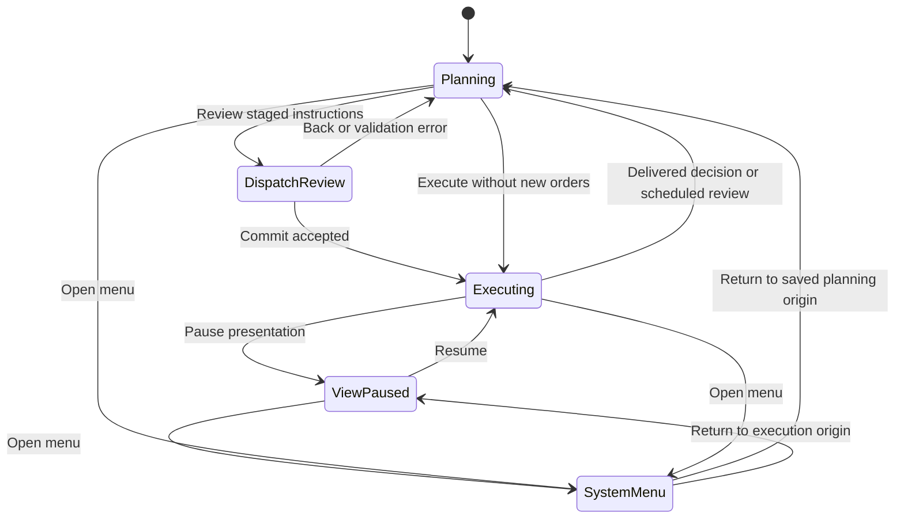
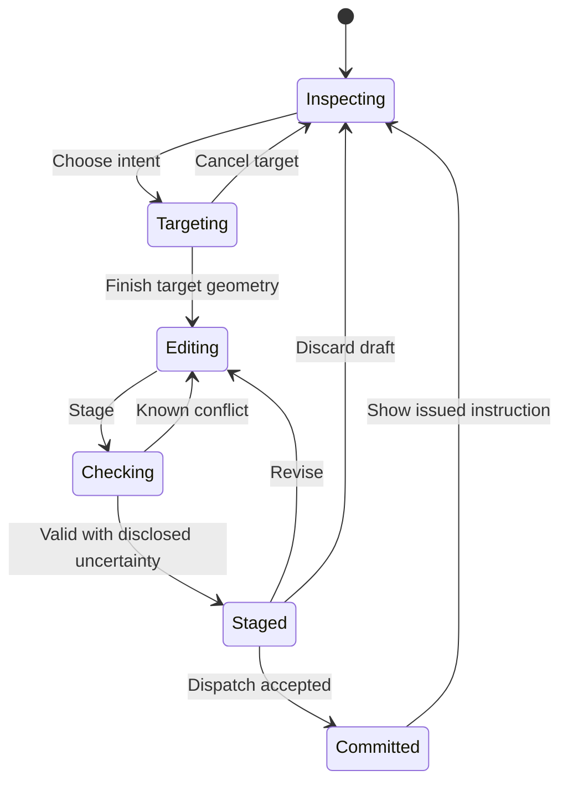
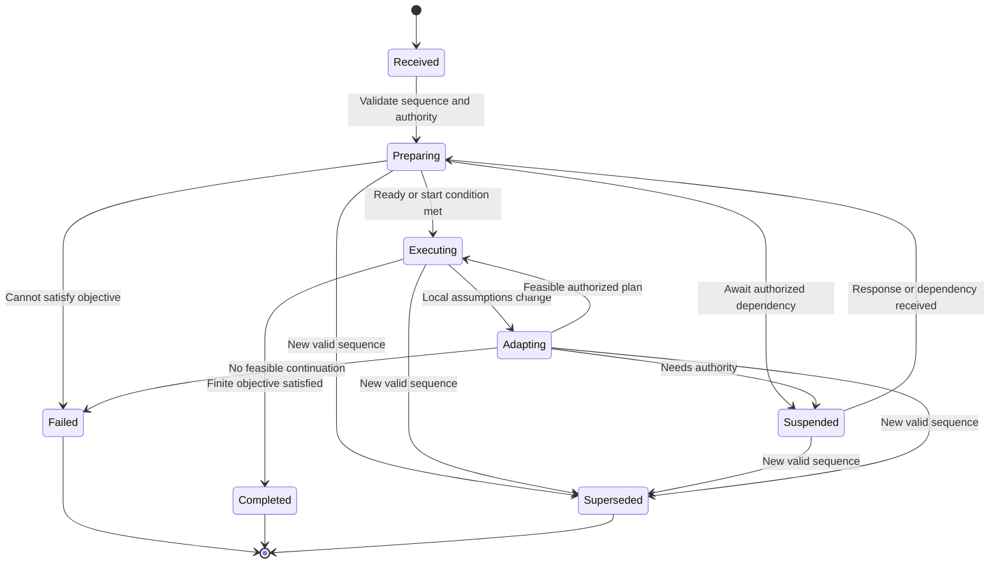
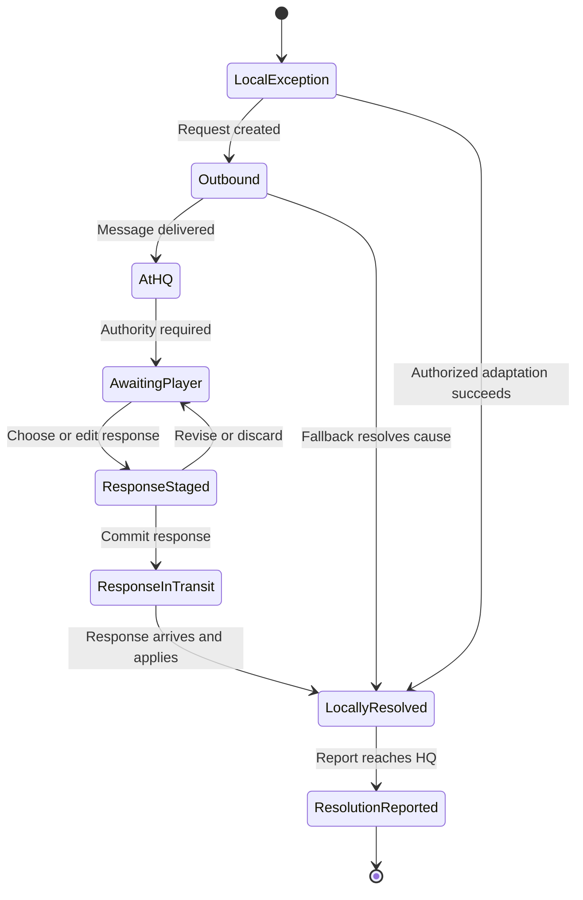
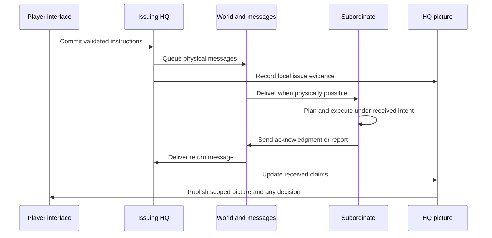

# Achlydesa — Field Atlas

## Style bible, interface layouts, and interaction state machines

**Version 1.0 · 28 September 2026 · Proposed implementation specification**

**Design statement:** Command a dying world through a field atlas made from inherited instruments, incomplete surveys, and the testimony of people carrying out your orders.

This document develops the approved field-atlas illustration into a visual and interaction system. The map is the principal play surface. Its terrain is procedural and pixelated; its symbols are deliberate and readable; its extraordinary places receive a small number of distinctive illustrations. The player specifies intent, boundaries, positions, targets, and support. Subordinates choose methods and perform routine work.

This is a companion to `ACHLYDESA_STRATEGY_RPG_HIGH_LEVEL_DESIGN.md`, `ACHLYDESA_AUTONOMOUS_SQUAD_TECHNICAL_DESIGN.md`, and `ACHLYDESA_SIMULATION_AND_PLAYER_INTERACTIONS.md`. It preserves their unified theater, physical communications, event-driven WEGO, autonomous squads, and repair-only advanced technology. The world bible remains authoritative for lore. Example unit names, map locations, numerical readouts, and UI wording here are design examples, not additions to canon.

**Presentation precedence:** This document replaces the earlier requirement for an oblique 2.5D camera, four snapped viewing angles, visible individual people at close zoom, and literal cutaway roofs. The default is a north-up, top-down atlas. Height, occlusion, floors, bridges, occupancy, and line of sight remain simulation properties. A floor selector and a contextual section diagram reveal them when needed. No second combat map is introduced.

## Contents

1. Experience and boundaries
2. Visual construction and production budget
3. Palette, typography, and surfaces
4. Terrain, scale, height, and semantic zoom
5. Symbols, uncertainty, and map layers
6. Architecture and the surreal
7. Application shell and layout rules
8. Interface inventory and navigation
9. Input grammar and selection
10. Orders, previews, and dispatch
11. Operations and coordination
12. Decisions, reports, and command pictures
13. Logistics, repair, and infrastructure
14. People, doctrine, diplomacy, and story
15. Session state machine
16. Authoring and interaction state machines
17. Orders, delivery, and knowledge state machines
18. Subordinate and service state machines
19. Decision-request state machine
20. Data contracts and interface synchronization
21. Worked interaction sequences
22. Accessibility, feedback, and writing
23. Implementation slices and acceptance criteria
24. Open tuning choices and source crosswalk

## 1. Experience and boundaries

The player should feel that they are using a durable command instrument which has survived its makers. It gives reliable control over their own decisions and imperfect evidence about the world. The contrast between a composed interface and an impossible landscape carries the tone.

Three questions should be answerable from the main screen: **What are my people trying to achieve? What has changed in what this headquarters knows? What needs my authority?**

| Principle | Consequence for the interface |
|---|---|
| Command by intent | A normal order requires a unit, a verb, and a target or place. Doctrine supplies defaults. |
| One theater, one clock | Zoom and opening dossiers never create separate tactical time or move forces to another map. |
| Reports have sources | Positions, states, inventories, and consequences identify their observer and observation time. |
| Autonomy is visible | Show a leader's reported plan, adaptations, and requests without asking the player to arrange soldiers. |
| Scarcity has physical causes | Show a missing capability, its dependencies, and choices. Routine supply arithmetic stays with staff. |
| Surrealism has operational consequences | Strange geography changes routes, dependencies, exposure, or obligations. Decorative noise does not obscure commands. |
| Art must be affordable | Most visible detail comes from reusable patterns, simple geometry, labels, and generated maps. |

The map is representational, but its useful measurements are honest. A counter may be much larger than a squad. A settlement may be a footprint and a glyph. Distances, selected footprints, bearings, terrain heights, and accessible connections must still agree with the simulation to the precision advertised. An enlarged landmark never becomes a false obstacle.

The interface does not require manual reloading, ration allocation, individual soldier movement, recurring vehicle servicing, inventory Tetris, research queues, or the scheduling of ordinary rest. Those are autonomous activities with reports when they materially threaten intent.

## 2. Visual construction and production budget

Build four separable visual layers:

| Layer | Construction | Purpose |
|---|---|---|
| Survey | Height bands, contours, slope hatching, stipple, roads, water, simple building footprints | Spatial decisions |
| Command marks | Screen-space counters, sectors, targets, route corridors, boundaries | Intent and reported disposition |
| Operational evidence | One selected overlay, confidence regions, report pins, dated annotations | Explain a decision |
| Archive plates | Small pixel illustrations in site, character, and Archon dossiers | Specificity, atmosphere, memory |

The first three layers should remain useful with every archive plate removed. Archive plates do not supply unique tactical information that exists nowhere else.

**Pixel grammar.** Start with terrain drawn to a low-resolution render target and upscale with nearest-neighbor sampling. Use a prototype range of two to four physical display pixels per terrain pixel at the default UI scale. Resolve labels, counter edges, and controls at native display resolution. Do not pixelate body text or the entire application screenshot. Snap sampled terrain to a stable world origin to avoid crawling stipple during panning.

Use a small family of repeatable source sizes: 16 × 16 terrain stamps, 24 × 24 site marks, 48 × 48 special silhouettes, and 160 × 120 dossier plates. These are production defaults, not obligations. A glyph can be generated from geometric primitives; a plate can use a restricted palette and broad shapes. Neither needs eight facing directions or animation frames.

**First playable art budget:** four terrain pattern families; six reusable site marks; twelve unit/capability marks; six status badges; one Anodyne plate; one junction plate; one portrait silhouette with text-led identity; and a single restrained set of UI sounds. Derive terrain variants by parameters rather than painting new tiles. Reuse drawing primitives between counters. Do not turn this budget into a promise to create forty unique illustrations before the game is playable.

Prototype silhouettes and map grammar before detailed art. Use references to understand shapes and material language, then create an original vocabulary. The accepted Anodyne direction is a preference for scale, unease, abstraction, and pixel economy; it is not a requirement to imitate another game's sprites.

## 3. Palette, typography, and surfaces

### 3.1 Palette tokens

The day palette uses dusty paper, restrained mineral colors, and dark ink. The night palette resembles a dim inherited instrument. Both retain the same meanings. These are initial tokens; verify every final foreground/background pairing in the implementation.

| Token | Day | Night | Use |
|---|---|---|---|
| Paper | `#E9DFC9` | `#222B29` | Main surface and label backing |
| Ink | `#352F3F` | `#E4DDC6` | Body text, primary shapes |
| Secondary ink | `#655B68` | `#AEB5A8` | Sources, timestamps, supporting text |
| Rule | `#B8AB94` | `#526057` | Nonessential dividers |
| Friendly | `#236965` | `#83C4B8` | Friendly affiliation, with rectangular shape |
| Hostile | `#8C3B2F` | `#F2A08C` | Reported hostile affiliation, with diamond shape |
| Caution | `#735008` | `#E4C276` | Constraint or resource warning, with text badge |
| Anomalous | `#884653` | `#D68C98` | Observed anomalous relationship, with special line pattern |
| Low ground | `#DDD2B8` | `#283B35` | Terrain fill only |
| Middle ground | `#BBBBA4` | `#3E5246` | Terrain fill only |
| High ground | `#9C979B` | `#625E68` | Terrain fill only |

Selection uses a double ink outline and a small `SELECTED` marker where useful. It does not borrow the hostile color. Drafts use an open arrowhead and `DRAFT`; uncertainty uses stipple and `ESTIMATED`; both remain distinguishable in monochrome. Anomalous magenta is never the only indication of danger.

Place text on opaque paper backings instead of relying on contrast against arbitrary terrain. Structural dividers can be subtle; essential interactive boundaries and keyboard focus must remain visible independently. Aim for at least 4.5:1 normal-text contrast and 3:1 essential graphical contrast. These are implementation acceptance targets, not a claim that the early illustration already passed accessibility testing.

The specified ink, secondary ink, friendly, hostile, caution, and anomalous colors were checked against their corresponding solid Paper background: all twelve pairings exceed 4.5:1. This token check does not certify text placed over terrain, disabled controls, focus rings, or a completed application.

### 3.2 Typography and spacing

Use a widely available monospace face for identifiers, coordinates, time, and short headings; use a readable sans-serif face for longer testimony and prose. A single readable monospace family is acceptable in the prototype. Reserve any bespoke bitmap face for optional mastheads.

Desktop defaults: 16px prose and form inputs, 14px dense rows, 12px secondary metadata, 20px panel titles. Essential actions must not become tiny because a report is long. Scale the interface independently of the map. Use tabular numerals for aligned times and stocks; limit all-caps to short identifiers. Keep paragraphs near 65 characters per line.

Use a 4px spacing unit, 8px within groups, 16px between groups, and 24px at major divisions. Controls have a minimum 36px height for mouse use and 44px effective touch targets. Corners are square or barely rounded. Prefer thin rules to decorative boxes. Paper grain belongs on terrain and plate margins, never across body text.

### 3.3 Surface behavior

There is one strong primary action per active task: `Stage order`, `Review dispatch`, or `Commit and execute`. Side panels are opaque. Decorative scan lines, chromatic aberration, lens distortion, flicker, and distressed lettering are disabled by default and never affect command information.

## 4. Terrain, scale, height, and semantic zoom

The map remains north-up. Zoom changes what is drawn, not the authoritative world or the simulation clock. The whole theater can span roughly 1,000–1,500 km; marches can last days. A scale bar, coordinates, map level, and selected headquarters remain available at every scale.

| View | What becomes prominent | What remains possible |
|---|---|---|
| Theater | Settlements, crossings, known jurisdictions, operation extents, supply corridors | Select any named squad from roster; issue a geographically valid destination order |
| Operational | Roads, terrain masses, force clusters, traffic, reported contact areas | Draw routes, areas, frontage, support relationships |
| Local | Cover classes, building footprints, entrances, slopes, occupied sectors, sight restrictions | Set a squad position/sector or target, inspect height and feasibility |
| Site level | Selected floor, bridge deck, underpass, relevant access connections | Issue a squad-level place/area order on that level |

These are semantic thresholds with hysteresis, not four separate modes. Do not make an extra click mandatory simply because a counter becomes a cluster. Selecting a cluster offers its members, with the prior selected squad preserved through zoom.

**Height rendering:** broad value bands communicate elevation; contours communicate gradient; sparse directional hatching identifies steep faces. Local sight previews are computed using the commander's available terrain model and are labeled accordingly. A selected ridge can expose a compact section showing observer height, obstruction, and target elevation. Do not render a complete 3D diorama to answer a height question.

**Stacked spaces:** a level control shows `Surface`, `Bridge deck`, or named floor. A route that changes levels includes a connector mark. The inspector names the level being targeted. Units on another known level receive a badge and can be selected through a list. Never snap an order silently to the roof when the player selected the road underneath.

**Geometry versus survey:** simulation geometry is authoritative for physical resolution; the command map uses surveyed or reported geometry. Known discrepancies are shown as revision marks. Unknown geometry is not secretly consulted by the UI to make a route preview smarter. A survey may be wrong, but the interface must distinguish its age and source from measured current information.

**Render pipeline:** available survey tiles → elevation bands → contours/patterns → known features → selected operational overlay → order geometry → counters/contact estimates → label placement → interaction affordances. Generate low-frequency shape first. If a texture interferes with reading a route, remove the texture.

## 5. Symbols, uncertainty, and map layers

### 5.1 Counter grammar

Use a simplified, internally consistent military-inspired symbol system; do not claim full conformity with an external symbol standard. Each counter combines affiliation frame, capability mark, short identifier, and at most two urgent badges. The inspector carries the rest.

| Meaning | Shape/text rule |
|---|---|
| Friendly element | Rectangle plus unit ID |
| Reported hostile element | Diamond plus contact ID; hostility attribution named in inspector |
| Unclassified contact | Open circle plus question mark and contact ID |
| Neutral/civilian presence | Rounded capsule plus explicit label |
| Fixed site | Small square footprint plus site glyph |
| Headquarters | Friendly frame with `HQ` |
| Selected element | Double selection outline; does not change affiliation |
| Last reported position | Anchor pin and age; growing estimate area where supported |
| No reliable current position | Last known anchor remains; `POSITION UNKNOWN` in inspector |

Counter size is constant in screen space over a useful zoom range. A selected footprint or sector is drawn in world space. A cluster badge indicates how many known elements are grouped, not how many enemies actually exist. Hover and selection cannot reveal a hidden unit through hit testing.

### 5.2 Lines and regions

| Mark | Encoding | Caveat |
|---|---|---|
| Draft intent | Dashed corridor, open arrowhead, `DRAFT` | Never mistaken for an accepted route |
| Issued intent | Continuous corridor, named order | This is the instruction, not proof of execution |
| Reported movement | Short dated trail | Ends at last report; no automatic live continuation |
| Position estimate | Stippled region and age | Estimate from available evidence, not a hidden truth radius |
| Hold frontage | Bracketed line with sector labels | Leader selects local positions |
| Support assignment | Thin directed connector, recipient named | Does not imply uninterrupted communications |
| Known service dependency | Double broken line, service label | Only documented links appear |
| Forbidden boundary | Hatched edge with explicit restriction | Constraint wins over speed preference |

Do not use fading alone for age; old reports must remain readable. Predicted positions are hollow and explicitly marked as estimates. Do not animate a counter along its predicted route as though it were confirmed movement.

### 5.3 Overlay policy

Allow one primary spatial overlay at a time: Terrain/observation, Contacts, Communications, Supply/endurance, Routes/traffic, Political claims, or Anomalous relationships. Friendly counters, selected intent, critical received warnings, and uncertainty labels remain visible. Permit a small selected-context overlay, such as one route on the supply view. Avoid a stack of translucent heatmaps.

Every overlay has a short legend, data age, and source scope. `No report`, `not surveyed`, `not applicable`, and a measured zero have different appearances. A blank map is not evidence of safety.

## 6. Architecture and the surreal

### 6.1 Architectural language

The built world combines retro-future civic ambition with cyberpunk accretion. Begin with substantial geometric forms: low administration slabs, circular terminals, pylons, enclosed walkways, reservoir housings. Attach later repairs: exposed conduits, scaffold platforms, patched antennae, exterior habitation, mismatched service modules. A structure should suggest an inherited function before it suggests visual spectacle.

At map scale, represent this with footprints and a few roof marks. At dossier scale, emphasize a single recognisable silhouette and a material contradiction: a polished ceremonial machine under improvised weatherproofing; a municipal entrance feeding an unlit service throat. Avoid requiring an individually painted facade for every settlement. Neon is a sparse sign of surviving systems, not a universal wash.

### 6.2 Surrealism as mapped relationships

The following are proposed visual treatments of established Archons, not new powers or complete mechanic definitions:

| Archon | Map signature | Dossier treatment | Information boundary |
|---|---|---|---|
| Anodyne | Reported service and wound-transfer relationships, individually sourced | Hospital-lamp jellyfish silhouette, suspended tendrils, small inhabited forms | No automatic display of every recipient or consequence |
| Autophagos | Dated city-bearing footprint and movement reports | Hermit-crab mass with civic structures carried on it | Its position and accessible routes age like other reports |
| Heliarch | Observed oil-fall area and dated sightings | Inverted mirror-plated whale; empty space dominates | Predicted hazard area is distinguished from observation |
| Pylaios | Known nonlocal connection between identified endpoints | Severe black gate interrupting ordinary architecture | Graph adjacency does not distort measured ground distance |
| Aletheia | Attached disclosures with source and contested status | White-gloved hands surrounding black cloth | A disclosure does not reveal an omniscient truth panel |
| Strategos | Reported threat interpretation and jurisdictional constraints | Weapons around a central brain, restrained scale cues | Interface explains known behavior without pretending to read hidden intent |
| Mneme | Recorded ribbon route and archive access points | Black magnetic ribbon river crossing conventional terrain logic | Retrieved testimony remains attributed; archive presence is not universal knowledge |

Impossible geometry can appear in a plate or an explicitly observed map feature. Functional controls retain stable positions, labels, and meanings. Never make a critical button illegible to imply corruption. If the world changes a rule, show the observed change, affected actions, and uncertainty. The Soterion junction receives a dependency view assembled from known services and authorities, not a complete spoiler diagram.

## 7. Application shell and layout rules

The shell is persistent. Panels expose different questions about the same world. No panel creates its own clock.

### 7.1 Desktop layout

Reference viewport: 1440 × 900 at default UI scale. Dimensions below are starting constraints, not fixed coordinates for every display.

| Region | Allocation | Contents |
|---|---|---|
| Top command strip | About 56px high | HQ selector, absolute time, planning/execution state, active operation |
| Left force rail | Optional 208px wide | Task forces/squads, intent, urgent exceptions |
| Center atlas | Remaining width, minimum useful width about 640px | Map, compact layer control, level control, scale |
| Right contextual panel | 336–400px when open | Selection, composer, decision, or site detail; one primary panel |
| Bottom execution strip | About 64px high | Next review, staged order count, dispatch/execute or playback controls |
| Report drawer | Collapsed by default; opens above bottom strip | Received chronology, grouped exceptions, evidence links |

At the reference size, opening the full roster and inspector leaves roughly 860px for the map. Collapse the roster first when width is constrained. At narrower desktop sizes, use a contextual sheet over part of the map. Below the supported game minimum, offer a stacked preview layout; mobile play is not a first-release requirement. UI scaling takes precedence over retaining all panels simultaneously.

Never cover a selected destination with an automatically opened panel. Recenter only when requested or necessary to keep the active map interaction usable. Preserve map center, zoom, overlay, and selection when closing a dossier.

### 7.2 Four canonical layouts

| Layout | Map content | Right panel, top to bottom | Bottom action |
|---|---|---|---|
| Command picture | Counters, last reports, selected current intent | Identity → report age/source → intent → capability exceptions → rationale → contextual actions | `Review dispatch (n)` or `Execute to review` |
| Order composition | Draft target/sector/corridor and relevant estimate | Issuing HQ → units → verb/target → doctrine summary → optional constraints → preview/unknowns | `Stage order` in panel; execution remains separate |
| Decision reached | Affected assets and received cause, ordinary map still usable | Decision/requester/time → conflict → recommendation → alternatives → fallback/deadline | `Stage response`; then dispatch |
| Service allocation | Selected supply/service overlay and proposed assignment | Desired capability → source/recipient → capacity/claims → reserve boundary → expected effect → exceptions | `Stage allocation` |

Selecting a report highlights evidence on the map and opens its source without replacing the order being drafted. Use an evidence subpanel with a clear return action. Two full inspectors do not compete for space.

## 8. Interface inventory and navigation

| Interface | Entry | Core contents and actions | Exit/result |
|---|---|---|---|
| Atlas | Default | Select, inspect, zoom, measure, change overlay | Preserved throughout play |
| Unit inspector | Counter or roster | Last reported state, intent, leader rationale, resources, order history | Open composer or related dossier |
| Order composer | Verb on selection | Target, defaults, constraints, conditional estimate | Stage draft or discard |
| Operation sheet | Operation label | Squad assignments, dependencies, timing, shared priorities | Stage revised orders |
| Dispatch review | Bottom strip | All staged instructions, recipients, authority, conflicts, delivery estimates | Commit and start execution |
| Decision queue | Qualifying received request | Grouped causes and affected elements, choices and fallback | Stage response, delegate within authority, or explicitly keep fallback |
| Report drawer | Report count or received notice | Chronology, evidence, source, observation and receipt times | Inspect; mark read without issuing anything |
| Intelligence dossier | Contact, site, or evidence link | Claims, provenance, contradictions, known capabilities | Share report or create observation intent |
| Service sheet | Supply/support action or overlay | Sources, corridors, recipients, reserves, shortages | Stage allocation or service order |
| Asset/site sheet | Asset or site | Condition, useful functions, dependencies, repair options | Stage recover/restore/abandon proposal |
| Personnel dossier | Leader/person link | Known biography, relationships, wounds, experience, appointment | Stage appointment/training where authorized |
| Doctrine sheet | Command menu | Current defaults, proposed amendments, scope and consequences | Stage promulgation |
| Contact/agreement sheet | Reachable faction/contact | Authority, communication route, terms, obligations | Send proposal; await actual reply |
| Campaign record | Journal/report menu | Known commitments, testimony, deadlines, consequences | Locate supporting record or place |
| Save/options | System menu | Saves, accessibility, controls, audio | Return to same command state |

Dossiers are tabs or sheets, not separate simulated locations. The inspector uses the same entity selection as the map. A service sheet selection can center the relevant convoy; a decision can open its order; an order can open its evidence. Returning restores the previous selection context. A concise breadcrumb shows the path when it is more than one level deep.

## 9. Input grammar and selection

| Input | Default behavior |
|---|---|
| Primary click | Select one visible/known object; empty ground clears selection unless targeting |
| Shift + click | Add/remove a friendly unit in the current command scope |
| Drag with explicit Select tool | Select friendly counters in area; avoids conflict with map panning |
| Middle drag or Pan tool | Pan; provide keyboard alternative |
| Wheel/pinch | Zoom around pointer or focus |
| Right click | Context menu of valid intents; never immediate movement |
| Choose verb then click | Specify target for a draft |
| Choose area/frontage tool | Place geometry; explicit `Finish` completes it |
| Escape | Cancel active geometry, then back out one interaction level; never cancel a committed order |
| Undo/redo | Edit uncommitted geometry/fields/staged drafts only |
| Space during execution | Presentation pause/resume; command controls remain unavailable |
| Dispatch shortcut | Opens review; does not silently commit |

Every gesture has a visible control and remappable keyboard equivalent. Use distinct cursor labels for `Select`, `Target`, `Draw frontage`, and `Measure`. Display active tool and recipient before placing geometry. Completing a drawing returns to a preview; it does not issue the order.

Clicking a hostile contact opens evidence and context first. `Kill`, `Suppress`, and `Assault` are explicit intents with different effects. A contact is a report-backed reference, not a privileged handle to its hidden true location.

Multi-selection retains individually inspectable squad assignments. Incompatible selections show which recipients need a different task, with role-aware alternatives. The player may intentionally give a unit a difficult task; disable only known invalid authority, geometry, or hard-contract combinations, not every uncertain plan.

## 10. Orders, previews, and dispatch

### 10.1 Composer fields

Show the minimum fields first: issuing HQ, selected unit(s), verb, target/place. Supported core verbs are Move, Observe, Suppress, Kill, Assault, Hold, Support, Retreat, Resupply, Evacuate, and Recover. Contextual activities such as Escort, Screen, Patrol, and Rest can be presented as templates where the simulation supports them.

Expand optional purpose, emphasis, constraints, timing, support, protected resources, completion/follow-on, and fallback only when relevant. Emphasis choices are Default, Speed, Caution, Concealment, and Conservation. A changed default gets an explicit badge. Do not make the player fill a doctrinal form for every movement.

The preview shows **command staff estimate**, known route/sector options, expected effect, broad timing, required support, protected stock conflict, and main uncertainty. A subordinate's actual proposed plan appears only after it has been received in a report. This distinction prevents a remote leader's untransmitted reasoning from appearing during drafting.

`Why this estimate?` exposes evidence and constraints, not the full hidden simulation. Examples: “Western causeway is the only surveyed vehicle crossing”; “Estimate excludes unreported road damage.” If insufficient information exists, say so and allow a valid intent to be staged with explicit uncertainty.

### 10.2 Draft, stage, commit

Drafting edits local UI data. Staging puts an instruction in the current HQ's dispatch basket; it still has no world effect. Review shows the recipient, desired effect, changed constraints, known conflicts, delivery method, and estimated communication delay for each item.

`Commit and execute` validates against the current planning revision and records orders at their issuing headquarters. The command service accepts the bundle atomically as a local instruction set or returns specific validation errors. **Delivery and execution are not atomic.** Each recipient receives its instructions through the world. A convoy might receive a replacement before its escort; the plan must account for this.

Known hard conflicts block commitment until edited or the conflicting instruction is removed. Unknown risk produces a warning, not magical validation failure. Presentation-only changes do not invalidate a draft; changed authority, evidence dependencies, or allocations do.

Staging an allocation creates a visible planning claim. Commitment creates the authorized request/claim in the issuer's ledger. Physical allocation happens under the logistics model; it does not teleport goods or globally lock resources that a disconnected HQ does not know about. Conflicting remote claims can produce a later denial and decision request.

### 10.3 Replacement and cancellation

`Replace order` creates a new sequence. `Request cancellation` creates a cancellation message with an explicit safe follow-on or applicable default. The inspector retains the previously reported active order until new evidence supersedes it. Labels such as `CANCELLATION SENT — RECEIPT UNCONFIRMED` are intentional.

Before commitment, Undo can erase the draft. After commitment, undo is unavailable; correction uses a new message. Cancelling a finite task never makes a unit stop self-protection, aid, or other authorized routine behavior.

## 11. Operations and coordination

An operation is a planning label and coordination sheet, not an autonomous general layer. Show one row per squad or service element, its role, task, start condition, support, fallback, and latest report. Task-force collapse is a convenience; expanding shows every element.

Use only a small set of dependencies: start now; start at a specified world time; after a specified report is received; support a named element; or remain reserve until a bounded authorized trigger. A linked readiness report must travel to the element or authority that evaluates the trigger. Receiving it at one HQ does not implicitly deliver it to all squads.

For each conditional task, specify who evaluates the condition, what evidence qualifies, a timeout, and a fallback. The normal UI offers templates such as “Advance after 01 reports crossing secure; if no report by 10:00, hold and report.” It does not expose a programming language.

Known cycles and mutually exclusive resource claims are highlighted in plain language: “02 waits for 03; 03 waits for 02.” If a fixed start time can arrive before order delivery, show that risk and the configured late-arrival behavior. A multi-day march can use scheduled reviews at meaningful waypoints or world times; the player does not confirm every routine halt.

## 12. Decisions, reports, and command pictures

### 12.1 Decision queue

A decision card states: who asks; when they observed the problem; when this HQ received it; current intent; violated boundary; what they will do without a reply; useful response deadline; and two or three meaningful alternatives. The recommended option is grounded in available evidence and can be edited.

Example: “02 cannot reach Lamp Ward by 12:00 without using the protected fuel reserve. Recommendation: delay arrival. Fallback: hold at Cistern Camp. Decision useful before 09:40.” `Release reserve`, `Change deadline`, and `Keep fallback` each author a specific response. Inspecting or marking the card read does not resolve it.

Group one physical cause with many affected units into one decision. Preserve separate decisions when authority or consequences differ. Urgency is the time until useful action becomes impossible, not a generic red severity score.

### 12.2 Report drawer

Every report exposes observer, observation time, receipt time, source path, associated order, and claim status. The compact row can show one age; expanding always shows both timestamps. Separate observation, testimony, estimate, and inference. Contradictory reports coexist until resolved; newest receipt is not necessarily newest observation.

The drawer groups routine adaptations and successful maintenance. Critical decision requests remain accessible even if the player reduces routine notifications. Reports may be read, pinned, shared, or attached as evidence. Sharing is a message that incurs delivery; pinning is a UI preference.

### 12.3 Headquarters switching

At a legitimate planning pause, the player can switch among appointed player-controlled commanders. The top strip, report drawer, map projection, drafts, and authority all switch together. Each HQ has its own draft basket and command picture. Preserve its camera state separately.

A request reaching any active player-controlled commander can pause the shared clock. The queue identifies its destination HQ and can switch to it. A request trapped with a squad cannot cause that pause. Inspect another HQ during execution only through information available in the active scope; unrestricted command-picture switching waits for planning.

A world coordinate can be entered if known. A foreign report cannot be attached to a remote order until delivered. The UI does not attempt to erase the human player's memory; it enforces message and authority contracts.

## 13. Logistics, repair, and infrastructure

### 13.1 Service sheet

Structure the sheet around **recipient → desired service → source → corridor → priority/reserve → expected endurance/effect**. Show useful exceptions such as missing transport, unavailable route, incompatible parts, or a deadline conflict. Routine manifests and truck schedules are inspectable but not required inputs.

The player chooses supply source, corridor constraints, escort/support assignment, priority, and reserve policy. Staff selects loads, schedules movement, redistributes ordinary supplies, and handles repeat service within policy. A change to a corridor generates the necessary operational instructions; it does not immediately reroute every disconnected vehicle.

Separate physical stock, already committed stock, planning claims, and forecast demand. A remote inventory is dated. Endurance is a range conditional on known activity; avoid false minute-level precision for an uncertain multi-day march. If zero is measured, display zero. If no report exists, display unknown.

### 13.2 Recovery and repair

Begin with the desired function: “Restore vehicle mobility,” “Recover relay,” or “Restore water service.” The sheet offers compatible known methods, donor cost, transport/labor requirement, and estimated downtime. Cannibalizing a unique asset or spending a protected reserve requires an explicit authorization within dispatch. Ordinary authorized maintenance does not.

There is no research tree. Surviving advanced capabilities are restored, repaired, recovered, or cannibalized. A discovered device can require assessment before useful options are known. Food and water services can renew resources under the simulation rules; this does not imply new advanced manufacturing.

### 13.3 Infrastructure and anomalies

Use a compact dependency list or graph for the selected service. Each edge names the known dependency, source, and age. Offer assess, secure, restore, reroute, sever, or abandon only when supported by knowledge and authority. Preview documented consequences, mark disputed ones, and state where the network is incomplete.

An Anodyne-related choice uses the same interaction grammar but can carry a consequential confirmation within dispatch: which known recipients may lose a service or receive harm, what remains unknown, and what the commander is authorizing. Do not bury such a choice in an ordinary repair checkbox.

## 14. People, doctrine, diplomacy, and story

| Interface | Player decides | Autonomous or simulated response | UI evidence |
|---|---|---|---|
| Personnel | Appointment, assignment, training priority, permitted recovery time | Succession, practice, treatment, relationship changes | Known experience and testimony; no mind-reading affection meter |
| Doctrine | Standing defaults and boundaries, scope, effective version | Leaders apply the received version to future/local planning | Version known at issuer; recipient acknowledgment where reported |
| Diplomacy | Desired terms, concessions, obligations, envoy/channel | Travel, consideration, counteroffer, acceptance or refusal | Sent proposal is separate from accepted agreement |
| Campaign record | Which commitment to pursue and what to risk | Faction action and persistent consequences | Known deadlines and evidence; no omniscient quest tracker |
| Generational handover | Institutional commitments and succession choices at authored transition | Time passage and world change under campaign rules | Explicit handover summary, inherited records, fresh surveys/reports |

Doctrinal amendments are authored deliberately. Repeated behavior can suggest a change but cannot silently rewrite the player's policy. Show what will change, affected units, protected boundaries, and distribution status. Old doctrine remains locally active until superseded according to delivery and precedence rules.

A diplomacy sheet names who can commit each party and how contact is maintained. A proposed agreement is not active because the player clicked it. Binding terms and major sacrifices receive a clear final review; routine correspondence does not need extra modal friction.

The story opens through the caravan's command tasks and reports. The checkpoint crisis teaches authority, self-defense, and consequences. Junction politics enter through observed service dependencies, access, and faction demands. Do not interrupt every tactical decision with dialogue. Important testimony can be opened from a report, then closed back to the same map.

Death updates only through available observation or testimony. A later correction can replace “missing” with “dead” without rewriting the original report. After the generational jump, archived coordinates and former alliances are marked as inherited knowledge until updated. The interface must not present a twenty-year-old report as live.

## 15. Session state machine

The global session state controls whether orders may be authored. Panel visibility never controls simulation time.

`ViewPaused` freezes simulation advancement as well as playback so the player can inspect comfortably. It grants no new planning authority. This is an implementation clarification of the earlier presentation-pause rule. The scheduler should not run ahead and expose a different future when resuming. `SystemMenu` retains its origin; returning from execution lands in view pause, with an explicit Resume control.

| State | Map/dossiers | Draft orders | Commit | Clock |
|---|---|---|---|---|
| Planning | Available in chosen HQ scope | Allowed | Through review | Frozen |
| Dispatch review | Review and return to map | Return to edit | Allowed if valid | Frozen |
| Executing | Inspect received picture | Unavailable | Unavailable | Advances under scheduler |
| View paused | Inspect same picture | Unavailable | Unavailable | Frozen; no new knowledge |
| System menu | Options/save/load | Unavailable | Unavailable | Frozen |

A scheduled review is set during planning, not invented retroactively by clicking Pause. Planning cannot be manufactured by repeatedly opening menus. A routine contact report does not stop execution when the existing order remains feasible. Hidden enemy events never create a privileged pause or telltale playback slowdown.

Saving preserves session origin, pending deliveries, local plans, reports, outstanding decisions, and staged drafts. Loading restores those states. Resuming execution must not redeliver an already processed order or grant a free planning window.

## 16. Authoring and interaction state machines

### 16.1 Order authoring

`Editing`, `Staged`, and `Committed` are not subordinate activity states. Staged drafts survive opening dossiers and switching back to their issuing HQ. A draft cannot be moved to another HQ by changing a selector; create a new order under that authority instead.

The application maintains independent selection, active tool, panel route, and draft states. Do not encode a state for every combination such as “map-selected-with-logistics-tab-and-order-draft.” Use small coordinated machines with guards.

### 16.2 Panel and tool rules

| Event | Guard | Result |
|---|---|---|
| Select evidence while drafting | Evidence available to current HQ | Suspend targeting; open evidence; preserve draft |
| Switch primary overlay | None | Change rendering only; preserve target and selection |
| Switch map level | Level known/selectable | Update visible level; draft target stays explicitly on its original level unless edited |
| Open another entity | Unsaved draft exists | Keep draft in basket and identify it; do not silently overwrite recipients |
| Change HQ | Planning state | Save current presentation context; load new HQ context; clear active drawing tool |
| Enter execution | All active geometry finished or discarded | Freeze committed versions; close composer; show execution controls |
| Close report drawer | None | Mark only explicitly read items; no order/decision mutation |

## 17. Orders, delivery, and knowledge state machines

Three machines are required. Combining them into a single `unitStatus` value would create misleading UI.

### 17.1 Authoritative recipient order

Terminal order states do not terminate the squad's survival and sustainment behavior. Finite completion applies the specified follow-on or secure/sustain/report default. Standing tasks persist. A received cancellation supersedes the relevant order and activates its safe follow-on. Invalid authority or stale sequence is rejected and can generate a response; it never enters Preparing.

### 17.2 Physical message delivery

Messages progress through queued, transport attempted, in transit, and delivered or transport failed. Retries use the same logical message identity and deduplicate. An acknowledgment is a separate return message. A delayed old order cannot overwrite a newer received sequence. Deadlines have explicit late-arrival policy.

**Important:** transport state is internal. The sender UI displays only locally known transmission events and received acknowledgments. A hidden courier death does not immediately change `SENT` to `LOST`. The UI can later show `DELIVERY OVERDUE` based on the sender's own expectation, without claiming to know the cause.

### 17.3 Commander's knowledge projection

| Evidence available here | Label |
|---|---|
| Draft exists locally | `DRAFT` or `STAGED — NOT SENT` |
| Issuer accepted instruction | `ISSUED — DELIVERY PENDING` |
| Local transmitter/courier departure recorded | `SENT — RECEIPT UNCONFIRMED` |
| Acknowledgment received | `RECEIPT REPORTED`, with acknowledgment time |
| Activity report received | `EXECUTING REPORTED`, with observation time |
| Completion/failure report received | `COMPLETION REPORTED` / `FAILURE REPORTED` |
| Expected acknowledgment absent | `OVERDUE — STATUS UNKNOWN` alongside last evidence |

This is evidence-driven, not a mandatory linear progress bar. A completion report can arrive before an acknowledgment. An older activity report can arrive afterward without rolling the headline back to executing. Keep the report in history, ordered by both observation and receipt as appropriate. Conflicting evidence is marked disputed rather than overwritten.

Staleness is an orthogonal attribute of a claim. Communications confidence, position uncertainty, and order knowledge are separate: a working radio link does not prove a squad has completed its task.

## 18. Subordinate and service state machines

### 18.1 Squad autonomy

The subordinate planner owns assess → plan → prepare → act → reassess. It may wait for a condition, adapt locally, request authority, or execute a fallback. The player sees a reported summary and can change intent or constraints. They cannot click an internal leaf behavior such as “reload soldier 4.”

Keep these dimensions independent:

| Dimension | Example states | UI use |
|---|---|---|
| Intent activity | Preparing, moving, observing, holding, supporting, recovering | Primary reported task |
| Cohesion | Unified, strained, fractured | Ability to act as a unit |
| Suppression/composure | Relevant reported pressure and recovery | Capability warning, not a universal stop flag |
| Connection | Reported available, delayed, cut, unknown | Delivery expectations, with evidence age |
| Capability | Mobility, fire, observation, aid, transport available/degraded | Explain feasibility |
| Authority exception | None, request pending, fallback active | Decision linkage |

A unit can be moving, strained, and disconnected at once. Do not collapse it to “inactive.” A death can trigger local succession without player interruption if doctrine covers it. If succession fails, the request follows the normal communication path.

### 18.2 Services and projects

| Machine | States | Critical transition rule |
|---|---|---|
| Supply job | Requested → assessed → allocated → loading → en route → delivered/partial/failed | Stock moves only with physical fulfillment; changed claims can block allocation |
| Repair project | Proposed → assessed → authorized → awaiting inputs → working → restored/partial/abandoned | Lost inputs suspend work; no completion from UI progress alone |
| Service availability | Available / degraded / interrupted / restoring | Availability and restoration project are separate dimensions |
| Agreement | Draft → sent → under consideration → counteroffered/accepted/rejected → fulfilled/expired/breached | Acceptance requires the proper authority; proposals are not active treaties |
| Doctrine distribution | Draft → issued → delivered locally → adopted locally → superseded locally | Recipients may legitimately operate under different received versions |

All remote transitions become visible through reports. A percentage bar is appropriate only when staff can support a meaningful estimate; otherwise use named milestones and the next blocker.

## 19. Decision-request state machine

`AtHQ` is the earliest point at which this request can cause a decision pause. `ResponseInTransit` means the player has answered but the squad may still be following its fallback. Committing a response acknowledges this request version for pause scheduling; it must not immediately pause again because the response has not yet arrived.

A new material fact can reopen the request with a new version. Repeated copies of the same cause are deduplicated. If the cause resolves locally before the request arrives, HQ may still receive a stale request; show the newer resolution if available, otherwise disclose its age. Do not suppress it using hidden knowledge.

`Keep fallback` is an explicit response with the appropriate continuation/review condition. `Remind me later` cannot suppress an unresolved critical boundary indefinitely. If the player elects to continue without a change, record acceptance of the stated fallback for that request version.

## 20. Data contracts and interface synchronization

### 20.1 Required records

| Record | Minimum contents |
|---|---|
| Order | ID, issuer HQ/authority, recipient, sequence, intent, target geometry and level, purpose, constraints, timing/timeout, support, fallback, doctrine version, issue time, evidence references |
| Message | ID, payload reference, sender/recipient, creation time, transport policy, expiry/late policy, causation ID |
| Report | ID, observer, observed time, received time per HQ, claim type, subject/order, estimate/uncertainty, source chain, supersession or contradiction references |
| Decision request | ID/version, requesting authority, cause, affected intents, violated boundary, fallback, response deadline, available alternatives, response linkage |
| Draft | ID, issuing HQ, planning revision, unsent order fields, validation state, dependencies, planning resource claims |
| UI context | Active HQ, selected IDs, camera/level, overlay, panel route, active tool, draft reference |
| Command picture | HQ ID, received-evidence revision, known geometry, projected entity claims, locally known outgoing activity |

### 20.2 Event ownership

The frontend reads the scoped command picture, not the authoritative entity store. Rendering, selection, tooltips, sorting, route preview, counts, alerts, and accessibility labels all use that same scope. Otherwise hidden information can leak through apparently harmless UI details.

Map, roster, inspector, and reports subscribe to one projected revision. Apply a received report coherently so a counter and its inspector do not briefly disagree. Selection uses stable IDs; when a reported entity becomes unavailable, preserve the record and explain the change instead of jumping to another unit.

Use idempotent command submission and deterministic event ordering. A double click or retry cannot spend a reserve twice. A stale planning revision returns a field-level conflict, preserving the user's draft. Commands and reports retain causation links so “Why did this change?” can lead to the received evidence.

Developer diagnostics may inspect ground truth in a separate debug environment. They must not feed player UI caches, exported campaign logs, replay views, or achievements that reveal hidden events prematurely.

## 21. Worked interaction sequences

Times and values in this section are illustrative fixtures for implementation and usability testing.

### 21.1 Hold the caravan crossing

1. At 08:10 planning, select 01 from the atlas. The inspector shows the 08:08 report and the current HQ.
2. Choose Hold, draw the causeway frontage, and accept doctrine defaults. Optionally add “Keep caravan passage open” and a western-bank fallback.
3. The preview shows the command staff's estimated sectors and known uncertainty. Stage the order.
4. Dispatch review identifies 01, the frontage, and estimated delivery. Commit starts the shared clock.
5. The issuer shows `SENT — RECEIPT UNCONFIRMED`. On delivery, the leader selects local positions. Receipt and activity become visible only when their reports return.
6. The caravan passes under its existing movement intent. Ordinary cover changes and rest do not request clicks. Hold persists until its condition ends or a replacement arrives.

### 21.2 A blocked bridge threatens the deadline

1. At 09:12, 02 discovers damage. It follows its authorized safe fallback and sends a request because alternatives violate the deadline or protected fuel limit.
2. HQ receives the request at 09:18. Only then does execution enter planning. Other units share the same paused world time.
3. One decision card lists the convoy and escort affected by the bridge. Selecting it centers the reported crossing and opens the supply consequence.
4. The player changes the deadline instead of releasing reserve fuel. `Stage response` creates linked replacement instructions; it does not edit the squad directly.
5. Commit resumes execution. The card says `RESPONSE SENT`; affected units keep their last received intent until replacements arrive. The same request version does not re-pause the game.

### 21.3 Cancellation and message reordering

1. Order 41 is sent, then a legitimate review allows replacement 42.
2. The UI retains 41 as the last reported active order and marks 42 as sent.
3. If 42 arrives first, the receiver accepts it. A later 41 is rejected as stale.
4. If the player requests cancellation 43, it is another delivered instruction. Pending cancellation does not erase 42 from the map as though the unit had already stopped.
5. A delayed report about 41 enters history without overwriting newer evidence about 42 or 43.

### 21.4 Two disconnected headquarters

1. Western HQ receives a sighting. At planning, the player switches to Eastern HQ.
2. Eastern HQ's map and report drawer do not contain that sighting. The western draft basket remains attached to Western HQ.
3. The player can order movement toward an already known pass. Attaching the western target report requires sending it through an available channel.
4. A squad cut off from both HQs continues intent and fallback locally. Its hidden combat never generates a player pause.

### 21.5 Severing an Anodyne dependency

1. Select a documented service link. The site sheet lists known recipients, evidence age, and incomplete portions of the network.
2. Choose an assessment or severing intent. The preview states known operational and human consequences, with uncertainty where evidence is absent.
3. Dispatch review isolates the consequential authorization so it cannot be mistaken for routine maintenance. The player commits or revises it.
4. The assigned element performs the task under physical and authority constraints. Consequences enter command knowledge through observation and reports, not a global instant casualty counter.

### 21.6 A multi-day march

1. Select the force, destination, movement emphasis, source/corridor, and a review at the next significant crossing or a specified time.
2. Staff estimates endurance, transport constraints, and route uncertainty. The player resolves only material conflicts.
3. During execution, leaders schedule ordinary rest, spacing, and service. Playback can accelerate while the scheduler preserves interactions throughout the theater.
4. The player may view-pause and inspect received reports. New instructions wait for the review or an actual delivered decision.
5. A routine report does not demand a click. A lost water source that makes intent infeasible can create one grouped decision once the report reaches command.

## 22. Accessibility, feedback, and writing

Color is always paired with shape, line pattern, text, or a combination. Give users UI scaling, adjustable label density, reduced motion, independent sound channels, and remappable controls. Do not communicate a deadline solely through sound or flashing. Provide keyboard selection via roster/search/list equivalents for objects that are difficult to hit on a dense map.

A list equivalent for nearby/selectable map objects must expose the same knowledge as the map. Screen-reader summaries name selected entity, HQ scope, report age, current reported intent, and available actions. Focus returns to the invoking control when a sheet closes. Large text triggers reflow before clipping.

Use short, restrained sound cues: received report, authority required, dispatch accepted, validation failed. A hidden event has no player-facing sound. Urgent reports can receive one notification; persistent alarms do not force hurried mouse work during paused planning.

**Writing formula:** subject + observed change + consequence + next action if needed. Example: “02 reports the causeway blocked. Current route misses the arrival deadline. Change the deadline or authorize reserve fuel.” Avoid unexplained numerical “efficiency” scores and personality labels that imply knowledge of hidden motives.

Use `reported`, `estimated`, `issued`, `received`, and `confirmed by [source]` precisely. Never use a generic green `ACTIVE` badge for a remotely issued instruction whose receipt is unknown. Error messages keep the draft and identify the fix: “03 is already assigned as the sole escort for this convoy. Change its priority or choose another escort.”

## 23. Implementation slices and acceptance criteria

### 23.1 Build order

| Slice | Build | Exit condition |
|---|---|---|
| A: Atlas vocabulary | Procedural height bands, contours, footprints, symbols, semantic zoom, selection | A player can identify a ridge, crossing, unit, contact estimate, and selected sector without bespoke environment art |
| B: Command loop | Inspector, composer, staged basket, dispatch, session machine, message delay | Hold/Move/Observe work end to end with distinct issue, receipt, and activity evidence |
| C: Exceptions | Report projection, grouped decision queue, cancellation, stale messages | Blocked crossing and disconnected squad scenarios behave without information leaks or pause loops |
| D: Operations and services | Linked tasks, corridor/source allocation, reserves, repair | A multi-day march runs without recurring administrative clicks |
| E: World specificity | Dossiers, one Archon dependency, testimony, consequential authorization | Anodyne changes an operational choice using the same readable command grammar |
| F: Campaign breadth | Doctrine distribution, diplomacy, succession, generational records | Institution persists without turning every person and settlement into a management panel |

Begin with one compact authored area: Cistern Camp, a ridge, one crossing, Lamp Ward, and a known Anodyne relationship. Use a few squads and one convoy to test the loop. Expand map extent after projection, path/height semantics, and long-duration scheduling work. The presentation does not require choosing a full 3D engine first; use whichever engine can reliably support the simulation and 2D layered rendering.

### 23.2 Acceptance checklist

- A new player can issue a default valid Hold order without opening advanced fields.
- Opening every dossier during execution never grants planning authority.
- A hidden event cannot alter counters, alerts, selection counts, forecasts, audio, or pause timing.
- The same physical point and level remain selected across zoom thresholds.
- A disconnected unit remains represented by dated evidence, not an invented live trajectory.
- Cancellation is visibly pending until appropriate evidence arrives.
- A stale message never replaces a newer received instruction.
- A request with a committed response does not create an immediate repeat-pause loop.
- Multi-HQ switching changes all evidence and authority together.
- A shared bridge failure produces one actionable cause with affected elements attached.
- A map symbol, tooltip, roster row, and inspector agree on one projected revision.
- Routine reload, rest, aid, maintenance, and distribution require no recurring player input.
- Known constraints block invalid drafts; unknown danger does not leak through validation.
- All essential statuses remain understandable in monochrome and at enlarged UI scale.
- The first playable remains visually coherent with only two special dossier plates.

Use these as integration and usability scenarios, not tests that merely repeat UI implementation details. Measure time to understand a request, mistaken belief that an order was received, avoidable panel switching, and manual interventions per march. Tune against observed friction; there is no evidence-based universal target click count specified here.

## 24. Open tuning choices and source crosswalk

The visual direction, information boundary, and command grammar are the recommended baseline. The following remain prototype choices: exact semantic zoom thresholds, terrain pixel scale, default review intervals, minimum supported game viewport, confidence wording, notification grouping thresholds, and how much routine report detail to collapse. Tune them with the first playable rather than treating illustrative dimensions as engine constraints.

| Earlier contract | Treatment here |
|---|---|
| Unified physical world and clock | Preserved; all screens are views of one simulation |
| Height, stacked structures, line of sight | Preserved; expressed through top-down maps, levels, and contextual sections |
| Oblique camera, snapped rotation, literal person zoom | Superseded by the approved field-atlas presentation |
| Unit + verb + target with doctrinal defaults | Preserved and expanded into composer/dispatch states |
| Physical orders and reports | Preserved; sender evidence, transport truth, and recipient state separated |
| Event-driven WEGO and presentation pause | Preserved; pause implementation clarified to freeze advancement without granting command authority |
| Autonomous squads, no managerial simulation | Preserved; exception-based service and personnel interfaces |
| Lore of Archons and Soterion | Remains governed by the world bible; visual treatments here do not add powers |
| Existing doctrine/research rationale | Inherited from the design documents; this bible makes product-design proposals, not new claims of doctrinal compliance |

The intended result is a game whose most detailed rendering is its understanding of command: where orders can travel, what people believe, which obligations bind them, and what happens when an impossible world refuses an otherwise sensible plan.
