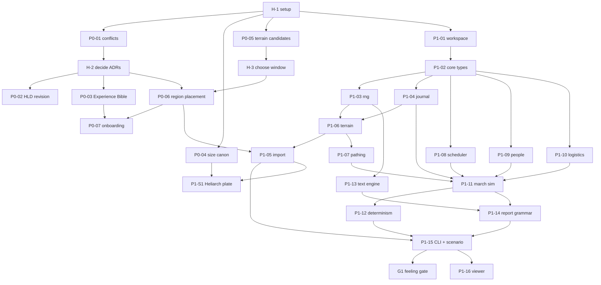

# Task Index — Phases 0 and 1

This directory holds the **specs**: the source of truth for what each task builds, its dependencies, and where it may run. **Status lives on the GitHub Project board**, and each spec has one GitHub issue, created by `tools/scripts/gh_task.py bootstrap`. Edit the spec, never the generated issue body. Re-run `bootstrap` to push spec header changes to issues and the board.

Phase 1 ends at feeling gate **G1**. Phase 2 specs are written only after G1, using what Phases 0–1 actually produced.

## Index

| ID | Title | Agent | Size | Depends on | Runs on |
|---|---|---|---|---|---|
| H-1 | Repository, GitHub, and agent setup | Liam | M | — | human |
| P0-01 | Conflict ledger and proposed ADRs | canon-editor | M | H-1 | either |
| H-2 | Decide the canon ADRs | Liam | S | P0-01 | human |
| P0-02 | Revise the High-Level Design | canon-editor | M | H-2 | either |
| P0-03 | Experience Bible | canon-editor | L | H-2 | either |
| P0-04 | Archon size canon | canon-editor | M | H-1 | either |
| P0-05 | Terrain source and candidate windows | canon-editor | M | H-1 | either |
| H-3 | Choose the terrain window | Liam | S | P0-05 | human |
| P0-06 | Red Ledger region placement | canon-editor | M | H-3, H-2 | local |
| P0-07 | Onboarding design | canon-editor | M | P0-03, P0-06 | either |
| P1-01 | Workspace, CI, and dependency guard | task-implementer | S | H-1 | either |
| P1-02 | ach_core: identity, time, position, quantity | task-implementer | S | P1-01 | either |
| P1-03 | ach_core: keyed random streams | task-implementer | S | P1-02 | either |
| P1-04 | ach_core: journal and snapshot format | task-implementer | M | P1-02 | either |
| P1-06 | ach_world: terrain chunks and height queries | task-implementer | M | P1-03, P1-04 | either |
| P1-05 | Terrain import tool | task-implementer | M | P1-06, P0-06 | local |
| P1-07 | ach_world: navigation grid and pathfinding | task-implementer | M | P1-06 | either |
| P1-08 | ach_sched: event scheduler | task-implementer | S | P1-02 | either |
| P1-09 | ach_people: minimal roster | task-implementer | S | P1-02 | either |
| P1-10 | ach_logistics: stocks and consumption | task-implementer | M | P1-02 | either |
| P1-11 | ach_sim: march simulation | task-implementer | L | P1-04, P1-07, P1-08, P1-09, P1-10 | either |
| P1-12 | Determinism harness, save, and load | task-implementer | M | P1-11 | either |
| P1-13 | ach_text: grammar engine | task-implementer | M | P1-03 | either |
| P1-14 | March report grammar and renderer | task-implementer | M | P1-13, P1-11, P1-09 | either |
| P1-15 | `ach` CLI and the three-day march scenario | task-implementer | M | P1-12, P1-14, P1-05 | local |
| G1 | Feeling gate: read the march log aloud | Liam | S | P1-15 | human |
| P1-16 | TUI trace viewer | task-implementer | M | P1-15 | local |
| P1-S1 | Spike: Heliarch horizon plate | task-implementer | M | P1-05, P0-04 | local |

**Runs on:** `either` — locally with `/task <ID>`, or on GitHub via the `agent:run` label. `local` — needs the raw terrain tiles on your machine (gitignored), so run it locally. `human` — yours.

P1-05 is numbered before P1-06 for readability but depends on it: `ach_world` owns the chunk format and the importer writes through it.

## Dependency graph

Parallel lanes: Phase 0 docs and P1-01 → P1-04 can run side by side. P1-08, P1-09, P1-10, P1-13 are independent of each other.

## Human steps

`H-1`, `H-2`, `H-3`, and `G1` have their own spec files with step-by-step instructions, and their own issues assigned to you. Close each issue when its "Done when" condition holds; that is what unblocks the tasks that depend on it.

## Refinements to the execution plan

These deliberate changes to `ACHLYDESA_EXECUTION_PLAN.md` are made by the task specs:

- `ach_text` depends only on `ach_core`. It expands grammars against a generic `Bindings` trait. Tools map simulation events to bindings. This keeps text reusable for reports, testimony, and proclamations without coupling to the simulation.
- The Phase 1 terrain is a 96 × 24 km strip, not the 20–30 km tactical corridor. A three-day march needs about 90 km (High-Level Design §4.1b). The tactical corridor of Phase 3 lies inside the strip.
- Movement speed uses Tobler's hiking function, precomputed into an integer content table so simulation code contains no floating point.
